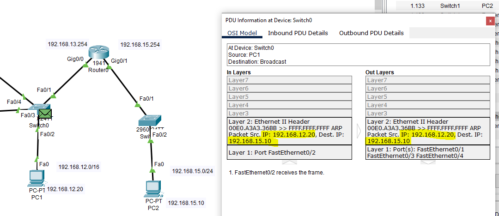
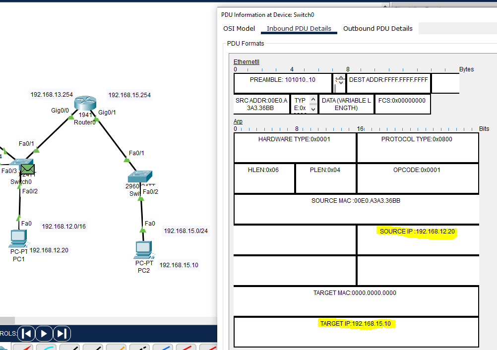
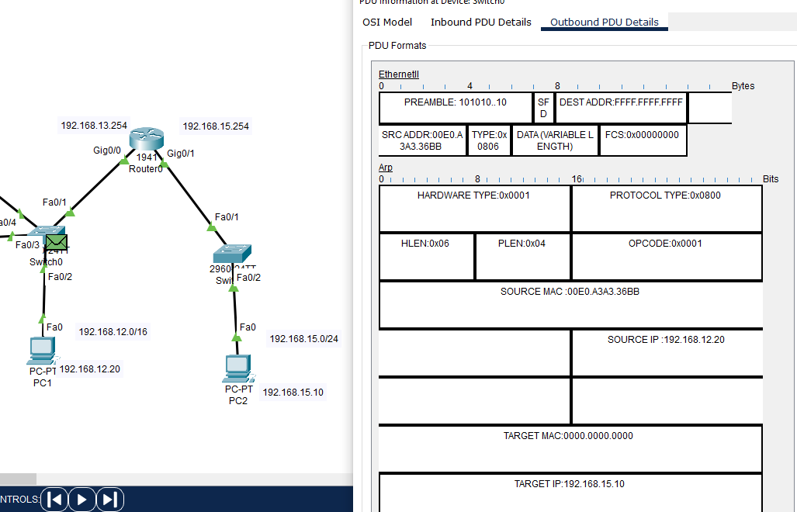

# packet tracer arp harjoitukset

erilliset cisco packet tracer harjoitukset, et vähä testaa ja harjoittelee, miltä se ikään kuin arp tulostus menee ja näin, sekä vaikutusta esim. jos tulee jokin ddos hyökkäys ja huomiona tässä tapahtuu LAN - verkkolla. Ehkä voisi kokeilla mm. wlan, että mahtaako tapahtua mitään?

## harj 1

