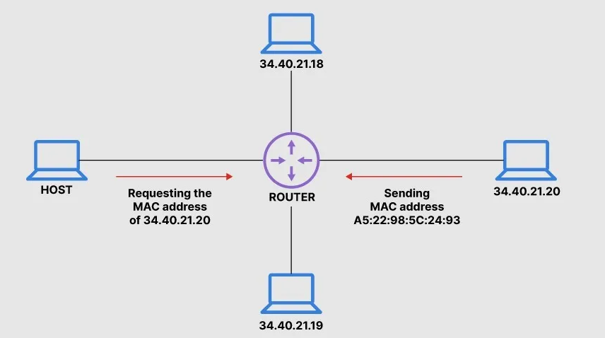

# Address Resolution Protocol

- [Address Resolution Protocol](#address-resolution-protocol)
    * [static & dynamic](#static--dynamic)

- [konffausket](#konffausket)
    * [komennot](#komennot)

- [linkit ja muut ohjeistukset](#linkit-ja-muut-ohjeistukset)

Address Resolution Protocol (ARP)

ARP on protokolla kuten nimen mukaan, joka on periaatteessa Ethernet verkosto ei väliä onko fyysinen tai langaton Wi-Fi yhteys. Sen tarkoituksena on selvittää johdonmukaisen kyseisen fyysisen käyttäjän IP-osoitetta, mutta vastaavasti tämä IP-osoite vastaa Ethernetin <b>Mac-osoite</b>, esim. mac-osoite;  <b> 00-XX-XX-XX-XX-XX </b>

Oman henkilökotaisen mac-osoite löytyy komentoriviltä tai powershell komennolla `ipconfig /all` - niin se on nimettynä <b>physical address</b> suom. fyysinen osoite ja jos tietokoneessa on useampi verkkokortti tai -sovitin niin myös heille generoituu myös oma yskittäinen mac-osoite. Powershell/Linux ja cmd:n komentorivillä `arp` näyttää ARP-välimuistin sisällön, sekä antaa vaihtoehtoisia tyyppisiä toimintoja. `arp -a` - tarkistaa kysemällä nykyisen protokollan tiedot, jos inet_addr on määritetty vain tietokoneen IP- ja fyysisen osoitteen näytettä. Myös tulostaa jos on useampi kuin yksi verkkokortti tai -sovinta, sekä tuloksena saattaa tulostaa lähistön liitettyn Wi-Fi yhteyden ketäkin käyttäjän MAC-osoitetta.

Ethernet liikennöinissä tapahtuu, niin kone lähettää verkkoon ARP-kyselyä, johon vastaa se liittämänsä IP-osoite. Samanaikaisesti koneet kuulevat/vastaanottavat viestinsä, jolla on kyseinen IP-osoite ja lähettää ARP-vastausviestinnän omalla MAC-osoitteella. Liikennöivä kone tallentaa vastauksen myös <b> välimuistiinsa (ARP cache) </b>, joten ARP kyselyssä ei tarvitse tehdä ennen jokaista liikennettä. 

ARP protokolla on <ins>hyvin haavoittuvainen</ins> hyökkäyksille ja sen avulla voi mahdollista salakuunella jopa kytkentäisiä lähiverkkoja, josta kutsutaan ARP-väärennös. Tätä mac-osoitetta pystyy generoimaan tai vaihtamaan sen osoitteen kokonaan, että esim. oman tietoturvan/suojan kannalta, niin voi esim. muuttaa sen tai vaihtoehtona jättää vain oletuksena. 

## static & dynamic

# konffausket

## komennot

# linkit ja muut ohjeistukset

