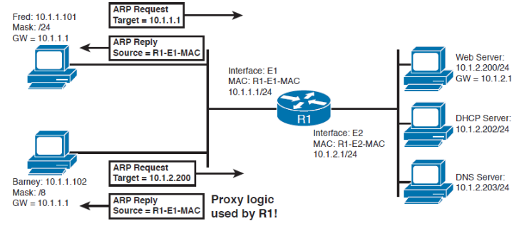
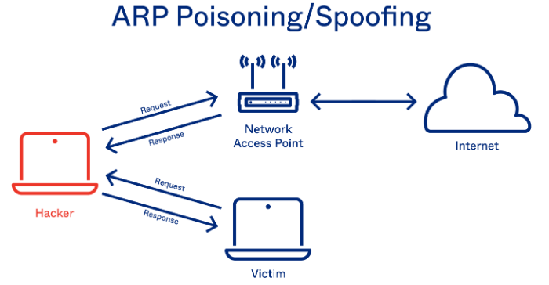
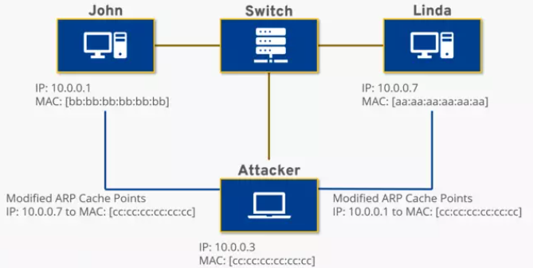

# Address Resolution Protocol

- [Address Resolution Protocol](#address-resolution-protocol)
    * [rarp](#rarp)
    * [static & dynamic](#static--dynamic)

- [arppi taulu](#arppi-taulu)
    * [arppi taulukko esimerkkit](#arppi-taulukko-esimerkkit)
    * [komennot eri brändit](#komennot-eri-brändit)

- [konffaukset](#konffaukset)
    * [proxy arp)](#proxy-arp)

- [erilliset tietoturvat](#erilliset-tietoturvat)
    * [arp cache entry](#arp-cache-entry)
    * [arp cache poisoning - spoofing](#arp-cache-poisoning---spoofing)
        * [arp spoofing prevention and detect](#arp-spoofing-prevention-and-detect)

<!-- huomioithan tämän alle tulee erilliset linkkit ja ohjeita, mistä löydetty sitä asiallista ja hyviä ajatuksia-->
- [linkit ja muut ohjeistukset](#linkit-ja-muut-ohjeistukset)
    * [arp konffaus](#arp-konffaus)
    * [roxy arp](#proxy-arp)
    * [arp spoofing](#arp-spoofing)
    * [arp poisoning](#arp-poisoning)

Address Resolution Protocol (ARP)

ARP on protokolla kuten nimen mukaan, joka on periaatteessa Ethernet verkosto ei väliä onko fyysinen tai langaton Wi-Fi yhteys. Sen tarkoituksena on selvittää johdonmukaisen kyseisen fyysisen käyttäjän IP-osoitetta, mutta vastaavasti tämä IP-osoite vastaa Ethernetin <b>Mac-osoite</b>, esim. mac-osoite;  <b> 00-XX-XX-XX-XX-XX </b>

Oman henkilökotaisen mac-osoite löytyy komentoriviltä tai powershell komennolla `ipconfig /all` - niin se on nimettynä <b>physical address</b> suom. fyysinen osoite ja jos tietokoneessa on useampi verkkokortti tai -sovitin niin myös heille generoituu myös oma yskittäinen mac-osoite. Powershell/Linux ja cmd:n komentorivillä `arp` näyttää ARP-välimuistin sisällön, sekä antaa vaihtoehtoisia tyyppisiä toimintoja. `arp -a` - tarkistaa kysemällä nykyisen protokollan tiedot, jos inet_addr on määritetty vain tietokoneen IP- ja fyysisen osoitteen näytettä. Myös tulostaa jos on useampi kuin yksi verkkokortti tai -sovinta, sekä tuloksena saattaa tulostaa lähistön liitettyn Wi-Fi yhteyden ketäkin käyttäjän MAC-osoitetta.

ARP kyselly (arp taulukko), mille MAC osoitteelle tämmöinen ip kuuluu ja sieltä tulee vastaus kytkimestä ikään kuin verkkolaiteelle on sama vastaus ja aika broadcast ei liiku vlan ulkopuolelle ja sillä saa myös vlan osiolla verkko koko kuormitusta. 

Ethernet liikennöinissä tapahtuu, niin kone lähettää verkkoon ARP-kyselyn, johon vastaa se liittämänsä IP-osoite. Samanaikaisesti koneet kuulevat/vastaanottavat viestinsä, jolla on kyseinen IP-osoite ja lähettää ARP-vastausviestinnän omalla MAC-osoitteella. Liikennöivä kone tallentaa vastauksen myös <b> välimuistiinsa (ARP cache) </b>, joten ARP kyselyssä ei tarvitse tehdä ennen jokaista liikennettä. 

ARP protokolla on <ins>hyvin haavoittuvainen</ins> hyökkäyksille ja sen avulla voi mahdollista salakuunella jopa kytkentäisiä lähiverkkoja, josta kutsutaan ARP-väärennös. Tätä mac-osoitetta pystyy generoimaan tai vaihtamaan sen osoitteen kokonaan, että esim. oman tietoturvan/suojan kannalta, niin voi esim. muuttaa sen tai vaihtoehtona jättää vain oletuksena. Myös tässä pientä erikseen oma readme.md kansio polku just kali linux ja jopa wireshark:iin, koska ne ovat suosittuimista tietoliikenteenverkon työkaluja.


## RARP

Reverse Address Resolution Protocol

## static & dynamic

<hr>

# arppi taulu

Arp table  - eli arppi taulukko, josta kertoo lähiverkkon tietoliikenteen yhteyden eli tarkistaa toimiiko yhteys ja mitä lähistön osoitetta löytyy. Joka toimii OSI-mallissa layer 2 ja 3:sen välillä, olemassa oleva MAC-osoite toimii layer 2:ssa ja IP-osoite toimii verkkokerroksen layer 3:ssa.

Jos lähiverkon tietoliikenteessä tulee vaikappa uusi käyttäjä (läppäri) koneen kanssa niin käyttäjälle määritetään yksilökohtainen IP-osoite, jota käytetään tunnistamiseen ja kommunikointiin. Kun uusi käyttäjä lähettää pakettia niin se on tarkotettu tietyn sisäisen lähiverkon host:in koneelle ja saapuvien gateway (oletusyhdyskäytävä). Taulukkoa, josta kutsutaan myös välimuisti (cache), että tallentaa kirjaa jokaisen IP-osoitteesta ja sitä vastaavasta MAC-osoitteesta. 

Arp taulukko esimerkki kahden välisen host:in yhteys (esim. kone ja gateway), ja taulukon näiden termien kuvaus
- protocol - protokolla tyyppi ja lähes aina Internet
- address - MAC-osoitteen liittyvä IP-osoite, tässä tapauksessa konen isäntä A IP-osoite
- age (min) - joku oletusarvo, mikäli jos yhteys ei ole käytetty n. 240minuuttiin. Tämä sarakke tarkoittaa, että merkintä on käytetty viimeksi 6min sitten ja ikään kuin syötettä ikä nollataan
- hardware - konen isännän MAC-osoite ja vastaavasti IP-osoite
- type - laitteiston tyyppi, jonka ethernet oletusarvo on aina ARPA
- interface - verkkoliitännän osoite mihin se yhteys lähettää / kulkeutuu

```
Router#show ip arp
Protocol  Address          Age (min)  Hardware Addr   Type   Interface
Internet  192.168.20.1            -   0010.1129.AA02  ARPA   GigabitEthernet0/1
Internet  192.168.20.2            2   0030.F2EB.0A6E  ARPA   GigabitEthernet0/1
```

ARP taulukosta myös VLAN (virtual LAN) id, et esim. tietty alue oma id, että vain nämä tiimit/jäsenet/organisaatiot voivat kommunikoida sitä tietoliikenne yhteytä. Tätä vlan id toistuu usein kytkimen laitteella, ehkä tätä arp taulukkoa löytyy muissa brändeiden reitittimessä mm. huawei reititimessä, mutta nillä on oma prosessit, ohje ja dokumentit. Ciscon laitteessa kuitenkin vain kytkimessä toistuu vlan id.

```
Switch0#sh ip arp
Protocol  Address          Age (min)  Hardware Addr   Type   Interface
Internet  10.20.30.120            -   00E0.B0E2.8003  ARPA   Vlan120
Internet  170.160.50.50           -   00E0.B0E2.8002  ARPA   Vlan50
Internet  192.160.1.11            -   00E0.B0E2.8001  ARPA   Vlan10

```

## arppi taulukko esimerkkit

1) esim Cisco reititimen arppi taulukkon yhteys, ja komennolla `show ip arp` tai `show arp`, mutta molemmat sallii sen arppi taulukon toistamisen. Ei ole pakko kirjoittaa `show` kokonaisena vaihtoehtona lyhenteenä `sh`. Ensimmäinen esimerkki josta R1 ja R2 (reititin) yhteys toisensa ja niiden arppi taulukko yhteys.


<details>
R1 
Cisco IOS Software, C1900 Software (C1900-UNIVERSALK9-M), Version 15.1(4)M4, RELEASE SOFTWARE (fc2)
Technical Support: http://www.cisco.com/techsupport
Copyright (c) 1986-2007 by Cisco Systems, Inc.
Compiled Wed 23-Feb-11 14:19 by pt_team

```
Router#show ip arp
Protocol  Address          Age (min)  Hardware Addr   Type   Interface
Internet  10.10.10.1              -   0010.1129.AA01  ARPA   GigabitEthernet0/0
Internet  10.10.10.2              2   00E0.A3B9.0701  ARPA   GigabitEthernet0/0
Internet  192.168.20.1            -   0010.1129.AA02  ARPA   GigabitEthernet0/1
Internet  192.168.20.2            2   0030.F2EB.0A6E  ARPA   GigabitEthernet0/1
Internet  192.168.20.5            2   00D0.FFA3.C731  ARPA   GigabitEthernet0/1

```
</details>

<details>
R2
Cisco IOS Software, C1900 Software (C1900-UNIVERSALK9-M), Version 15.1(4)M4, RELEASE SOFTWARE (fc2)
Technical Support: http://www.cisco.com/techsupport
Copyright (c) 1986-2007 by Cisco Systems, Inc.
Compiled Wed 23-Feb-11 14:19 by pt_team

```
Router#sh ip arp
Protocol  Address          Age (min)  Hardware Addr   Type   Interface
Internet  10.10.10.1              0   0010.1129.AA01  ARPA   GigabitEthernet0/0
Internet  10.10.10.2              -   00E0.A3B9.0701  ARPA   GigabitEthernet0/0
Internet  192.168.25.1            -   00E0.A3B9.0702  ARPA   GigabitEthernet0/1
Internet  192.168.25.2            0   0060.5C1A.A2C2  ARPA   GigabitEthernet0/1
Internet  192.168.25.5            0   0002.4A81.5EE8  ARPA   GigabitEthernet0/1

```

</details>

2) Esim. cisco kytkimen arppi taulukkon yhteys L2 taso

<details>
cisco WS-C2960-24TT-L (PowerPC405) processor (revision B0) with 65536K bytes of memory.
Processor board ID FOC1010X104
Last reset from power-on
1 Virtual Ethernet interface
24 FastEthernet interfaces
2 Gigabit Ethernet interfaces

```
Switch#show arp
Protocol  Address          Age (min)  Hardware Addr   Type   Interface
Internet  192.168.10.3            -   00E0.B078.6301  ARPA   Vlan10
Internet  192.168.20.3            -   00E0.B078.6302  ARPA   Vlan20
Internet  192.168.30.3            -   00E0.B078.6303  ARPA   Vlan30
Internet  192.168.40.3            -   00E0.B078.6304  ARPA   Vlan40

``` 

</details>

3) Esim. cisco kytkimen arppi taulukkon yhteys L3 taso

<details>
cisco WS-C3650-24PS (MIPS) processor (revision N0) with 865815K/6147K bytes of memory.
Processor board ID FDO2031E1Q6
1 Virtual Ethernet interface
28 Gigabit Ethernet/IEEE 802.3 interface(s)

``` 
Switch#sho arp
Protocol  Address          Age (min)  Hardware Addr   Type   Interface
Internet  192.168.10.4            -   00E0.B007.CB01  ARPA   Vlan10
Internet  192.168.20.4            -   00E0.B007.CB02  ARPA   Vlan20
Internet  192.168.30.4            -   00E0.B007.CB03  ARPA   Vlan30
Internet  192.168.40.4            -   00E0.B007.CB04  ARPA   Vlan40

``` 

</details>

## komennot eri brändit

ARP komentoa löytyy muissa tietoliikenneverkko brändeissäkin mm. <b> cisco, huawei, HPE aruba, zyxel </b> ja jne, että vähä riippuu mitä nyky brändeissä mennään ja mitkä ovat top brändit, mutta komento on lähellä samaa tai identtisiä. Näitä komentoja löytyy brändien omista dokumentista, mutta tähän kirjoitettu alle muutama esimerkki ja eristä brändeistä. 

Myös oletuksena windows ja linux, ehkä jopa mac tukee arp taulukkoa, että oletuksena se menee `arp -a` ettei se sotke tietoliikenneverkko brändeiden kanssa.. tässä muutamista on ainakin, että kuinka tarkistettaan arppi taulukkoa

| Huawei reititin | START HERE |
|---- | ------ |
| `display arp` | lyh. dis arp |
```
<router_company_ce1>dis arp
IP ADDRESS MAC ADDRESS EXPIRE(M) TYPE INTERFACE VPN-INSTANCE 
 VLAN/CEVLAN(SIP/DIP) PVC
------------------------------------------------------------------------------
10.45.153.19 9835-XYXY-ABCD I - GE0/0/8 transit
```
|  |  |
|---- | ------ |
| `display arp interface ` | lyh. dis arp int |
| `dis arp int vlanif10` | esim. tarkstaa interface vlan id |

```
<router_company1-ce1>dis int GigabitEthernet 0/0/1
GigabitEthernet0/0/1 current state : UP
Line protocol current state : UP
```

| Aruba | START HERE |
|---- | ------ |
| erilliset esim. aruban arp komennosta |  |
| `show arp`  | |

```
#show arp 
 IP ARP table
 IP Address MAC Address Type Port
 --------------- ----------------- ------- ----
 10.234.189.182 cc88c7-XYXYXY dynamic 3 
```

| |  |
|---- | ------ |
| `show arp state` |  |
| `show arp summary` |  |
| `show arp vrf` | vrf lyh. Virtual routing and forwarding |
| `show arp vrf wlan \| inc XYXY.XYXY.XYXY` | |

<hr>

# konffaukset

Konffauksesta tapahtuu IP-osoitteella, että käyttää sitä tai paikallista osoitetta, joka kuuluu paikallisen segmentiin tai lähiverkkon LAN alueeseen. Paikallisen osoitetta tunnetaan parhaimminkin datalink osoitetta, koska se sisältyy paketien otsikon datalinkkiä OSI-mallin layer 2:ssa.

## Proxy arp

välityspalvelimen arp - tekniikka, jolla on tietyn välityspalvelin (proxy) vastaa ARP protokolan kyselyä IP-osoitteelle, joka ei ole kyseisessä verkossa. Toiminnassa tarkottaaa yksi host tai useampi hosti isäntä tietokone lähettää toiselle koneelle tarkoitettuihin ARP-pyyyntöihin. "Väärennöksessä" identiteettinen reititin ottaa vastuun pakettien reitittämisestä ns. kuin "todellisen" kohteeseen. Proxy arp voi auttaa aliverkon maskin(subnet mask) koneiden pääsemään etäaliverkkoihin ilman, että tarvii määrittää reititystä tai oletusyhdyskäyttäjää (default gateway)



Cisco packet tracer simulaatiossa normaalisti toimii, mutta harjoituksen kannalta kantsii aktivoida simulaatio, ja testata esim. pc1 pinggaa pc2:sta tai lähettää (p) viestin, ja josta taulukko toistuu/näkee ARP protokolan.

| Cisco routerin konffaus yhteen porttiin ja sama vastaavasti jos lähtevä porttiinkin sama methodi |
| ---- |
| Router(config)#int giga0/0 |
| Router(config-if)#ip pr |
| Router(config-if)#ip proxy-arp ? \|
|  <cr> |
| Router(config-if)#ip proxy-arp |

<hr>

# erilliset tietoturvat

## arp cache entry

## arp cache poisoning - spoofing

ARP huijaukset tai myrkytys, joka on (mitM) hyökkäys (man in the middle) <b>väliintulohyökkäys</b>, jonka avulla hyökkääjä voivat siepata verkkolaitteiden välisiä viestejä. 

Hyökkääjän toiminnat ovat;
1. Hyökkääjä on oltava pääsy verkkoon ja skannaavat verkon määrittäkseen vähintään kahen laitteiden IP-osoitetta, ja sanotaan esim. työasema ja reititin.

2. Hyökkääjä käyttää huijaustyökalua (spoofing tool), kuten <b>Arspoof</b> ja <b>Driftnet</b>, josta lähettäkseen väärennettyjä ARP-vastauksia.

3. Väärennetyt vastaukset mainostavat, että molempiin IP-osoitteella on oikea MAC-osoite, jotka kuuluvat reitittimelle ja työasemille on hyökkääjä MAC-osoite. Tämä huijaus keikka on reitittimen ja työaseman muodostama yhteys hyökkääjän koneeseen, vähä kuin liittänyt reitittimen --- (hyökkääjä) ---  työasema, eli kuuntelee kahden laitteen keskellä.

4. Molempiin laitteet päivittävät ARP-välimuistin merkinnän ja siitä eteenpäin kommunikoivat hyökkääjän kanssa.

5. Hyökkäääjä loppu peleissä on nyt kaiken viestinnän keskellä.





### arp spoofing prevention and detect

ARP huijausta estämiseen, eli suojausta ja parhaimmillaan estäkseen arp huijausta on käyttäen mm. vpn yhteyttä eli tunneloiva yhteys.

- VPN yhteys mahdollistaa salatun tunnelin yhteyden ja tukee viestinnän salattua ja arvotonta ARP-huijaushyökkäystä.
- Käyttää staatista ARP protokollaa, jonka avulla voi määrittää staattisen ARP-merkinnän IP-osoitteelle ja estäkseen laitetta kuuntelemasta ARP-vastausta kyseiselle osoitteelle. Jos esim. työasema muodostaa aina yhteytä samaan reitittimeen nii voi määrittää tälle reittimelle staattisen ARP-merkinnän, jotta estäkseen hyökkäystä.
- Pakettien filteröinti (suodatus ratkaisu), joka voi tunnistaa myrkytetyn ARP-paketin havaitsemalla, että ne sisältävät ristiriitaisen lähdetietoa ja pysäyttämällä ne ennen kuin ne saavuttavat verkkoon oleviin laitteisiin.
- Tarkistaa toimivien nykyiset suojaukset (defender)  asentamalla huijaushyökkäystä sovellusta yhteistyökseen IT- ja turvallisuustiimien kanssa. Jos hyökkäys onnistuu, tunnistaa puolustustoimivien heikkoja kohtia ja kantsii korjata niitä.

ARP havaitsemiseen tapahtuu ARP-välimuistin hyökkäystä eli komennolla  `$arp -a` - tämä komento tukee powershell, linux ja cmd:ssä, ja tulostuksena on taulukkon muotoinen.

- esimerkki arp taulukko

```
Internet Address    Physical Address

192.168.5.1        00-14-22-01-23-45
192.168.5.201      40-d4-48-cr-55-b8
192.168.5.202      00-14-22-01-23-45
```

Taulukossa tulostuu kaksi eri IP-osoitetta, jolla voi olla sama MAC-osoite, tämä tarkoittaa ARP-hyökkäys on käynnissä. Koska IP-osoitteesta `192.168.5.1` voidaan tunnistaa reitittimeksi ja hyökkääjä mahdollisesti on `192.168.5.202`. ARP huijauksia/hyökkääjiä voidaan metsästää avoimen lähdenkoodin avulla kuin <b>Wireshark</b> ja saadakseen lisätietoja hyökkääjiä käyttämästä viestintätyyppiä.

<hr>

# linkit ja muut ohjeistukset
https://www.techtarget.com/searchnetworking/definition/Address-Resolution-Protocol-ARP <br>
https://study-ccna.com/the-arp-table-on-a-cisco-router/ <br>
https://www.netlab.tkk.fi/opetus/s38116/1997/esitelmat/40482p/ <br>

## arp konffaus 
https://www.cisco.com/c/en/us/td/docs/routers/ncs6000/software/ncs6k-7-6/b-ip-addresses-cg-ncs6000-76x/configuring-arp.pdf <br>

## proxy arp
https://ipcisco.com/lesson/proxy-arp/ <br>

## arp spoofing
https://www.ionos.co.uk/digitalguide/server/security/arp-spoofing-attacks-from-the-internal-network/ <br>
https://www.imperva.com/learn/application-security/arp-spoofing/ <br>

## arp poisoning
https://www.okta.com/au/identity-101/arp-poisoning/ <br>
https://www.cisco.com/c/en/us/td/docs/switches/lan/catalyst4500/12-2/25ew/configuration/guide/conf/dynarp.html <br>
