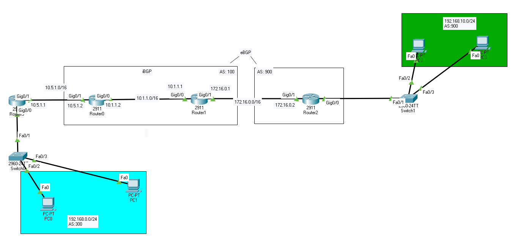

# BGP (Border Gateway protocol)

- [Reititysprotokolla](#Reititysprotokolla)
  * [BGP protokollan käyttö](#BGP-protokollan-käyttö)
- [Autonominen järjestelmä](#Autonominen-järjestelmä)
  * [AS numero](#AS-numero)
- [eBGP and iBGP](#eBGP-and-iBGP)
- [BGP options](#BGP-options)
  * [Default route](#Default-route)
  * [Default route and ISP Routes](#Default-route-and-ISP-Routes)
  * [All internet routes](#All-internet-routes)
- [Komennot](#Komennot)
  * [verifying](#verifying)
- [tutoriaalit ja muu guide oppaat](#tutoriaalit-ja-muu-guide-oppaat)

# Reititysprotokolla

BGP (border gateway protocol) mikä on Internetin reitityksen protokolla, mitä tarkoituksena on hoittaa reititysekn autonomisten järjestelmän (autonomous systems, lyhenne: *AS*) välillä. BGP tukee luokatonta reititystä ja käyttää reittien yhdistämistä pitäkseen reititystaulukojen koon pienenä. 

Kaksi tyypistä BGP mallista (External & Internal) External BGP (eBGP) - naapurit, jotka yhdistävät erillisenä autonomisen järjestelmän. Internal BGP (iBGP) - naaprurit samssa autonomisessa järjestelmässä.

Vähä niin kuin mainostaa ensin, mitä lähellä löytyy, kuin "OSPF" melkee. Ensin mainostaa oma lähialueet "network (ip-add)", ja määrittää naapruin AS luvun, mikäli on olemassa. Kaapelointi tulee olemaan suorakytkentä, ei mitään ristiinkytkentöi tai serial kaapelia.

## BGP protokollan käyttö

BGP käyttöä ei ole välttämätöntä, kun sitä tarvitaan useita Internet-yhteyksissä. Lähtevien liikenteessä vikasietoisuus tai redudanssi voidaan helposti hoitaa, joko IGP:llä, kuten OSPF tai EIGRP. BGP on myös tarpeetonta, jos ulkoisen AS (kuten internet) on vain yksi yhteys. Linjalla on yli 100 000 reittiä Internetissä ja sisätiloissa reitittimissä ei pitäisi turhaan kuormittaa.

Esim tai ehkä (multi-homed AS Topology) ISP (internet service provider) Internetin - palveluntarjoaja.  

Yritys (OSP) ---- BGP---- ISP-3 (EIGRP) -----BGP------ jakautuu joko ISP-2 ja Content Provider(OSPF)  

ISP-2 ----- BGP ---- COntent Provider (OSPF)

staatisessa reitityksessa tilanteessa ei kannata käyttää BGP:tä

BGP:ssä käytetään kahdessa reitittämisen itsenäisessä järjestelmässä iBGP ja vastoin protokollan Internet-sovelluksessa eBGP.

# Autonominen järjestelmä
Autonominen järjestelmä = AS (autonomous system)

Tarkoittaa TCP/IP- reitityksenprotokolla, käytettävissä yksittisen toimijan verkkokokonaisuutta.

Omistaja vastaa tiettyjen IP-osoitetta liikenteen reitityksellä perille. AS järjestelmässä on tunnettava toisensa ja niiden on käytettävä erityisen autonomisen järjestelsmä välisen reititykseen suunniteltujen protokollaan IP-osoitteen kertomisella.

## AS numero

# eBGP and iBGP

BGP:ssä käytetään kahdessa reitittämisen itsenäisessä järjestelmässä iBGP ja vastoin protokollan Internet-sovelluksessa eBGP.

iBGP: n ja eBGP-vertaisarvioinnin välillä on tavassa, jolla yhdeltä vertaiselta vastaanotetut reitit levitetään muille vertaisryhmille. Esimerkiksi uudet reitit oppinut peräisin eBGP peer tyypillisesti uudelleen kaikille iBGP ikäisensä sekä kaikki muut eBGP ikäisensä (jos kauttakulku on käytössä reitittimen). 
Jos kuitenkin uusia reittejä opitaan iBGP-vertaisverkossa, niitä mainostetaan uudelleen vain kaikille eBGP-vertaisryhmille.
Nämä reitin etenemissäännöt edellyttävät tosiasiallisesti, että kaikki iBGP-vertaisryhmät AS: n sisällä ovat yhteydessä toisiinsa täydellä silmällä.

iBGP on vähä kuin oma grouppi routerit, ja routeri jatkaa siitä eteenpäin sitä kutsutaan eBGP, vähä kuin edellisen BGP-1 harjoituksessa.

Tai kaksi erii AS lukua sitä kutsutaan kuin eBGP  
esim;; AS(100) -----eBGP----- AS(200)

# BGP options
## Default route

## Default route and ISP Routes

## All internet routes

# Komennot

## verifying

Tarkista BGP konffaus ja yms reititystaulukkot:  

$ show running-config | begin bgp  
$ show run | begin bgp  
$ show ip bgp  
$  show ip bgp neighbors  

kaikki protokollat:  
$ show ip protocols

perus reititystaulukko:  
$ show ip route

# tutoriaalit ja muu guide oppaat
