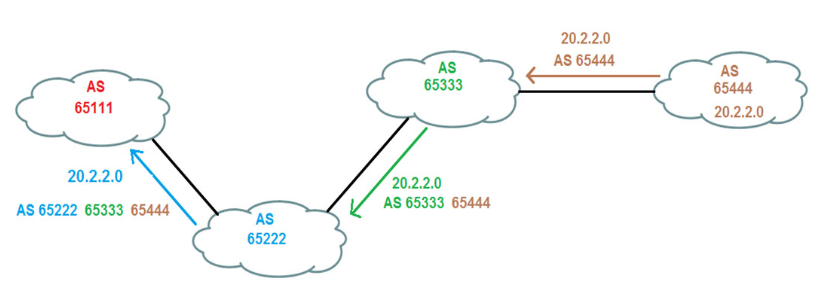
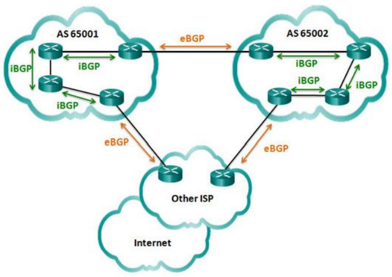
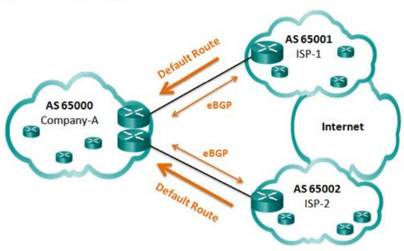
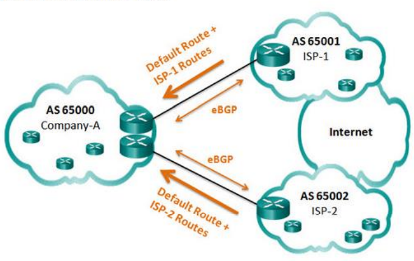
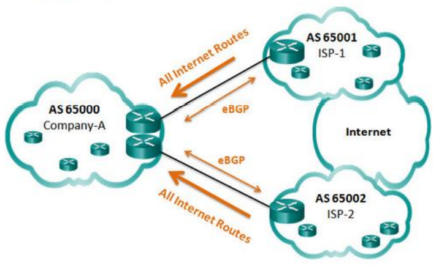

# BGP (Border Gateway protocol)

- [Reititysprotokolla](#Reititysprotokolla)
  * [BGP protokollan käyttö](#BGP-protokollan-käyttö)
- [Autonominen järjestelmä](#Autonominen-järjestelmä)
  * [AS numero](#AS-numero)
- [eBGP and iBGP](#eBGP-and-iBGP)
- [BGP options](#BGP-options)
  * [Default route](#Default-route)
  * [Default route and ISP Routes](#Default-route-and-ISP-Routes)
  * [All internet routes](#All-internet-routes)
- [Komennot](#Komennot)
- [tutoriaalit ja muu guide oppaat](#tutoriaalit-ja-muu-guide-oppaat)

# Reititysprotokolla

BGP (border gateway protocol) mikä on Internetin reitityksen protokolla, mitä tarkoituksena on hoittaa reititysekn autonomisten järjestelmän (autonomous systems, lyhenne: *AS*) välillä. BGP tukee luokatonta reititystä ja käyttää reittien yhdistämistä pitäkseen reititystaulukojen koon pienenä. 

## BGP protokollan käyttö

# Autonominen järjestelmä
Autonominen järjestelmä = AS (autonomous system)

Tarkoittaa TCP/IP- reitityksenprotokolla, käytettävissä yksittisen toimijan verkkokokonaisuutta.

Omistaja vastaa tiettyjen IP-osoitetta liikenteen reitityksellä perille. AS järjestelmässä on tunnettava toisensa ja niiden on käytettävä erityisen autonomisen järjestelsmä välisen reititykseen suunniteltujen protokollaan IP-osoitteen kertomisella.

## AS numero

# eBGP and iBGP

# BGP options
## Default route

## Default route and ISP Routes

## All internet routes

# Komennot

# tutoriaalit ja muu guide oppaat
