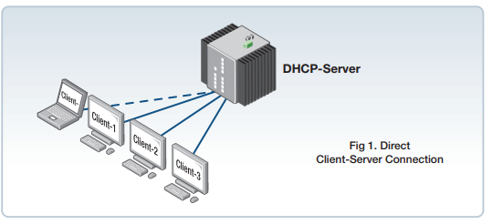
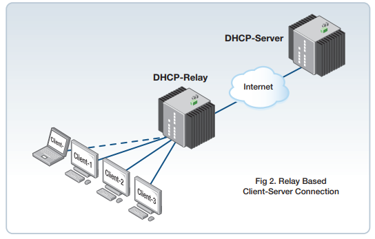
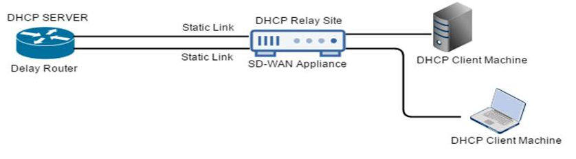

# DHCP (Dynamic host configuration protocol) 

DHCP protokolla mikä on yleinen tehtävä, mikä jakaa IP-osoitteita lähiverkkon tuelle, jopa esim. käyttäjä tietokone isännälle tai muille kytketyille laiteelle.
Ylläpiätäjä antaa tietyn IP-osoitteen, mitä jokainen laite pyyttää käynnistyksen  yhteydessä DHCP-palvelimeen oman IP-osoitteelle.

Myös annettun IP-osoite voi olla määrä-aikainen, ja yksinkertaista asiakaskoneiden asetuksien hallinta. DHCP-palvelin voi jakaa asiakkaille myös muita asetuksia, kuten oletusyhdyskäytävä (default gateway) ja nimipalvelin IP-osoite

# Configurations

Konfiguroinnin määritystä usein tapahtuu reitittimessä, että suorittaisi kuin palvelin laite, jotta jakaa yksittäisen tai jakaa kohteen IP-osoitteen koneen laiteistolle. Myös vaihtoehtoisena on määrittää DHCP määrityksen fyysisen serverin palvelimen siään, jotta ei tarvitse suorittaa reitittimen DHCP määritystä, mutta keinoja voi olla monta. Saman määrityksessä DHCP pitää olla tekijä nimi, jotta lajittaa esim. yksittäisen VLAN organisaatioille tai muu tarkoitetuun tekijänsä kuten osoittaa yksittäistä tekijää esim. tulostin, pöytä/läppäri, vanhat pöytäpuhelin luurit tai muuhun käyttöön tarkoitukseen.

# DHCP Relay

DHCP relay agent, mitä ikään kuin tukee tai välittää porttien saamista DHCP serverin tai sisäisen reittimen DHCP määriytstä, jotta pitää määrittää ip helper-address - osoite, mitä tietokoneiden isännät saavat sitä satunnaisen DHCP protokollan IP-osoitteen määrityksen. DHCP-palvelin ja käyttäjän välissä tapahtuu eri kuin palvelin, että eri verkot. DHCP relay vastaanottavat DHCP-viestejä ja luovat sitten uuden DHCP-sanoman lähetettäväksi toisella käyttöliittymän (interface). 

| konffaus step | kuvaus |
| ------------- |----- |
| $Router> enable | kirjauduttaan reitittimen sisään, mikäli on salsana määritetty turvallisuuden takia |
| $Router# configure terminal | mennään konfigurointien sisään ja määritettään asetukset | 
| esimerkki, kun määritettään kyseisen portille   Router(config)# interface FastEthernet0/0 | konfiguroidaan interface portti numero |
| ip helper-address address esimerkki   Router(config-if)# ip helper-address 172.16.1.2 | Välittää UPD-lähetykset, mukaan lukien BOOTP ja DHCP.   - Osoiteargumentti voi olla tietty DHCP-palvelimen osoite tai se voi olla verkko-osoite, jos muut DHCP-palvelimet ovat kohdeverkkosegmentissä. Verkko-osoitteen avulla muut palvelimet voivat vastata DHCP-pyyntöihin.   - jos on useita palvelimia, voi määrittää yhden avustajan osoitteen kullekin palvelimelle.

Jos huawei ympäristössä menisi $dhcp relay server-ip, ja sama poistettaan määritys tai kyseinen ip-osoite $undo dhcp relay server-ip

Verkon ylläpitäjä voivat käyttää SD-WAN (software-denied wide area network) - laitteiden DHCP relay palvelua pyyntöjen ja vastausten välittämistä paikallisen DHCP-asiakkaiden/käyttäjien ja DHCP-etäpalvelimen välillä. Sitä sen avula voi paikallistaa isännät, jotta voivat hankkia/käyttää dynaamisisa IP-osoitteiden DHCP etäpalvelinta. DHCP relay vastaanottaa DHCP viestiä, ja luoo uuden DHCP viestin lähettäville toisille liitännälle.

# linkkit ja muut tutoriaalit: 
https://www.cisco.com/en/US/docs/ios/12_4t/ip_addr/configuration/guide/htdhcpre.pdf  
https://docs.citrix.com/en-us/citrix-sd-wan/current-release/dhcp-server-and-dhcp-relay.html  
https://doc-pak.undip.ac.id/7992/1/Prosiding_ICITACEE2019_2.pdf  
https://www.alliedtelesis.com/sites/default/files/documents/configuration-guides/dhcp_feature_overview_guide.pdf  
https://www.juniper.net/documentation/en_US/release-independent/nce/information-products/pathway-pages/nce/nce-216-evpn-dhcp-relay.pdf  
 
 
