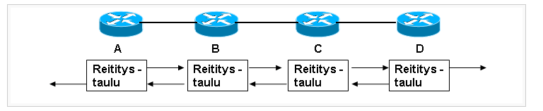

# Dynaaminen reititys

Dynaaminen reititys, mitä helpoiten muistaa reititimen mainostaa lähistön ip-osoitetta. Perinteisesti se tiedonsiirron protokollapinon verkkokerroksen osa, joka päättää, mihin ulostuloihin sisään tulevat datapaketit lähetetään. Tietoliikenne ohjataan kulkemaan tietoliikenneverkossa reittiä, joka kuluttaa vähiten joitakin resursseja.  

Jokaisen reititin vastaanottaa reititystaulun naapurilta. vähä kuin mainostaa naapurin IP-osoitetta, että sillä tallentaa tiedot omaan reititystaulukkoon ja näin se kasvatata sitä etäisyysvektoria ja jne. Tämä tapahtuu säännöllisin väliajoin suoraan naapureina olevien reitittimien kesken molempiin suuntiin.

Kun reititin havaitsee topologian, muuta reititystä protokolla voi mainostaa tätä muutosta muille reittitimille.

Lähentymisominaisuudet sisältävät reitityksen etenemisnopeuden tietoa ja optimaalisten reittien laskeminen. Nopeus eteneminen tarkoittaa aikaa, joka verkon reitittimillä kestää reititystietojen välittämiseen. Yleensä vanhemmat protokollat, kuten RIP, lähestyvät hitaasti, ottaa huomioon, että nykyaikaiset protokollat, kuten EIGRP ja OSPF, lähestyvät toisiaan nopeammin.

* [versiot](#versiot)
* [commands](#commands)
* [router rip](#router-rip)

## versiot

RIP versio 2
RIP versio 1 ja 2 ovat etäisyysvektori reititys protokollia, 
jotka käyttävät reiittimen hyppylaskentaa (router hop) mittareina.
Ne tukevat maksimihyppymäärän arvoa 15. 

RIPV4 tärkein parannus edelliseen version se on, että lähettää ensin aliverkon peitteen päivitysten mukana.
Se pystyy erottamaan eri aliverkon (subnet mask)- mitä ei löydy ripv1:stä

## commands

Tarkista reititystaulukko

$show ip protocols
$show ip route | begin gateway
$show ip route | begin default
$show ip route
  
## router rip

- None—The router neither broadcasts its route table nor does it accept any RIP packets from other routers. This option disables RIP.  

- In Only—The router accepts RIP information from other router, but does not broadcast its routing table.  

- Out Only—The router broadcasts its routing table periodically but does not accept RIP information from other routers.  

- Both—The router both broadcasts its routing table and also processes RIP information received from other routers.  

 

RIP version  

- RIP-1—This is a class-based routing version that does not include subnet information. RIP-1 is the most commonly supported version.  
- RIP-2B—This version broadcasts data in the entire subnet.  
- RIP-2M—This version sends data to multicast addresses.  
