# EIGRP (Enhanced Interior Gateway Routing Protocol )

- [EIGRP K-arvot](#EIGRP-K-arvot)
- [EIGRP operaatio (kaistanleveys ja viive)](#EIGRP-operaatio-(kaistanleveys-ja-viive))
- [EIGRP Metric matematiikka](#EIGRP-Metric-matematiikka)
  * [Metric lasku toimitus](#Metric-lasku-toimitus)
  * [Ensimmäinen lasku esimerkki](#Ensimmäinen-lasku-esimerkki)
  * [Toinen lasku esimerkki](#Toinen-lasku-esimerkki)
- [EIGRP DUAL algoritmi](#EIGRP-DUAL-algoritmi)
- [Configurointi ja Wildmask](#Configurointi-ja-Wildmask)
  * [EIGRP passive interfaces](#EIGRP-passive-interfaces)
- [EIGRP infot & protokollan ja muut infot](#EIGRP-infot-&-protokollan-ja-muut-infot)

EIGRP on oma reititysprotokolla, mikä perustuu Cisco alkuperäisen IGRP-protokollasta. EIGRP on edistyksellinen etäisyysvektorin reititysprotokolla, mitä sisältää optimointeja, mitä tarkoituksena on minimoida kaikkia topologian muutoksien aiheutumia reitityksen epävakautta, sekä reitittimen kaistanleveyden käyttöä ja käsittelytehoa. EIGRP eroaa useimmista muista etävektoriprotokollista siinä, että se ei luota jaksottaisiin reitin kaatopaikkoihin, joten se pystyy ylläpitämään topologian taulukkoa. EIGRP käyttää reittien valinta oman DUAL-algoritmia, että reititysilmukka ei synny. DUAL-algoritmi reittiminen pitää pysyä selvittämään, että laite on suoraan kytketty, että hello-viestin avulla EIGRP selvittää ovatko naapurilaitteet reitittimiä vai ei.

EIGRP:ssä tapahtuu metric laskenta, mitä laskee reitityksen kaistanleveyden (bandwidth), viiveen (delay), luotettavuus (reliability) ja kuormituksen (load). Oletusarvoa lasketaan vain kaistanleveyttä ja viiveen kautta, jotta saadaan tulokseen metriikka, ja luotettavuus ja kuormitus on asetettu nollaan.

EIGRP lähettää päivitystietoja verkosta vain, jos tapahtuu muutos, kuten yhteys poikki tai laite hajoaa. Protokolla tukee myös luokatonta reititystä CIDR (Classless Inter-Domain Routing) sekä kuormantaustasta, että pitää tehkokkaan kuormittavan liikkaa reitittimen resurssia. 

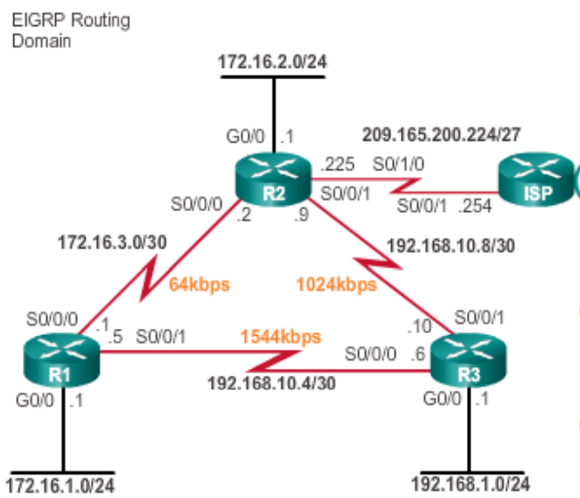

Kolme tyyppistä taulukkoa:  
- Naapuri-informaatio / Neighbor table  
 mm. naapurien osoitteet ja ”local interface”)  
 &nbsp; $show ip eigrp neighbors

- topology table (topologitaulu)  
&nbsp; tarkistaa reitityksen metric luvun, että toteutumisen ja raportoidun etäisyyden. Myös hyppystä, että jos (kuin reititystaulukko komento)
  $show ip eigrp topology   
  
- Varsinaisen reititystaulukko / Routing table  
  tarkistaa koko reitityksen yhteydet, protokollat (EIGRP, OSPF, staatinen tai dynaaminen), myös EIGRP metric luku  
  &nbsp; $show ip route
  
- tarkista reitittimen porttien kaistanleveys (bandwidth), ja usein ovat nimetty BW XY Kbit/sec.  
&nbsp; Jos reitittimeen kytkeytyy serial johto, mitä oletuksena on aina  1544 kb/s  
&nbsp; $show interfaces [portti-luku]

# EIGRP K-arvot

Toiminassa tapahtuu naapurien löytäminen, topologien tietojen vaihtaminen ja reittien valinta. Naapurien löytäkseen tapahtuu <i> Hello </i> viestiä IP-osoitteseen kautta, että löytäkseen potentiaalisen vereisen naapurin EIGRP reitittimen, ja suorittaa parametrin tarkistuksen tarkastaen, mistä reitittimistä pitää tulla naapuri. Myös tarkastuksen sisältävät nelljä kohtaa:

1. Pitää läpäistä autentikointi toiminnan
2. Pitää olla konfiguroitu käyttämällä samaa autonomisen systeemin (AS = autonomous system) numeron.
3. Naapurien reititimien lähde IP-osoite, mitä pitää olla samassa aliverkossa kuin lokaalinen reitittimen IP-osoite ja maski.
4. Reitittimien K-arvojen pitää täsmätä, ja Cisco järjestelmä ei suosittele vaihtamista, koska ovat määritetty oletuksena. K-arvoja on:

| K-arvot | Osat  | Kuvaus teksti  |
| ------- | --- | --- |
| K1 | kaistanleveys (bandwidth) | reititin alhaisin kaistanleveys |
| K2 | kuorma (load) | reitin huonoin kuormitus pakettinopeuden perusteella |
| K3 | viive (delay) | reititin kumulatiivinen rajapinnan viive |
| K4 | luotettavuus (reliability) | Luotettavuuden perustuen reitin hengissä pysyminen |
| K5 | MTU (reliability | Pienin MTU reitissä (ei käytetä reitin laskemisessa) |

<h2> EIGRP K-arvojen oletusluvut </h2>

| Setting | Default Value |
| ----- | ------------ |
| K1 | 1 |
| K2 | 0 |
| K3 | 1 |
| K4 | 0 |
| K5 | 0 |

# EIGRP operaatio (kaistanleveys ja viive)

EIGRP protokollan reitityksessä lasketaan metrikkaa (metric), että jakautuu kahteen osaan, kaistanleveyttä ja viivettä. Muitakin asetuksia on mahdollista suoraan peilaten K-arvoihin, kuormitus ja luotettavuuteen. Metrikkaan tulosta tapahtuu EIGRP konfiguroinnin jälkeen, että reititin ymmärtää EIGRP rakennetta ja komenolla ($show ip route) löytää metrikkaan tuloksen. Tuloksesta kertoo reitityksen seuraaja <b> (DUAL) </b>, että mahdolliisen seuraaja IP-osoite. Seuraaja reitti märittää mittarin määränpäähän saavuttamista, että reitti on tallennettu reititystaulukoon. Toteutettava seuraaja on varapolku samaan määränpäähän, jota voidaan käyttää välittömästi, jos seuraajareitti epäonnistuu.

<b> Oletus EIGRP käyttöliittymien kaaplien/johtojen metriika taulukko </b>

# EIGRP Metric matematiikka

Jokaisessa reitittimen portissa on käyttölittymä tyyppi, että määrittyy reitittimen naaras ethernet, giga tai serial portti. Jokaisen porttissa on jokin ominaisuus kuten viive, kaistanleveys ja muu oletuksen luvun suuruus. Myös konfiguroinnissa voi määrittää manuaalisen kaistanleveyden luvun, että metriikka luku muuttuu saman aikaisesti. Komenolla $show interface (portti-nimi-luku), että löytää kyseisen porttien taustat kuten tiedonsiirto nopeus, kaistanleveys, viive, määritettyn manuaalinen IP-osoite ja muita data yksikköitä. 

K-taulukkojen arvojen ja yksikköt, että tässä kuvassa on reitittimen porttien teknisien luvujen tyyppit. MTU osoittaa MTU K5, BW tarkoittaa Bandwidth K1 (kaistanleveys), DLY tarkoittaa Delay K3 (viive), Reliability tarkoittaa luotettavuus K4 ja kohta 255/255, viimeisenä rxload tarkoittaa load K2 (kuorma)

Oletuksena serial kaapeli on kaistanleveydeltään 1 544 Kb/s. Jos muutettaan serial kaapelin kaistanleveyttä manuaalisesti, mitä reitityksentaulukkon metriikka summa muuttuu samantien. 

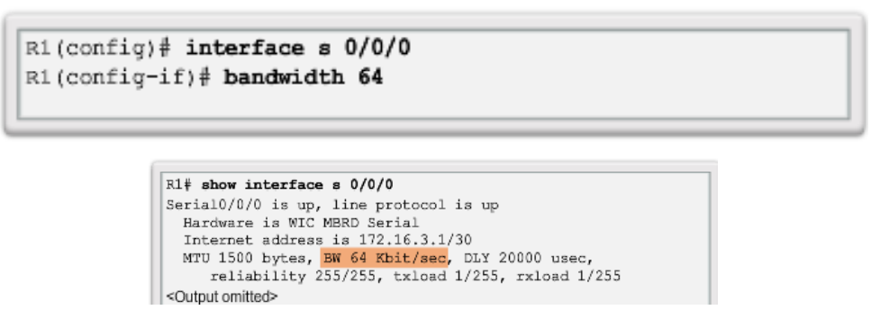

## Metric lasku toimitus

Lasku toimitus menee kaavan mukaan, mutta helpoiten ymmärtää tällä, ja käytettään:  
( (10^7 / Bandwidth) +  total delay / 10) ) * 256 = metric  
<b> nuolenkärki osoittava kaava </b>  

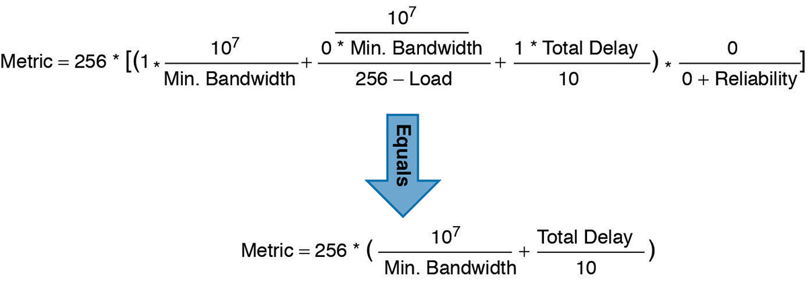

## Ensimmäinen lasku esimerkki 

Jos on määrittänyt EIGRP protokollan konfiguroinnin, että pinggaukset toimivat, koneet kommunikoivat, reitittimen porttit ovat päällä ja käyttää oletuksen reitittimen kaistanleveyden summaa. Myös käytettään tämän alemman kuvan esimerkkiä. Metric suuruudesta kulkeutuu nopeamman reitityksen mukaan, koska gigabitEthernet:issä on vähemmän viivettä, jos tarkistaa reitityksen taulukkon, mitä tulostuu/näkyy [90/3072]. Koska pinggauksen viesti kulkeutuu Router-0 :sta --> Router-1 --> Router-2:lle. Jos Router-0:n reitittimen gigabitEthernet:n sammuu, joten viesti paketti kulkeutuu serial kaapelin kautta, sekä reitityksentaulukkon metric päivittyy samantien.

Myös kaistanleveys tarkoittaa myös synonyymissä tiedonsiirtonopeus, että paketti viesti välitetään lähettäjältä vastaanottajalle. Kaistanleveys yksikkö on <ins> bit/s </ins> tai <ins> bps</ins>, mutta lasku toimituksessa tapahtuu aina Kbit/s. Kun tarkistaa reitityksentaulukkon, mitä näkee kaistanleveyden summan, että yksikkön. 

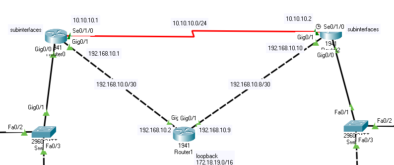

Komennolla tarkistaa tavallisen reititystaulukkon ($show ip route) tai EIGRP reititystaulukkon ($show ip router eigrp). Tavallisessa reititystaulukkossa näkyy, mitä tähän kohteen reitittimeen on konfiguroitu, yhteys ja muu kohteen IP-osoite, sekä tarkennettun reitittimen portti numero kohde. EIGRP tarkistaa samantien metriikkan luvun.

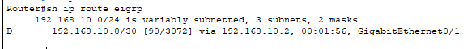

Lasku toimitus menee kaavan mukaan (nuolenkärjen osoittava kaava), että käyttää pienintä kaistanleveyttä kaikissa lähteen, ja kohteen välisen liittännässä. Jos serial kaapeli johto on päällä tai ei, se viesti paketti kulkeutuu pienen viiveen kautta, koska jotta viesti pääsee nopeasti perille vastaanottajan luoksen. Tässä esimerkkissä käytettään oletuksena käytettään GigabitEthernet porttia, että sen kaistanleveys (bandwidth) on 1 000 000 ( kbps / b/s). 

Jos reitityksen välissä on yksi tai useampi reititin, mitä tarkoittaa viesti lähtee eteenpäin kuljettakseen viestin vastaanottajaan, ja viesti kuin hyppii kaapelin/reitittimen ylitse. Tätä kutsutaan viiveeksi, koska reitin viive, että jokaisen reitittimen välisen johdossa on oma viive kuten Gigabit Ethernet:issä on 10s viive, serial kaapelissa 20 000 <b> ( tarkista metriikka taulukko) </b>.

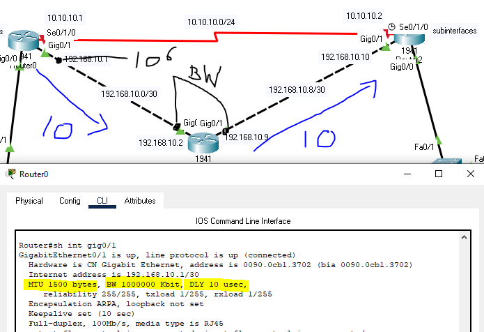

Kone lähettää viestin, mitä kulkeutuu nopeamman ja vähemmän viiveen kautta siksi lähtee Router-0 Gigabit Ethernet:istä kohti Router-1 ja viimeisenä Router-2:lle. Kuvassa on piiretty kaksi kertaa (10) delay, mikä tarkoittaa laskussa lasketaan yhteen, että reitityksessä kulkeutuu kokonais GigabitEthernet johto. Myös viiveessä jaettaan 10, koska skaalauttu viive, siksi pitää laskea reititykse viiveet yhteen, ja viimeisenä jakaa 10.  

Lasku kaava: ( ( 10 ^7 / Bandwidth ) + ( Delay-jump / 10) ) * 256 = metric   bandwidth + delay = metric  

10^7 = 10 000 000 & 10^6 = 1 000 000  
 ( (10^7 / 10^6) / ( (10+10) / 10 ) ) )* 256 = metric  
 ( (10 + (20 / 10 )) * 256 = metric ) 
 ( 10 + 2 ) * 256 = <ins> 3 072 </ins>

## Toinen lasku esimerkki

Toisessa laskutoimituksessa, jos nopeamman reitityksen viive yhtäkkiä portti sammuu/katkaisee tai muu huolto ongelma, mitä vaihtoehtona on kulkea toisesta reitistä.

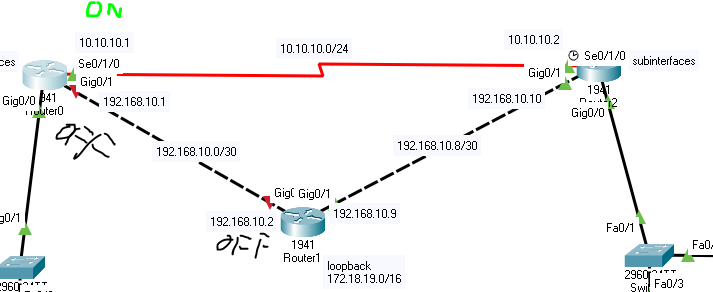

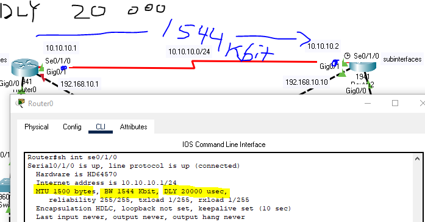

# EIGRP DUAL algoritmi

Parhaissa reitin määritelyssä EIGRP:ssä hyödyntää DUAL algoritmia (Diffused Update Algorithm). DUAL takaa silmukattomat ja varmuuskopioidut polut koko reititysalueella. DUAL-toimintoa laskeakseen parhaat reitit kuhunkin kohteeseen, mukaan lukien mittarin ja seuraavan hypyn reitittimen, ja päivittää reititystaulukkonsa parhailla reiteillä. DUAL ja päivittää reititystaulukkonsa parhailla löydetyillä reiteillä. Jos reittiä ei löydy, uusi reitti kohteena pyrkii löytää naapurien avulla.

DUAL käyttää useita termejä, joita käsittelee tässä taulukossa: 

| Dual termit | Termien kuvaus |
| ----- | ------------ |
| Successor | Seuraaja, kohteen/vastaanottajan IP-osoite |
| Feasible successors (FS) | Kuvastaa vaihtoehtoista reittiä kohdeverkkoon |
| Reported Distance (RD) | Reitin arvo naapurireitittmen ja kohdeverkon välillä |
| Feasible Distance (FD) | Kuvastaa parasta reittiä kohdeverkkoon |

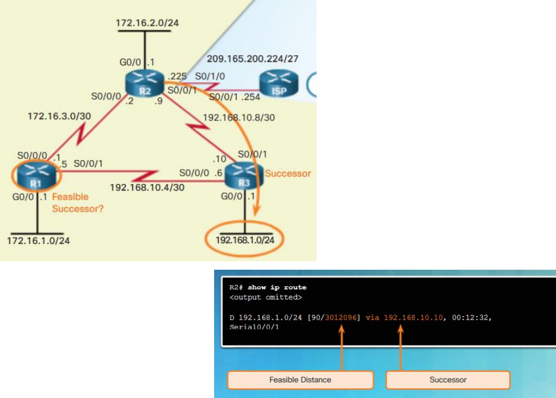

# Configurointi ja Wildmask 

## EIGRP passive interfaces

Komento käskee käyttöliittymää kuuntelemaan muita reitityksen protokollan määrityksiä kuten dynaaminen RIP ja IGRP reittejä, mutta ei mainosta niitä. Käyttäytymnisessä vaihtelee protokollasta toiseen. EIGRP:N passiivista rajapintaa käytettäessä lopettaa lähetävien "hello"-viestiä lähetätmistä, joten reititin ei voi muodostaa naapurialueita passiivisen rajapinnan kautta. Passiivisen käyttöliittymän komentoa voidaan käyttää naapurivierailujen pysäyttämiseen. Komentoa voidaan käyttää reitittimen konfigurointitilassa. Mahdollistamme passiivisen rajapinnan estämään tarpeetonta päivitysliikennettä, esimerkiksi kun liitäntä on LAN-liitäntä, johon ei ole kytketty muita reitittimiä. Se lisää myös suojausohjaimia, kuten estämään tuntemattoman huijarin reitityslaitteita vastaanottamasta EIGRP-päivityksiä.

Periaatteessa dynaaminen RIP ja EIGRP voi konfiguroida Router-X sisään, mutta sisäisen mainostava IP-osoite, mitä pitää osoittaa vastapäässä/menevä kaapeli/johto.  
-----(RIP)---Gig0/1 (Router-X)---- Serial 0/1/1 & Serial 0/1/0-----(EIGRP).
Komennon kohdalla tulee oltava "tarkanna" tai voi olla "monimutkainen", että kumpaan tulee passive portti tai ei

Passive komento, mitä ovi vähentää suorittimen reitityskuormitusta vähentämällä niiden liitäntöjen määrää, jolloin protokollan on kommunikoitava.

OSPF ja EIGRP:ssä tätä komento poistaa kokonaan kyseisen liitännän reitinkäsittelyn käytöstä. Käytä tätä komentoa vain, jos että reititysprotokollan ei tarvitse puhua millekään määritetyssä käyttöliittymässä.

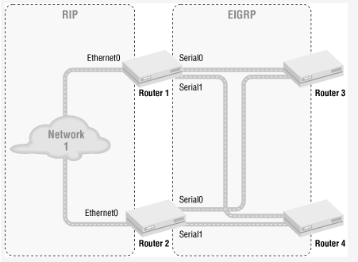
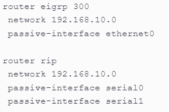

# EIGRP infot & protokollan ja muut infot

https://www.cisco.com/c/en/us/support/docs/ip/enhanced-interior-gateway-routing-protocol-eigrp/16406-eigrp-toc.html

<h2>metriikka laskut</h2>
https://www.cisco.com/c/en/us/td/docs/ios-xml/ios/iproute_eigrp/configuration/15-mt/ire-15-mt-book/ire-wid-met.html
https://www.ciscopress.com/articles/article.asp?p=2999383&seqNum=4
https://www.computernetworkingnotes.com/ccna-study-guide/eigrp-metric-k-values-explained-with-examples.html

https://www.omnisecu.com/cisco-certified-network-associate-ccna/eigrp-metric-calculation-formula-example.php
