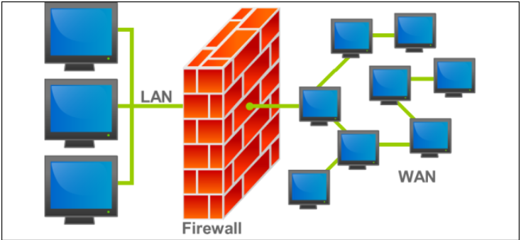

# Fireweall - palomuuri

- [Cisco packet tracer](#Cisco-packet-tracer)
- [Security level](#Security-level)
- [guide, oppaat ja konfiguroinnit:](#guide,-oppaat-ja-konfiguroinnit)
  * [konfiguraatiot:](#konfiguraatiot:)
  * [asa 5505](#asa-5505)

# Cisco packet tracer

CIsco simulaatiossa on kaksi tyypistä palomuuri kytkintä (5506-x ja 5505), mutta todellisuudessa voi olla useampi mallinen, että nämä kaksi tukee simulaatiossa. Nimeämisessä käytettään *ASA* eli Adaptive Seuciryt appliances, ja 5506-x on wifi point mukana.

# Security level

# guide, oppaat ja konfiguroinnit:  

https://www.cisco.com/c/en/us/td/docs/security/asa/asa96/configuration/firewall/asa-96-firewall-config.pdf  

## asa 5505

https://www.routerfreak.com/basic-configuration-tutorial-cisco-asa-5505-firewall/ 

## konfiguraatiot:  

