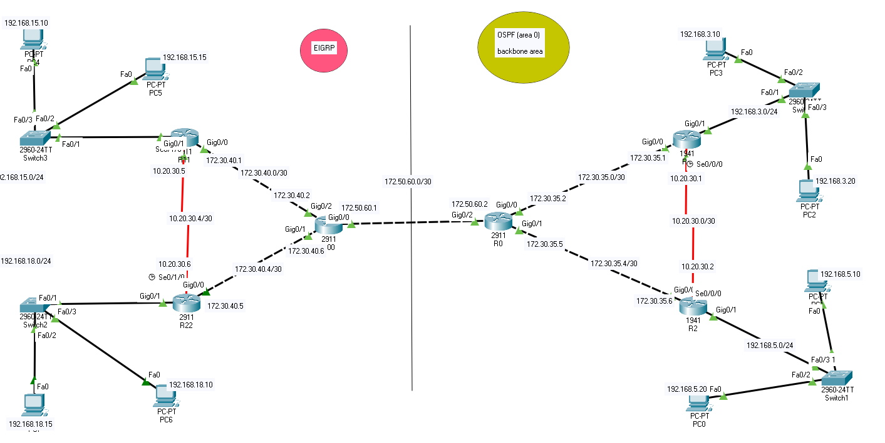
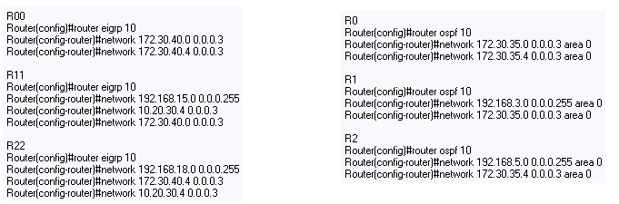
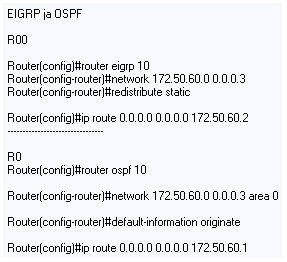
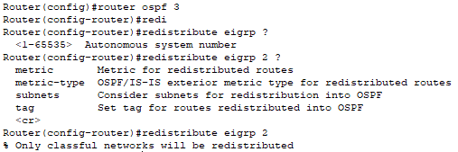
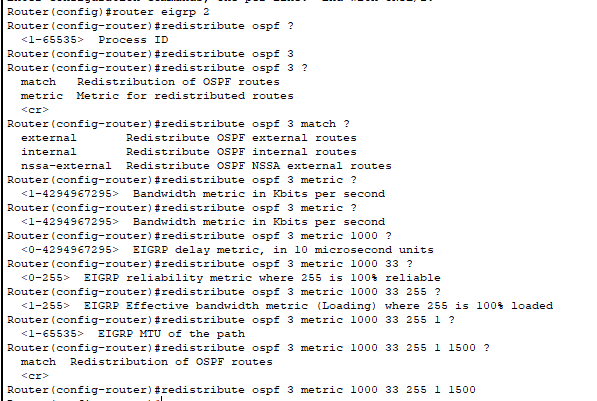
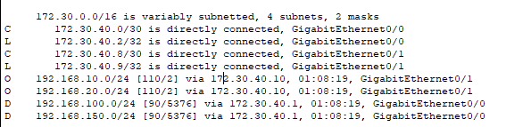
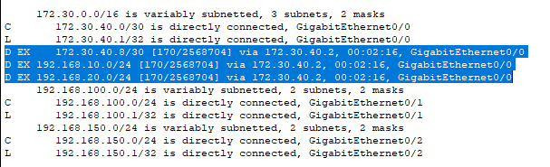
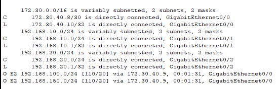

# OSPF ja EIGRP combo

- [configurations](#configurations)
  * [OSPF default route](#OSPF-default-route)
  * [redistribution](#redistribution)
  * [redistribution configurations](#redistribution-configurations)
  * [reititystaulukko](#reititystaulukko)
- [guide, tutoriaalit ja yms](#guide,-tutoriaalit-ja-yms)

Reitityksessä tapahtuu pientä *redistributing* , mitä kuin tapahtuu jakamisen uudelleen ja yhteenvetoa (summization). Koska useissa verkoissa on erilaisia reititysprotokollia ja tarvitsee jonkinlaisen menetelmän vaihtamiseen, jotta suorittavat reitityksen välillä, siksi kutsuttaan *redistributing*. Molemmissa tapahtuu cost ja metric menetelmä, koska OSPF:ssä käyttää cost ja EIGRP:ssä käyttää k-arvoja, mitä eivät sovi yhteen, ja RIP käyttää hyppylaskua. 

Lisäksi *redistributing* tuoo toisen ongelman kuin, jos et *import* eli tuo reititsytietoa yhdestä reititysprotokollasta toiseen , että on mahdollista luoda reitityssilmukoita. 

# configurations

Konfiguroinnissa voi tapahtuua oletuksena sen alueen protokollan määritys eli mainostaa oman OSPF ja EIGRP reitityksen, että lisää perintiesen staatisen reitityksen kuin toisi toisen puolen raja puolelta tulevia organisaatioita. Myös määrityksessä on mahdollista keinoa, jotta saisi OSPF ja EIGRP protokollan kommunikoitua yhdessä. Toiminnassa vaikuttaa useiden protokollien määrityksessä kuten dynaaminen RIP, staatinen IP route, ja muita reititysprotokollia. 

## OSPF default route

Normaalisessa alueen pistää oletuksen reitityksen, mitä voi olla peräisin mistä tahansa OSPF-reitiyksestä. OSPF voi luoda oletusreitin, mitä on käytettävä (default-information originate) komentoa "default-information originate". On kaksi tapaa mainostaa aluetta, mitä ensimmäisenä on 0.0.0.0 OSPF-tunnus, jos mainosreitittimet on oletusreittei. Toinen on 0.0.0.0:n mainostaminen riippumatta siitä, onko mainosreitittimellä jo oletusreitti. Toinen tapa voidaan toteuttaa lisäämällä avainsana aina oletusinformaation alkuperäkomentoon.  

Komento: "default-information originate"

  Staattisella oletusreitillä reitittimen tarvitsee vain tietää kohteen sisäisen organisaatiossa, ja käyttää oletusreittiä välittääkseen IP paketien muille osoitteile verkkoon. Myös tapahtuu, jos mainostaa OSPF ja EIGRP protokollien välisen yhteyden toisiinsa.

- EIGRP into OSPF

- OSPF into EIGRP

## redistribution

Reititysprotokollan tarkoituksena on mainostaa muille reititysprotokolille, että kuin suorittaisi kokoonpanon kuten staatinen, dynaaminen RIP, EIGRP ja OSPF tai muu perus suoraan yhdistetyille reiteille, joten tätä kutsutaan Suom. *uusjako / uudelleen jakaminen.* Usein yhessä reititysprotokollan käyttämisessä tapahtuu koko IP-verkko reititys, mitä usein tapahtuu sitä kokoonpanoa tai projektin luomista, kuten yrityksen fuusioiden, useiden verkovalvojen hallintaa, osastoa ja jopa useita toimittajia ympäristössä. Erilaisien reititysprotokollien suorittamista on usein osa verkon suunnittelua, koska jotta saataisi verkko ympäristöä toimimaan ja jakaa dataa asiakkaalle tai muille organisaatioille vastaavia tärkeitä pakettja/tietoja. 

Erot reititysprotokollan ominaisuuksissa, kuten mittareissa, hallinnollisissa etäisyyksissä, luokka- ja luokkattomissa ominaisuuksissa, voivat vaikuttaa uudelleenjakoon. Nämä erot on otettava huomioon, jotta uudelleenjako onnistuu. Reitityksellä tapahtuu, että käyttämällä erillisiä reititysprotokollia jotta haluaa yhdistää puolta verkosta muihin protokolliin.

Jos suorittaa staatista reititystä, mitä eigrp <num> sisään tulee komento kuin (redistribute static) ja samaan ospf <num> reitityksessä (default-information originate), jotta tapahtuu se special / mainonta kahden reitityksen protokollan ympäristössä. 
 
 

### redistribution configurations

Kahden reitityksenprotokollassa eli OSPF ja EIGRP tapahtuu syntaksi, ja määrityksessä vaikuttaa kuten EIGRP:n sisäisen K-arvojen termit eli: *kaistanelveys (bandwidth), viive (delay), luotettavuus (reliability)	, MTU (reliability).* Kuin EIGRP yrittäisi saada käsiksi OSPF protokollan, mitä vaikuttaa special komento.

Määrityksessä tapahtuu eng. *Redistribute OSPF into EIGRP* ja myös *Redistribute EIGRP into OSPF*, että jakaa molemmille reititysprotokollien tekijälle ominaisuutta, ja jotta ymmärtävät toisiaan.

- OSPF into EIGRP  

100 33 255 1 1500 - kuulemma on oletus arvoinen metrikka arvo   

Router(config)#router eigrp 2   
Router(config-router)#redistribute ospf ?  
  <1-65535>  Process ID  
Router(config-router)#redistribute ospf 3   
Router(config-router)#redistribute ospf 3 ?   
  match   Redistribution of OSPF routes  
  metric  Metric for redistributed routes   

Router(config-router)#redistribute ospf 3 match ?  
  external       Redistribute OSPF external routes  
  internal       Redistribute OSPF internal routes  
  nssa-external  Redistribute OSPF NSSA external routes  
  
Router(config-router)#redistribute ospf 3 metric ?  
  <1-4294967295>  Bandwidth metric in Kbits per second  
Router(config-router)#redistribute ospf 3 metric ?  
  <1-4294967295>  Bandwidth metric in Kbits per second  
Router(config-router)#redistribute ospf 3 metric 1000 ?  
  <0-4294967295>  EIGRP delay metric, in 10 microsecond units  
Router(config-router)#redistribute ospf 3 metric 1000 33 ?  
  <0-255>  EIGRP reliability metric where 255 is 100% reliable  
Router(config-router)#redistribute ospf 3 metric 1000 33 255 ?  
  <1-255>  EIGRP Effective bandwidth metric (Loading) where 255 is 100% loaded  
   
Router(config-router)#redistribute ospf 3 metric 1000 33 255 1 ?  
  <1-65535>  EIGRP MTU of the path  
Router(config-router)#redistribute ospf 3 metric 1000 33 255 1 1500 ?  
  match  Redistribution of OSPF routes  
  <cr>   
Router(config-router)#redistribute ospf 3 metric 1000 33 255 1 1500   

- EIGRP into OSPF

Router(config)#router ospf 3   
Router(config-router)#redistribute eigrp ?  
  <1-65535>  Autonomous system number   
Router(config-router)#redistribute eigrp 2 ?  
  metric       Metric for redistributed routes  
  metric-type  OSPF/IS-IS exterior metric type for redistributed routes  
  subnets      Consider subnets for redistribution into OSPF  
  tag          Set tag for routes redistributed into OSPF  
  <cr>  
Router(config-router)#redistribute eigrp 2  
% Only classful networks will be redistributed  

### reititystaulukko

   Kun on määrittänyt EIGRP:stä OSPF:lle ja OSPF:stä EIGRP:lle, niin tarkista reititystaulukko, jotta havaitsee tapahtuman muutoksen.

- Router-0  
   
 
- Router-1  
   
   
- Router-2  
   

# guide, tutoriaalit ja yms

https://www.cisco.com/c/en/us/support/docs/ip/open-shortest-path-first-ospf/47868-ospfdb9.html  
https://study-ccna.com/ospf-default-information-originate/  
https://www.cisco.com/c/en/us/support/docs/ip/enhanced-interior-gateway-routing-protocol-eigrp/8606-redist.html  
https://www.cisco.com/c/en/us/support/docs/ip/enhanced-interior-gateway-routing-protocol-eigrp/8606-redist.html#topic3  
https://spankbang.com/4vizt/video/casey+kisses+rocky+emerson+missed+opportunity  

https://www.timigate.com/2018/03/configuring-cisco-route-redistribution-between-eigrp-and-ospf.html
https://networklessons.com/cisco/ccie-enterprise-infrastructure/redistribution-between-eigrp-and-ospf

https://www.youtube.com/watch?v=gmvnfUFKLrY

