# OSPF (Open Shortest Path First)

- [OSPF areas](#OSPF-areas)
  * [LSA types](#LSA-types)
- [OSPF metric and cost](#OSPF-metric-and-cost)
  * [Cost](#Cost)
  * [cost säädöt](#cost-säädöt)
- [OSPF single and multi areas](#OSPF-single-and-multi-areas)
  * [Single areas](#Single-areas)
  * [Multi areas](#Multi-areas)
  * [Multi areas LSA types](#Multi-areas-LSA-types)
  * [Summarization](#Summarization)
  * [OSPF DR and BDR](#OSPF-DR-and-BDR)
- [OSPF configurations](#OSPF-configurations)
  * [Router ID](#Router-ID)
  * [Passive interfaces](#Passive-interfaces)
- [OSPF and EIGRP fusion](#OSPF-and-EIGRP-fusion)
- [OSPF tutoriaalit ja muut guide asiat](#OSPF-tutoriaalit-ja-muut-guide-asiat)

Sitä käytetään erityisesti Internet Protocol (tai IP) -verkoissa. Se on linkitilan reititysprotokolla ja yleisimmin ryhmitelty sisäisten yhdyskäytäväprotokollien kanssa. Se toimii yhden autonomisen järjestelmän (tai AS:n Autonomus System suom. itsenäistä järjestelmää) sisällä. OSPF luokitellaan linkkitilanprotokollana.

Version 1 oli testiversio, ja siitä kehitettiin eteenpäin. Version 2, mikä oli ensimmäinen yleinen versio OSFP:n. Ja versio 2:sta tapahtui muokkausta, ja syntyi version 3, mikä toimii IPV6-osoitteella. 

OSPF reitityksessä tallentaa reititys- ja topologien tiedot kuten: naapuri, topologian ja reititystaulukko. (Neighbor & topology & routing tables)

OSPF:n käyttävien reitittimien on luotava naapurisuhde ennen kuin tapahtuu reittien vaihtamista. Koska OSPF on linkkitilan reititysprotokolla, mitä naapurit eivät vaihda reititystaulukkoa, mutta sijaan vaihtavat tietoa verkon topologiasta. Jokaisen OSPF-reitin suorittaa sitten SPF-algoritmin (Shortest Path first) laskettakseen parhaan reitin, ja lisää ne reititystaulukkoon. Reititin laskee reititysprotokollan algoritmilla nopeimmat reitit itsensä, ja tietämänsä aliverkkojen välillä. Reititysprotkolla myös havaitsee tietojen muutosta, kuten katkenneista reiteistä tai reitittimien porttien muutosta.

OSPF protokollassa on viisi tyypistä aluetta (areas), mitkä autonominen järjestelmä voi jakaa alueitta, jotka auttavat vähentämään linkkitilailmoituksia, ja muutaa OSPF-yläliikennettä ja myös lähetettää verkkoon.

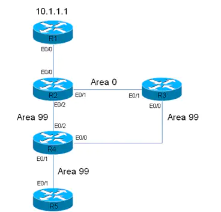

OSPF - reitityksen komennot, että käyttöliittymistä tarkistaa reitityksen taustat, reititystaulukkot, informaatiot ja muut yksityiskohdat:

| $komennot | komentojen kuvaus |
| --------- | -------- |
| show ip protocols | Tarkistaa koko reitittimien protokollan taustat ja reitityksen verkko ja IP-osoiteet, ja reitityksen informaatiot |
| show ip route | Tarkistaa reitittimen koko reititystaulukkon, että yhteys tyypit ja metriikka luvut |
| show ip route ospf | Tarkistaa vain ospf reitityksen määritettyn tiedot, että yksittäinen protokolla tekijänsä |
| show ip ospf interface | Tarkistaa informaation koko ospf aktiivisen käyttöliittymän, kuten porttien taustat, alue ja prosessin id |
| show ip ospf neighbor detail | Listaa ospf naapurien infot ja taustat kuten DR & BDR tekijät, ja muita IP-osoitteiden tietoja  |
| show ip ospf neighbor | Tarkistaa ospf reitittimien naapurien tausta, että näkyy IP-osoite, prioriteetti, valtio/aste (state) tekijänsä DR/BDR/DROther ja käyttöliittymän porttit |
| show ip ospf database | Tarkistaa ospf tietokannan datat, että tulostuu linkki ID (IP-osoite), routerien link-state (alue x) ja tausta |
 

Reitittintyypit OSPF:ssä:
| Tyypit | Kuvaus | 
| ------- | ---- |
| Sisäinen reititin | Tämä reititin sisältää kaikki rajapinnat, jotka kuuluvat toisilleen samalla alueella.|
| Area border router (ABR) | ABR yhdistää yhden tai useamman alueen runkoverkkon. ABR havaitsee kaikkien niiden alueiden jäseneksi, joihin se on kytketty. Se pitää muistissa useita Link State-tietokantoja, että yksi jokaiselle alueelle. Oletuksena alue 0 on aina kahden tai useamman alueiden keskellä, että toimii kuin välittäjänä, ja jotta saisi konfiguroinnin kokoonpanon kommunikoimaan. |
| runkoverkkoreititin | Reitittintä, jolla on rajapinta runkoverkko alueelle, mitä kutsutaan runkoreittimeksi |
| Autonominen järjestelmän rajareititin | ASBR on reititin, joka on kytketty verkkoon useammalla kuin yhdellä reititysprotokollalla. ASBR vaihtaa reititystietoja itsenäisten reitittimien kanssa. Ne suorittavat ulkoisen reititysprotokollan, käyttävät ilmoitusreittejä tai edes käyttävät molempia menetelmiä. |

# OSPF areas

OSPF alueita on viisi tyypistä, kuten runkoverkkoalue (backbone area ns. area 0), normaali alue (standard area), tynkäalue (stub area) ja täysin tynkä alue (totally stubby area), ja ei niin tynkkä alue (no so stubby area (NSSA)).

| alueet | kuvaus |
| ----- | ------ |
| runkoverkkoalue | Eng. Backbone area, ja aluen numero on aina alue 0. Kaikkissa muisas alueiden on kytkeydyttävä runkoalueeseen, koska jotta liikenne välitys alueesta toiseen on mahdollisa esim. Area-2 <---> Area-0 <---> Area-4. Runkoalue hyväksyy kaikkien eri LSA-tyypit (Link state Advertisements). Jos käytössä on vain yksi alue, joten aluenumerot voi valita vapaasti, että sen ei tarvitse olla 0. |
| standardi alue | Eng. Standard area. Normali aluenumero, mitä voi mikä tahansa muu paitsi kuin 0, normaalialue hyväksyy kaikki eri LSA-tyypit. |
| tynkäalue | Eng. Stub area, mikä ei hyväksy reititietoa oman AS:n (autonomous system) ulkopuolelta, jos reitittimen pitää reitittää oman AS:n ulkopuolelle, se käyttää oletusreittiä. |
| täysin tynkä alue | Eng. totally stubby area, joka ei hyväksy reitititietoa oman AS:n ulkopuolelta, eikä muista oman AS:n alueista. Jos reitittimen pitää reitittää oman alueen ulkopuolelle, mitä käyttää oletusreittiä. |
| ei niin tynkkä alue | Eng. no so stubby area (NSSA), on eräänlainen tynkä, minkä voi pysyttää tuomaan AS:n ulkoisia reittejä ja lähettämään ne mihin tahansa muuhun alueeseen. Se ei kuitenkaan pysty vastaanottamaan AS:n ulkoisia reittejä verkon muilta alueilta. |

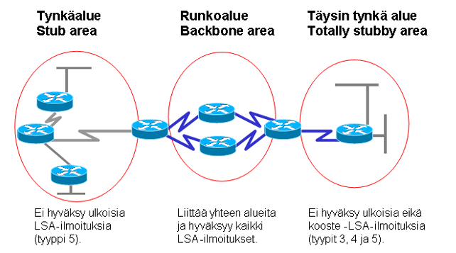

## LSA types

LSA-tyypit (Link-state advertisement) perus viestintä avulla OSPF:ssän reititys IP protokollaan eli TCP/IP malli. Se kommunikoi reitittimien paikallisten reititystopologien kaikkien muiden paikallisen reitittimien kanssa samalla OSPF-alueella. OSPF on suunniteltu skaalautuvaksi, mitä osa LSA:t eivät ole tulvissa/peittää kaikkiin rajapintoihin, mutta vain niihin, jotka kuuluvat asianmukaisen alueeseen. Yleisen LSA tyypit käytettään 1-5, että 6-11 ovat muita tyyppejä.

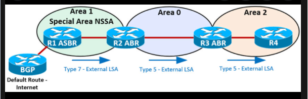

| LSA tyypit | Kuvaus | 
| -------- |---------- |
| 1 | reititinlinkkaus (router), sisältä kaikki linkkitunnukset - verkko, jokaisen reitittimien luoma ja paikallinen alue, että reititin lähettää tyypin 1 LSA-paketteja omissa alueessa. |
| 2 | verkkolinkkitila (network), sisältää kaikki segmenttiin liitetyt reitittimet, jotka on luotu DR:llään (Designated Router), ja jotka ovat paikallisia alueita. LSA leviää vain sen alueen sisällä, josta se on peräisin. |
| 3 TAI 4 | koostelinkkitila (Summary LSA & ASBR LSA). Tyyppi 3 kuvaa reittejä paikallisen alueen verkkoihin ja niitä lähetettään runkoalueeseen, että lisäksi sen avulla kertoo paikallisen alueen sisäisille reitittimille, mitkä kohteet voivat saavuttaa ABR:n kautta. Tyyppi 4 kuvaa reittejä ASBR-reitittimiin, että LSA:t leviävät vain sen alueen sisällä, joista sen peräisin ovat. | 
| 5 | ulkoinen linkkitila (autonomous system external LSA). Tyyppi 5 LSA on peräisin ASBR-reittimeltä. Tyyppi 5 kuvaa reittejä sellaisena kohteena, jotka sijaitsevat toisessa AS-alueessa tai toista reititysprotokollaa käyttävissä verkoissa. Tämä LSA leviää koko autonomisen alueen sisällä. |
| 6 | monilähetys (Multicast LSA) |
| 7 | ei niin tynkkä alue (no so stubby area LSA) |
| 8 | ulkoinen attribuuti (external attribute LSA for BGP) |

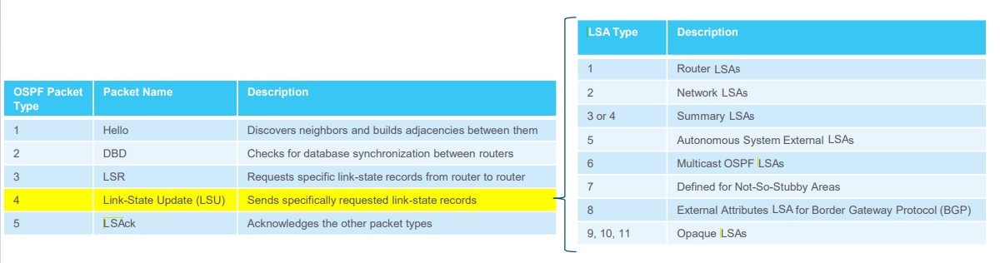

# OSPF metric and cost

Metric = cost & laskutus menee: cost = viitekastanleveys / käyttöliittymän kaistanleveys.   Oletuksena viitekaistanleveys on 10^8 eli 100 000 000 bps & käyttöliittymä kaistanleveys tarkoittaa reitittimen porttit kuten seriel- ja fast-, giga- ja muu ethernet johto. OSFP luottaa *cost*:iin, koska ovat kääntäen verrannollisia linkin laistanleveyteen. Siksi suuremman kaistanleveyden linkit ovat parempi kuin pienet, että cost-kaava on viitekainsataleveys jaettuna käyttöliittymän kaistanleveydellä. 

Jokaisen host:i löytyy reititystaulukkosta ($show ip route), että tulostuu esim. [110/65], ja 65 on se host.. & Jos esim. lasku 1, käytössä on ethernet-liitäntä (10 Mbps), OSPF-polun cost olisi: (10^8 / 10^7) = <ins> 10 </ins> & taulukkosta saa ratkaisun, että oikealla on cost-tulokset. 

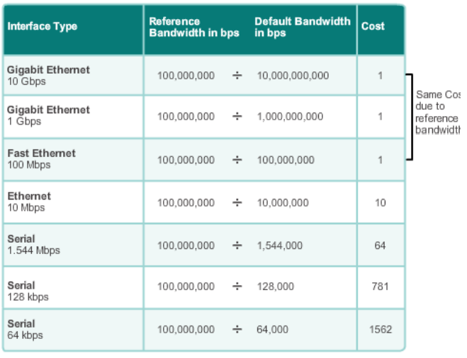

## Cost

EIGRP ja OSPF:ssä voi määrittää portti liitännän kaistanleveyden suuruuden, että laskutus ja metriikka muuttuvat. OSPF:ssä tapahtuu myös, että portti liittänän cost suuruudeen arvoltaan <1-65535> rajalta, ja kaistanleveys kilobitteinä rajaltaan <1-10 000 000>. Myös kuvassa on esim. konfiguroinnista, että kuinka muuttaisi kaistanleveyden ja cost arvon suuruuden. Kolmas määrityksessä tapahtuu, että reitityksen alueen numerolle tapahtuu viite kaistanleveyden asetuksen muutos, mikäli muuttaa laskettua arvoa. Reitittimen käyttöliittymän CLI komenolla ($show ip ospf interfaces), jotta pääsee tarkistaa sisäisen OSPF:n käyttöliittymän, reititystaulukkon, alue numero, prioriteetti, infot ja cost-arvon suuruuden. Sekä reititystaulukkosa ($show ip route), jos havaitsee taulukko riviltä merkittynä <ins> o </ins>, mitä tarkoittaa reitittimen minimin cost voitto luku.

Reitittimestä perus tarkistaa OSPF protokollan cost luvun, että EIGRP protokollassa se on metric. Kuvan mukaan R1 ja R2 välinen yhteyksen <ins> cost luku on 64 </ins>, että R2 jatkuu eteenpäin, mitä voi olla tietokonen isäntä alue tai loopback osoite, ja tätä lasketaan mukaan siksi sisältyy <ins> cost 1 </ins> eli yhteensä cost on 65. Reititystaulukkon kohteen IP-osoite kertoo konfiguroidun OSPF protokollan, kuten reitityksen area luvun, etäisyys ja metric luvun, mitkä otettaan enemmin huomioon. Sama reitityksestä huomioidaan, mihin suuntaan se jatkuu jotta tiedetään se cost arvo summa.

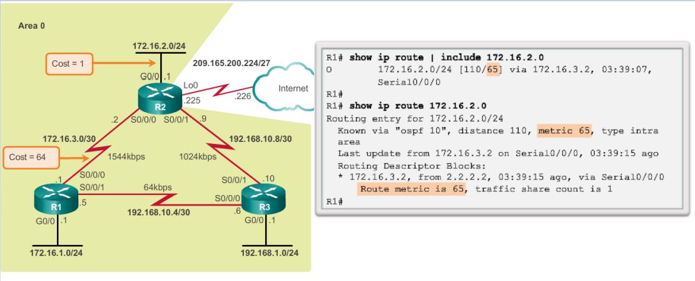

Komennolla ($show ip route <vastapään-olevan-IP-osoite>, että minkä avulla single- ja multi area:n molempien metric arvon. Arvo lasketaan reitittimen välisen summauksen, että vastapään tietokoneiden isäntä IP-osoitteet. Summauksena tapahtuu, että laskee nopeamman reitityksen, jotta viesti pääse perille nopeamalla metric/cost arvolla. Jos reitittimen portti liitäntä yhteys on poikki, joten viesti paketti kulkeutuu toisesta reitistä ja jotta viesti pääsee perille vastaanottajan luokse. 

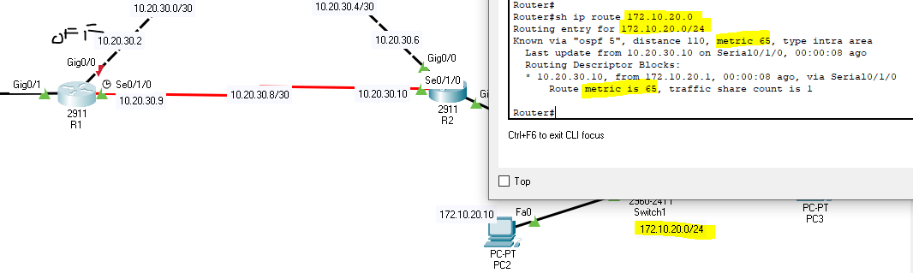

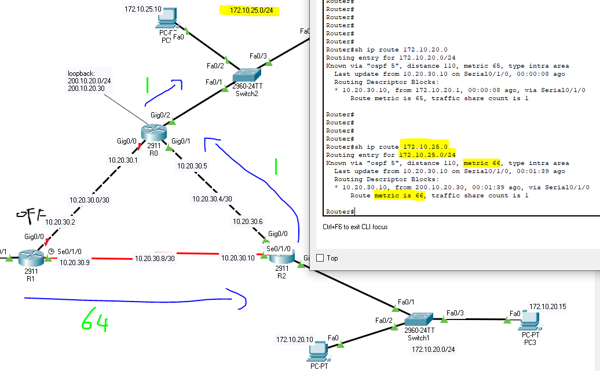

## cost säädöt

Säädöt tapahtuu kaistanleveydessä, jos reitityksessä on määritetty OSPF protokolla ja alue numero. Viite kaistanleveyden muuttamisessa ei vaikuta linkin kaistanleveyden kapasitetttiiin, vaan metriikkaan eli reititystaulukkon metric/cost lukuun, ja määrityksessä käytetyn laskelmaan. Sen kaistanleveyttä käytttämällä automaattisen kustannusten referenssikaistanleveyden Mb/s reitittimen määrityskomentoa.  

<b> ($auto-cost reference-bandwidth 1000) </b> - mikä kuin menee >> (metric and cost) kappaleen taulukkon mukaan, että sen oletus luku on 10^9 (1 000 000 000 bps) mukaan, sekä ($auto-cost reference-bandwidth 10000) oletus luku muuttuu 10^10 (10 000 000 000 bps) & jos haluttaan takaisin alkupeärisen 10^8 oletusarvon, että komenolla (auto-cost reference-bandwidth 100)

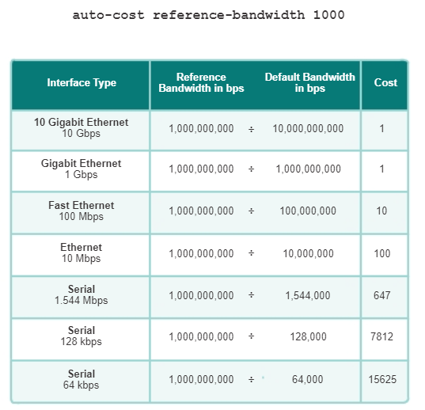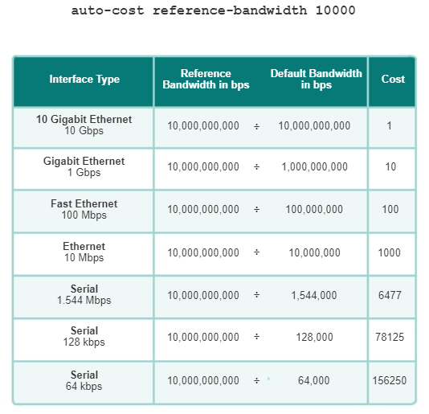

Komentoa tulee määrittää jokaisen reitittimen ospf protokollan sisään, kuin mainostaa viereisen IP-osoitteen ja kohteen alue numero. Riittää määrittää alueen reitittimestä kaistanleveyden muutoksen, ja komennossa kysyy/käskee ylläpiätäjän "please ensure reference bandwidth is consistent across all routers" Suom. että tarkistaa reitityksen viitekaistanleveys on tasainen kaikissa reitityksessä. 

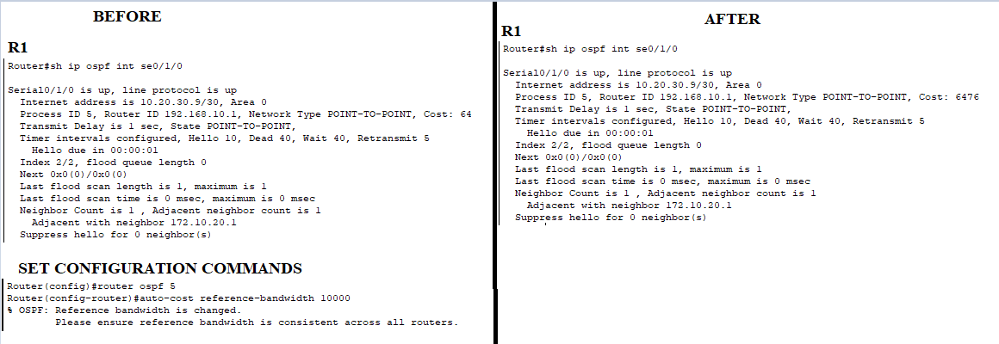

Toki jos ei halua seurata "auto-cost reference-bandwidth <num>" taulukkon suuruutta, että voi muuttaa reitittimen manuaalisen porttien summan kuten serial johto on oletuksena 1544 Kbit/s. Ja cost arvo kuitenkin muuttuu, kun on muuttanut reitittimen porttien kaistanleveyden suuruuden. Sekä porttien numerosta voi määrittää manuaalisen cost luvun, mikä on vapaa vaihtoehtoinen määritys.

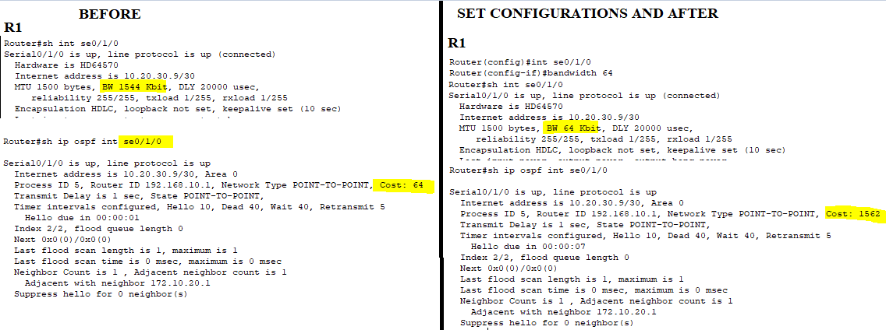

# OSPF single and multi areas

## Single areas

Kun määrittää minkä tahanasa reitityksen, mitä aluksi tapahtuu <ins> yksittäinen alue </ins>, sekä tulee olemaan mukana jos projektissa luoo laajemman monipuolisen alueen. OSPF:ssä on joitain perussääntöjä aluejakoon. Runkoverkko (backbone router) alue 0 tai 0.0.0.0 on määritettävä, koska jos sitä käytää useampaa kuin yhtä aluemääritystä. OSPF:n aluetta voi määrittää kerran, että voi valita minkä tahansa alueen, vaikka tapahtuu ensimmäisenä alueeksi 0. Myös single area on hyvä alku askel, että helppo suorittaa esim. alle 5 reitittimen reititystä, että hyödyssä single area:ssa on:

- Large routing table; suuri reititystaulukko, OSPF:ssä ei oletusarvoisesti suorita reitin yhteenvetoa. JOs reittejä ei ole tiivistetty, reititystaulukko voi tulla hyvin suureksi, riippumatta verkkon koosta.
- Large link-state database (lsdb); LSDB kattaa topologian koko verkon, että jokaisen reitin on säilytettävä merkinnän jokaisen verkon aluealla, vaikka reititystaulukkoon ei ole valittu jokaista reittiä.
- Usein SPF algoritmien laskelmat; suuressa verkossa, muutokset ovat väistämättömiä, joten reitittimet viettävät monia CPU (suoritin, central processing unit) laskemalla uudelleen SPF-algoritmin ja päivittää reititystaulukkoa.

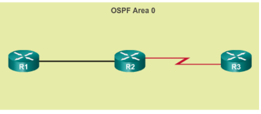

## Multi areas

Moni alueessa tapahtuu, että single area on mukana reitityksessä, se on pakko olla keskellä. Koska single area alue 0, mikä kommunikoi moni alueiden välisen yhteyden kuin välittäjänä. Kun verkko laajenee, että reititystauluko, tietokokanta ja SPF-laskelmat voivat kuluttaa kohtuuttoman paljon reitittimen resursseja. Jos suuri OSPF aluetta jaetaan pieniin alueisiin, että tätä myös kutsutaan multi area OSPF:ksi, sekä suuressa verkko alueessa verkon käyttöönotoissa prosessoinnin vähentämiseksi ja muistin yläpuolella. 

Esim. kun reititin saa uutta topologiaa, kuten lisäykset, poistot tai muutosta, jotta reitittimen on uusittava SPF algoritmia, sekä uusi SPF-juuri (Shortest Path First) ja päivittää reititystaulukkon. Multi area OSPF:ssä vaatii hierarkkista verkon suunnittelua. Pääaluetta kutsutaan runkoverkkoalueeksi (area 0), ja kaikkien muiden alueiden on liityttävä runkoalueelle. Koska hierarkkisen reititys tapahtuu edelleen alueiden välillä (interarea routing), kun taas monet pitkäveteiset reititysoperaatiot, kuten tietokannan uudelleenlaskenta, mitä pidetään alueella. OSPF:n hierarkkisen topologioita on kuten:

- Pien reititystaulukko; reititystaulukon merkintöjä on vähemmän verkkoina, että osoitteet voidaan tiivistää alueiden välillä. esim. R1 tiivistää reitit alueelta area 0 ja R2 tiivistää reitit alueelta area 51.
- Reduced link-state update overhead; minimoi käsittelyn ja muistin vaatimukset, koska LSA:n järjestelmässä vaihtelevia reitittimiä on vähemmän.
- Reduced frequency of SPF calculations;

<b>SPF tree topology</b>  
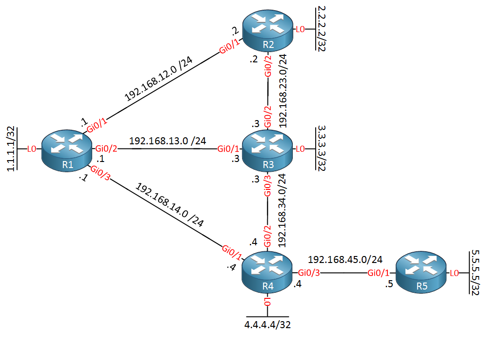

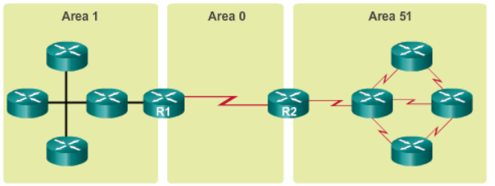

### Multi areas LSA types
 
LSA tyyppejä on 1-11 yhteensä, että jokaisessa tyypissä on tekninen kuvaus ja ominaisuus. LSA toimivat yksittäisen tietokantatietuen ja tarjoavat OSPF-verkkotietoja. LSA yhdessä kuvaavat OSPF-verkon tai alueen koko topologian, että multi alueet toteutuvat toteutuksen tuettavien viittä ensimmäistä LSA eli 1-5. 
 
| LSA type multiarea | teknisen kuvaus |
| ------------ | -------------- |
| LSA type 1: reititinilmoitus | vastuussa jokaisen reitittimen & OPSF-tunnus, Router-ID, suoraankytketyt verkot, linkkien tilat ja kustannukset & alueen sisäinen |
| LSA type 2: verkkoilmoitus | vastuussa MA/NBMA verkosta vastaava pääreititin (DR) & OSPF-tunnus, Router-ID, suoraankytketyt verkot, linkkien tilat ja kustannukset & alueen sisäinen |
| LSA type 3 & 4: yhteenvetoilmoitus | vastuussa aluerajareititin & reittimen OSPF-tunnus & mainos reiteistä aluerajareitittimen takana olevien verkkoihin & mainos reiteistä AS-rajareitittimeen, että AS rajareitittimen tunnus |
| LSA type 5: ulkoisten reittien ilmoitus | vastuussa AS-rajareititin, ja tunnus & ulkoisen verkon IP-osoite ja maski & mahdollinen varareitti ulkoiseen verkkoon & kustannus vakiona tai huomioiden sisäisen kustannukset |
 
### Summarization
 
## OSPF DR and BDR

DR (Designated Router) & BDR (Backup Designated Router).  

BDR - varalla oleva hallitseva reititin OSPF-protokollaa käyttävässä multiaccess-verkkoa & DR - halitseva reititin OSPF-protokollaa käyttävässä multiaccess-verkossa. <ins> Multiaccess </ins> tarkoittaa verkkoa, että on enemmän kuin kaksi reititintä yhdistettynä toisiinsa samassa aliverkossa esim. kytkimen kautta. Yhdistetyt reitittimen kokoonpanossa muodostavat konvergenssin (lähentyminen / yhteen suuntautuminen), missä ne synkronoivat tietokantansa. Kun tietokantojen synkronointi on valmis, mitä naapurireitittimet muodostavat tilaan nimellä *adjacency*, mikä tarkoittaa muodostuu kahden reitittimen välisissä yhteyksissä *Point-to-Point*-yhteyksiä. Multiaccess-verkoissa adjency-toiminassa kuuluu, joka OSPF-protokolla valikoi yhden reitittimestä hallitsevaksi reitittimeksi rooliin <b> DR </b>, mikä muodostaa adjancency:n muiden naapurien kanssa. Tämä yksinkertaistaa verkon toiminnan, koska DR voi lakata toiminnasta, että valitaan myös varalla oleva hallitseva reititin <b> BDR </b>. Sekä muut olevat reitittimet ovat nimellä <b>DROther</b>  

Verkon ylläpitäjä (network system administrator) voi määrittää reitittimien arvojärjestyksen manuaalisesti. Tärkein vaihtoehto on muuttaa DR:ksi halutun reittimen multiaccess-verkkon yhdistävän siirtoyhteyden prioritetti suuremmaksi kuin muu reitittimet. Prioritettin oletusarvo on 1, sekä prioritetti sattuu olemaan nolla, mitä reitittimestä ei voi tulla <b> DR:ksi eikä BDR:ksi. </b> Vaihtoehtona on asetta DR:ksi haluttuen reitittimelle mahdollisimman suuri IP-osoitteeksi. Verkossa käytettäessä osoitteesta riippumatta tämä voi tehdä esimerkiksi määrittämällä reitittimelle erikseen Router-ID tai konfiguroida reitittimelle yksittäinen loopback-portti osoite.

DR:n tehtävänä on pitää muiden samassa multiaccess verkossa olevien OSPF:n protokollien käyttävien reitittimien linkkitilausksien tietokannat ajan tasalla. Jos DR-reititin kaatuu tai sammuu, mitä BDR-reitittimestä tulee uusi DR ja DROther-reitittimien ympäristössä/reititiyksessä valitaan uusi BDR. Kun alkuperäisen DR palaa toimintaan eli palaa käyntiin, siitä ei tule uudestaan DR-reititintä, vaan DROther. DROther valitaan DR:ksi jos sekä DR ja BDR lakkautuvat toiminnasta.

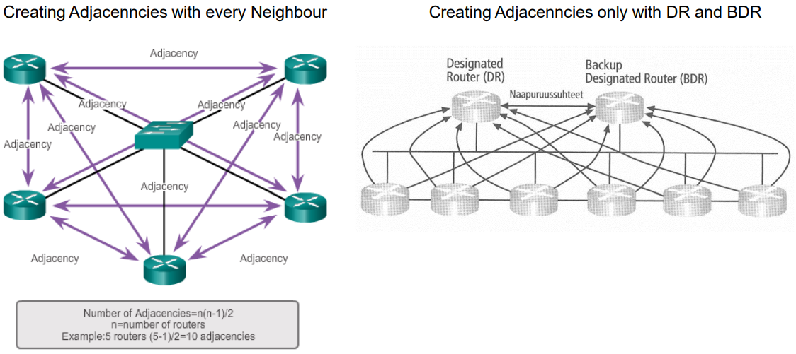

# OSPF configurations

Konfiguroinnissa muistuttaa kuin EIGRP ja dynaaminen RIP protokollan määritys, että mainostaa viereisen IP-osoitteen, mutta OSPF:ssä tapahtuu määrityksessä alueen muodostamista. Ennen sitä tulee määrittää OSPF luku, koska jotta viereisen reitittimet saisi kokoonpanon ja koneiden isännät kommunikoivat toisenssa, että kyseessä yksityis- tai monipuolinen alue. 

## Router ID

Jokaisessa OSPF-verkon reitityksesä tarvitsee yksilöllisen OSPF-reitittimen tunnuksen, mitä käytetään reitittimelle yksilöllinen identiteetti (olio). OSPF Router ID on IPV4-osoite, ja 32-bittinen binäärinumero, mikä on määritetty kullekin OSPF-protokollaa käyttävälle reitittmelle. OSPF-reittimen tunnistaa, jos ei tule mitäään muutta sen jälkeen, kun protokollan prosessi on aloitettu ja naapurisuhde on muodostettu. Jos muutaa OSPF-reittimen taustan, mitä on ladattava IOS uudelleen tai käytetävä komento ($clear ip ospf process), jotta reitittimen tunnuksen muutos tulee voimaan. IOS:n lataaminen uudelleen tai ($clear ip ospf process) komento käyttäminen voi aiheuttaa tilapäisen verkkokatoksen. 

Jos on kerran määrittänyt id-tunnuksen, mitä muut reitittimet tarvitsee myös tunnuksen, jotta osallistukseen OSPF-reitityksen joukkoon. Koska järjestelmänvalvoja voi määrittää reitittimen tunnuksen tai määrittää sen automaattisesti. Yhteensopivuuden reititin käyttää tunnistakseen seuraava toiminnat:

- Participate in the synchronization of OSPF databases - suom. osallistuu OSPF-tietokannan synkronointiin. Sisäisen Exchange-tila aikana reititin, jolla on suuri reititintunnun, ja lähettää ensin tietokantakuvauspakettinsa (DBD). 
- Participate in the election of the designated router (DR) - suom. osallistuu nimetyn reitittimen DR valintaan. mutliaccess-LAN reitityksessä reititin, jolla on korkein reititintunnus, mitä valitaan DR:Ksi. Reitityslaite, jolla on toiseksi suuri reititintunnus, jolloin valitaan varareitittemeksi (BDR).

Router ID tunnuksen luonti on vapaaehtoinen, koska jos luoo tunnuksen, mitä viereinen naapuri alue ei pääse pinggaa toisiinsa. Loppu peleissä oma alueet pinggaa vain oman alueen isännän tietokoneita, jos reitittimessä on määrittänyt haluamanssa IP-osoitteiden reitityksensä. ABR reitittimessä, mikä toimii kuin kahden reitittimen välittäjä esim. vasen alue 0 ja oikealla alue 1, että komennolla ($show ip ospf neighbor) havaitsee alueen naapurien linkkitaustan, tai vaihtoehtona on tarkistaa protokollan taustat ($show ip protocols).

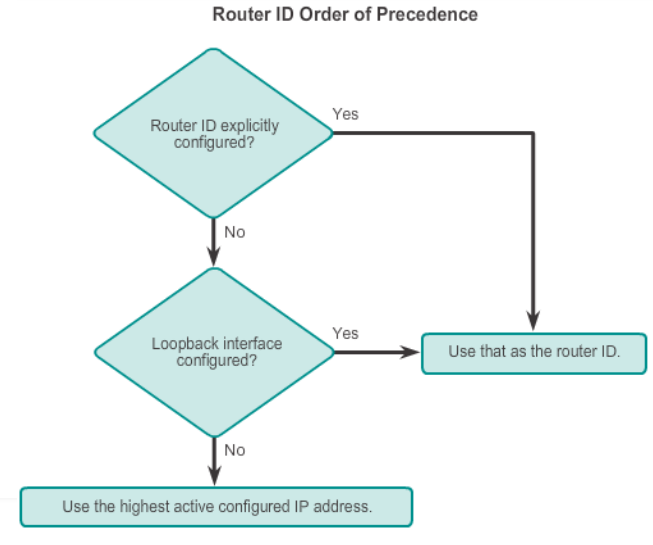

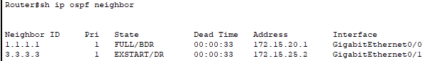

<h2>Configuration a loopback interface as the Router ID</h2>

Kun luoo fyysisen käyttöliittymän, mitä reitittimen tunnus voi määrittää loopback interface osoitteen. Yleensä IPV4-osoite on helpoin loopback interface osoite, mitä määritettään käyttämällä 32 bittisenä ja aliverkko peite tapahtuu (255.255.255.255) menetelmällä. Kuin luo tehokkaan isäntäreitin, että 32-bittinen isäntäreitti ei mainostettaisi reittinä muihin kuin OSPF-reitittimiin.

Kun reititin on valinnut Router tunnuksen ID, mitä aktiivisesti OSPF-reititin ei salli reitittimen tunnuksen muuttamista ennen kuin reititin ladataan uudelleen tai OSPF-prosessi nollataan. Esim. R1:ssä määritetty reitittimen tunnus on poistettu ja reititin ladattu uudelleen. Tässä on, että nykyinen reitittimen tunnus on 10.10.1.1, joka on Loopback 0 IPv4-osoite. Reitittimen tunnuksen tulee olla 1.1.1.1. Siksi R1 on määritetty komennolla router-id 1.1.1.1.

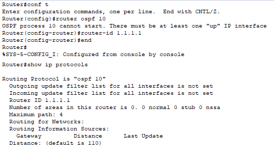

Jos komennnossa annettaan ($clear ip ospf process), mikä kuin poistaisi tai uudelleen käynnistää kohteen reitittimen, mutta ei poista konfiguroitua tai määritetty ospf lukua, eikä mainostettua viereisen IP-ositetta. Varsinaisesti runkkoverkon alue 0 ja alue 1 tai muu kohteen välisen yhteys pysyy ennallaan, mutta vain DR nimike muuttuu ja tapahtuu kuin *adjency force to reset* 

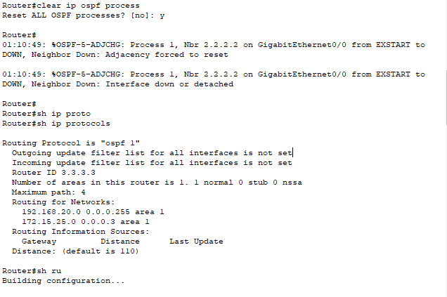

## Passive interfaces

Oletusarvona OSPF-viestit välittävät eteenpäin kaikkiin OSPF-yhteensopiviin liitäntään. Nämä viestit tarvitsee lähettää vain rajapintoina, jotka muodostavat yhteyden muihin OSPF-yhteensopiviin reitittimiin. Tarpeettomat viestien lähettäminen lähiverkkoiden vaikutusta verkossa:

- tehoton käyttö kaistanleveys
- tehoton käyttö resurssi
- turvallisuudenriskien lisääntyminen
- passivinen käyttöliittymä ominaisuus auttaa rajoittamaan reitityspäivitys mainosten laajuutta.

Passiivisen käyttöliittymän komentoa käytetään estämällä OSPF-hello-paketti viestiä tietyissä rajapinnassa, koska sitä käytetään myös muissa reititysprotokollassa kuten dynaaminen RIP ja EIGRP protokollassa. Passiviisen liitännän käyttöönottossa verkkolaitteisa tuotaa lisä toimintoja kuten:

- OSPF ilmoittaa tai mainostaa yhä käyttöliittymän liitettyjen verkkoa
- OSPF reitittimet lopettavat OSPF hello-viesti-pakettien lähettämistä käyttöliittymässä, mutta salii liitännän liitetyt verkojen mainostamista
- Käyttöliittymässä OSPF ei enään käsittele vastaanotettuja Hello-viestejä.

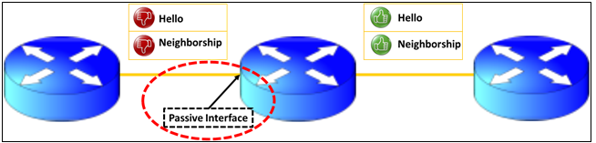

Passiivinen käyttöliittymä tulee määrittää reitittimen liitäntöihin, missä ei ole määritetty OSPF-reititintä eli ulkopuolinen ja ei ole omaa aluetta, sekä ne eivät saa OSPF-tietoja. Protokollan reitityskuormassa prosessorille voi vähentää minimoimalla niiden liitäntöjen määrää, joiden kanssa on oltava vuorovaikutus. *Passive-interface* - komento poistaa OSPF- ja EIGRP-reitinkäsittelyn kyseisen rajapinnan. OSPF protokollassa tapahtuu, että kommunikointi viestit lakkautuvat/estävät toisiinsa, jotta tietokoneiden isännät ei kommukoi kahden alueiden keskennään, sekä oman alueet vain pinggaavat toisiinsa. Koska passiivisen käyttöliittymissä tapahtuu kuin turvallisuuden lisääminen, että estää toisen alueen tulevia viestejä, jolloin kuin reitityksesä tapahtuuu kuin luoneen alueen naapurisuhde. Myös hyökkääjä voisi sitten mainostaa väärennettyjä reittejä liikenteen ohjaamiseksi väärin.

Passiivisen käyttöliittymän komentoa voidaan määrittää kahdella tavalla, mutta periaatteessa estää toisen alueen tuomia viestejä ja isännän koneet ei pinggaa/vastaanotta viesti pakettia, sekä oman alue viestit ei lähetettä pois omasta alueesta ulkopuolelle. Jos tarvitaan kaikkien liitäntöjä olevia passivisia rajapintoja ja jättäen yhden tai muutaman käyttöliittymän ei-passiviseksi, sitä voidaan luoda passiiviseksi rajapinnaksi oletuskokoonpanoon käyttämällä "*passive-interface default*" - komennolla. Tämä muistuttaa myös EIGRP protokollaa, mutta siellä tapahtuu kommunikointi, koska eri IP-osoitteiden luokituksen avulla, jotta saa koneiden isännät komunikoimaan toisiinsa. Jos EIGRP:ssä projektiss tapahtuu kaksi saman IP-osoitetta, ja tapahtuu EIGRP protokollan mainostus, mikä tuottaa pinggauks ongelman. Koska jos määrittää EIGRP:ssä passiivin käyttöliittymän reititykseen, mitä IP-osoite (A.B.C.D) tulee olemaan ensimmäisen 16-bittin (A.B) voi olla sama luokka, mutta viimeiset 16-bittit (C.D) voi määrittää muu osoitteen.

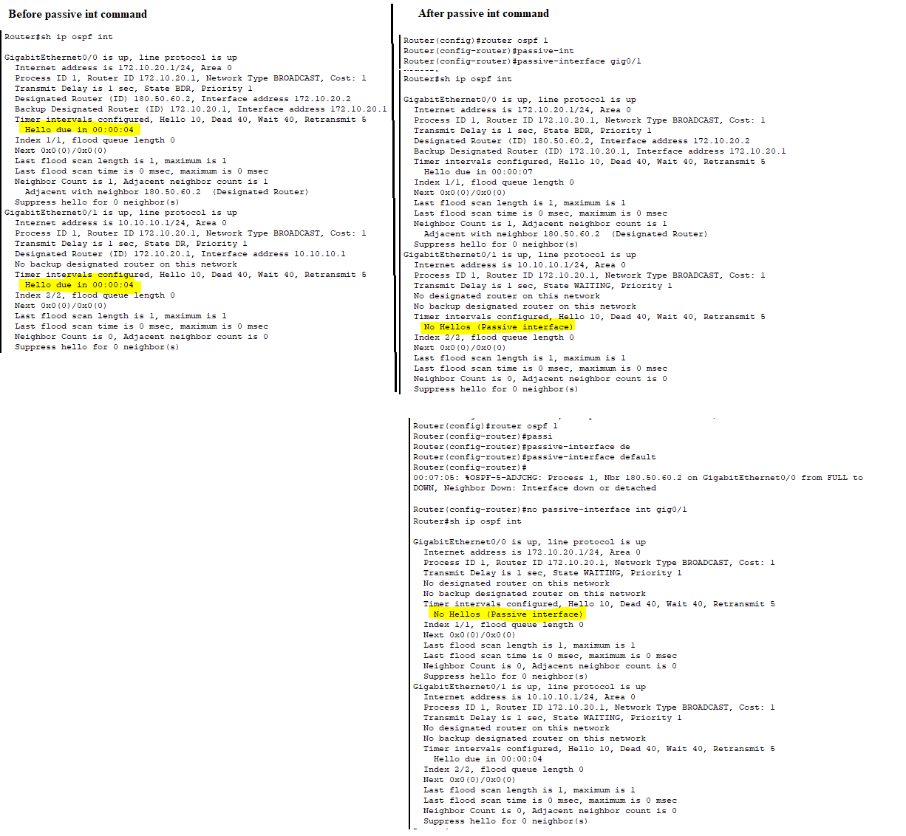

# OSPF and EIGRP fusion

EIGRP ja OSPF protokollassa on jotakin hyvin samankaltaista yhteistä, mitä selittää protokollien taustalla ja muita syyn kehityksiä. Konfiguraatiossa yhtenä tekijännä on erona OSPF:n ominaisuudessa käyttää alueita, mitä pitää konfiguroida, että vaikka alueita voi olla yksi tai useampi. Sekä EIGRP:ssä konfiguroinnissa tapahtuu mainostaminen, että mainostaa viereisen IP-osoitteen ja sisältyen aliverkkojen määritys, sekä valinta summaus konfigurointi. EIGRP:ssä ja OSPF:ssä lasketaan metriikkat, mutta OSPF:ssä se on cost eli hinta/kustannus, että molemmissa tapahtuu laskenta (matematiikka).

Molemmissa ovat sisäisten yhdyskäytävän  reititysprokollia, mitkä auttavat valitsemaan reitit tiedon siirtämistä tai jakamisen vuorovaikutuksen reitittimen kansa. EIGRP:ssä tapahtuu etäisyyvektorireititysprotokolla, ja OSPF käyttää linkkitilan reititysprotokollaa. Molemmissa on kyky oppia verkon dynaamista reittiä, että molempien toiminallisuus on samalainen, mutta osassa on eroa. Esim. EIGRP on Cisc oma IGP, mikä tarkoittaa, että se on suosittu Cisco verkoissa, ja OSPF on avoimen standardi IGP yritysverkoille. Jos vertaa molempien protokollaa

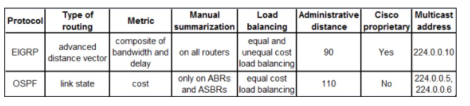

Myös fuusiona, että voi suorittaa kokoonpanon, että reitityksen projektissa suorittaa EIGRP ja OSPF:n protokollan. Reitityksen kommenossa voi mahdollista tuottaa pientä ongelmaa, jotta yhteys pelitää ja reititys toimiii.

# OSPF tutoriaalit ja muut guide asiat

http://ladu.htk.tlu.ee/erika/lasse/routing_protocols/esimerkki_linkkitilaprotokollistaospf.html
https://education-wiki.com/3990219-what-is-ospf
https://www.ciscopress.com/articles/article.asp?p=1763921&seqNum=6
https://www.ciscopress.com/articles/article.asp?p=2294214

<h2>OSPF linkkit (LSA) tyypit</h2>
https://www.cisco.com/c/en/us/support/docs/ip/open-shortest-path-first-ospf/7039-1.html#anc44  
http://www.netcontractor.pl/blog/?p=451  
https://stucknactive.com/2019/04/02/6-14-ospf-lsa-types/  
https://www.digitaltut.com/ospf-lsa-types-tutorial  
https://www.firewall.cx/networking-topics/routing/ospf-routing-protocol/1178-ospf-lsa-types-explained.html  

<h2>Router ID</h2>
https://ccna-200-301.online/ospf-router-id/  
https://networklessons.com/ospf/ospf-router-id  
https://www.ciscopress.com/articles/article.asp?p=2294214  

<h2>EIGRP vs OSPF</h2>
https://askanydifference.com/difference-between-eigrp-and-ospf-with-table/  
https://www.router-switch.com/faq/ospf-vs-eigrp.html   
https://techdifferences.com/difference-between-eigrp-and-ospf.html  
https://www.educba.com/eigrp-vs-ospf/  

<h2>DR & BDR </h2>
https://study-ccna.com/designated-backup-designated-router/  
https://geek-university.com/designated-router-and-backup-designated-router/  

