- [lyhyt teoria](#lyhyt-teoria)
- [radius harjoitus](#radius-harjoitus)
  * [harjoitus 1](#harjoitus-1)
  * [harjoitus 2](#harjoitus-2)
  * [harjoitus 3](#harjoitus-3)

- [tacacs harjoitukset](#tacacs-harjoitukset)
  * [tacacs harj 1](#tacacs-harj-1)
  * [tacacs harj 2](#tacacs-harj-2)
  * [tacacs harj 3](#tacacs-harj-3)

# lyhyt teoria

Harjoituksien kohdalla pari tärkeetä komentoa:
 
<h3> määritettävien aaa - lausekkeessa riippuu, mitä ollaan tai mitä on konfiguroimassa sisään </h3>

| komento | kuvaus |
| ----- |----- |
| $aaa authentication login default group [radius/tacacs+] local | paikallista user-db:tä tulee käyttää, jos RADIUS tai TACACS+ -palvelin ei ole käytettävissä | 
| $aaa authentication login default local group [radius/tacacs+] local | sallitaan, että sekä paikallistaa ja RADIUS tai TACACS+-tiliä voidaan käyttää |  

Tämä komento periaatteessa korvautuisi kokonaisuudessaan lähes kaikken: <b> Router(config)#aaa authentication enable default group [radius/tacacs] local </b>   
Tämän komento authentikointi turvallisuuden voimakkuus on vähä parempi kuin jos konffaisi reititimen sisään: $enable password abcd & Koska, kun yritettään kirjautua telnet host:in polkun kautta [ip-osoite] sisään kohti reititintä se kysyy kahesti käyttäjätunnus ja salasanaa. Cisco packet tracer simulaatiossa tämä komento antaa PC-koneiden tai yksittäisen reititimen kirjautua sisään hallinnoida konfigurointi asetuksia, että luoneen serverin AAA käyttäjätunnuksia. Simulaatiossa, kun otettaan reititintä polkua $enable - (lyhenne $en)käyttöön eli hallinnoidaan ja muokkataan sisäisen konfigurointi asetuksia, niin kysyy uudestaan käyttäjätunnus ja salasanaa, eli...

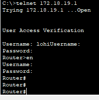

Jos konfiguroi $enable password abcd - mitä perus kysyy salasanaa, mikä sen vahvuus on melko heikkoa, kun siirryttään $enable polun jälkeen. Eli..

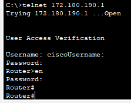

myös ei ole estettä konffata (enable password) komentoa, mutta se ois toinen vaihtoehto, kun kirjaudutaan telnet host:in kautta reititimen sisään niin authentikointi enable group komento ei tulisi mukaan. Lisäksi jotta haluttaan vahvistaa (enable password) toimisi niin pitää lisätä ($Router(config)#aaa authorization exec default group radius local) - ei ole estettä onko radius vai tacacs+ pohja..

# radius harjoitus

## harjoitus 1 

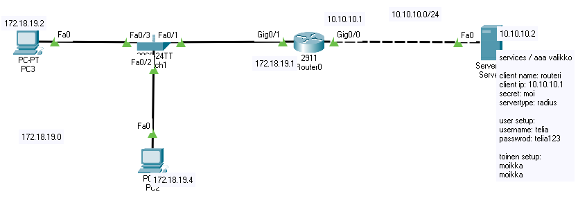

<b>Serveri </b>  
 
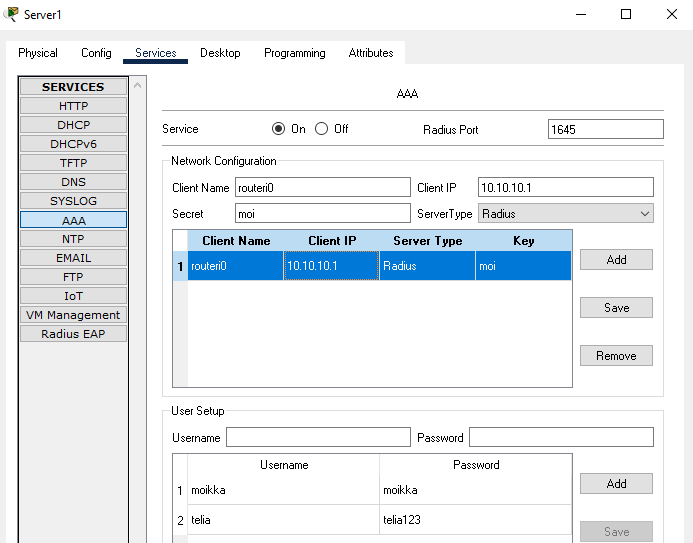

<b>Routerien steppit </b>
| konffaus steppit | server käyttöliittymä |
| ------- | --------- |
| Router(config)#aaa new-model   Router(config)#radius-server host 10.10.10.2 key moi   Router(config)#aaa authentication login default group radius local   Router(config)#line vty 0 5   Router(config-line)#login authentication default   Router(config-line)#    new: tämä puuttui   Router(config)#aaa authentication enable default group radius local     vaikka pääseee routerien sisään, mutta tähän asti    Router>   Router>en   Username:   Password:   Router# | services / aaa valikko    - <b>Network configuration</b>   client name : routeri   client ip: 10.10.10.1 <-- reititimen portti liitäntä IP-osoite ja serverin välinen yhteys   secret : moi <-- avain, mikä määriyttyy pääsypalvelimeen   servertype: radius <-- vaihtoehtona on tacas    -  <b>User setup </b>   tässä valikkossa luodaan käyttäjätunnus, mikä muistuttaa vähä kuin kytkimen tai reitittimen sisään luodaan telnet/ssh tunnukset   myös saa luoda toisen tunnuksen, jossa sisään kirjautumisessa sallii  yhden tai useamman käyttäjäntunnukset |
| määritettävien aaa - lausekkeessa riippuu, mitä ollaan tai mitä on konfiguroimassa sisään | 
| $aaa authentication login default group radius local | paikallista user-db:tä tulee käyttää, jos RADIUS-palvelinta ei ole käytettävissä | 
| $$aaa authentication login default local group radius | jos halutaan, että sekä paikallistaa ja RADIUS-tiliä voidaan käyttää |  

<b> HUOM! </b>   komento ($aaa new-model) joka sovletaa välittämästi paikallista todentamista, että linjoihin ja liitäntöihin. Jos telnet sessio avataan reitittimelle, joten tämä komennto käyttöönoto jälkeen (yhteys aikakatkaisee) ja yhteys muodostuu uudelleen, käyttäjä on todennettu reitittimen paikallisen tietokonnan avulla. On suositeltavaa määrittää käyttäjätunnus ja salasana pääsypalvelimelle ennen AAA-määrityksen aloittamista, jotta et lukittuisi reitittimeen. 

## harjoitus 2

Vasen R0 & oikea R1  
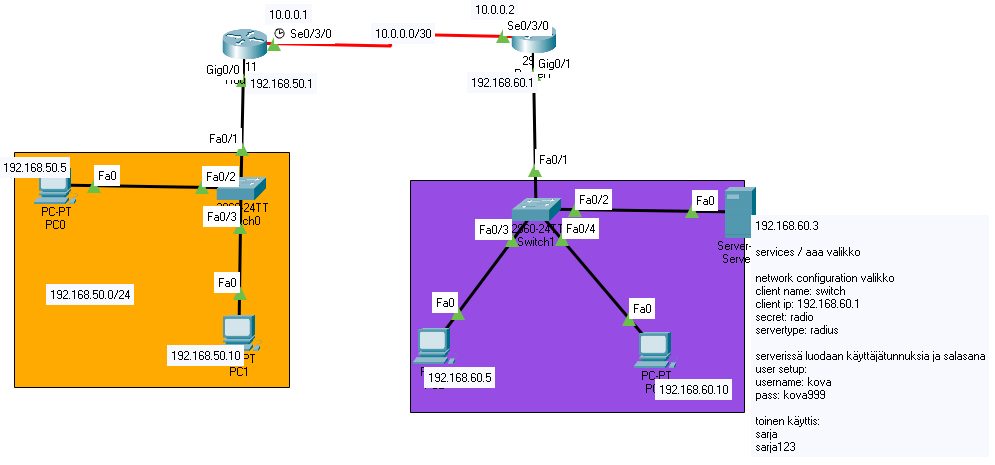  

Ensimmäisenä konffataan reititykset, että 192.168.50.0/24 ja 192.168.60.0/24 kommunikoivat/pinggaavat toisiinsa, ennen kuin konffaa radius authentikoinnin sisään. Konffauksesta voi konffata joko staatisella tai dynaamisella pohjalla, että koneet pinggavat. 

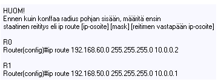  

Kun koneet pinggavat toisiinsa, sen jälkeen konfiguroidaan R1 sisään radius määritykset. Konffauksesta username cisco password cisco999 - kohta on valinnainen, koska tämän määrityksen jälkeen se ei tallennu serverin tietokanta järjestelmään, mutta serveriin pitää manuaalisesti luoda käyttäjätunnus ja salasana.

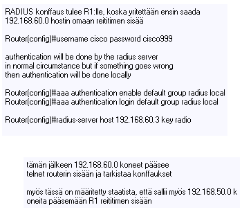  

## harjoitus 3

Special harjoitus 3, että tarkistellaan kahden radius konffauksen pientä eroa, mutta periaatteessa molemmat toimivat ja vaikuttaa autentikontien vahvuuteen. Koska kirjautumisen kanssa kirjaudutaan telnet host:in kautta reititimeen antamalla käyttäjätunnus ja salasana kaksi kertaa vai kerran, että kirjauduttua syötettään kyseisen salasana..

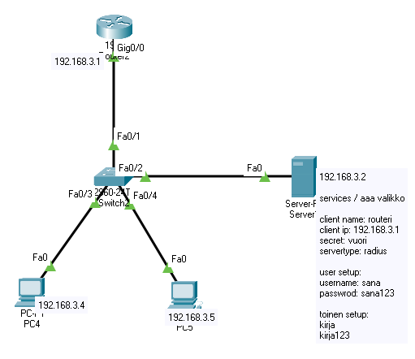  
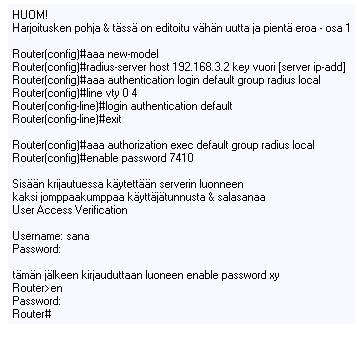  
  

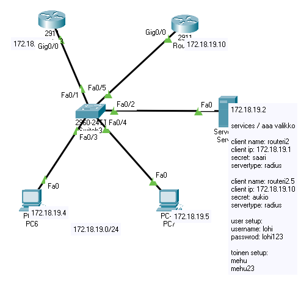  
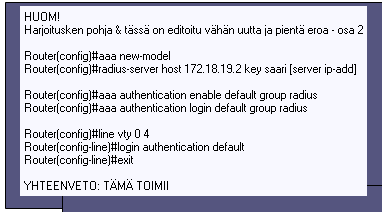  
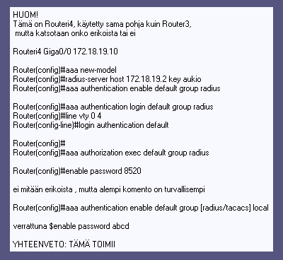  

# tacacs harjoitukset

## tacacs harj 1

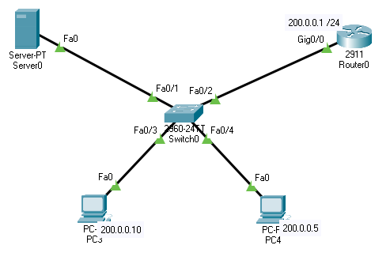

<b>Routerien steppit </b>
| konffaus steppit | server käyttöliittymä |
| ------- | --------- |
| Router(config)#aaa new-model   Router(config)#aaa authentication login default group tacacs+ local  Router(config)#aaa authentication enable default group tacacs+ local    tacacs server need host ip-add and key word   Router(config)#tacacs-server host 200.0.0.100 key toinen    VTY line & suoritettaan telnet   line vty 0 4 & login authentication default - mean we want to use login   credentials from the tacacs server preferably   Router(config)#line vty 0 4   Router(config-line)#login authentication default   Router(config-line)#    | AAA server   200.0.0.100    services / aaa valikko    network configuration valikko   client name: switch   client ip: 200.0.1   secret: toinen   servertype: tacacs    serverissä luodaan käyttäjätunnuksia ja salasana   user setup:   username: puu   pass: puu123    toinen käyttis:   koivu   koivu123 |
| ennen sitä pitää muuttaa hostname eli routerin nimeäminen   Router(config)#hostname Routeri   Routeri(config)#crypto key generate rsa    The name for the keys will be: Routeri.cisco.com   Choose the size of the key modulus in the range of 360 to 2048 for your   General Purpose Keys. Choosing a key modulus greater than 512 may take a few minutes.    How many bits in the modulus [512]: 1024  % Generating 1024 bit RSA keys, keys will be non-exportable...[OK]    Routeri(config)#ip domain name cisco.com Routeri(config)#ip ssh version 2    Please create RSA keys (of at least 768 bits size) to enable SSH v2.   Routeri(config)#crypto key generate rsa    Line vty:lle, että suoritettaan ssh, koska videossa ei haluta telnet   Routeri(config)#line vty 0 4   Routeri(config-line)#transport input ssh   Routeri(config-line)#exit    PC / KONE KÄYTTÄJÄT   C:\>ssh -l puu 200.0.0.1 | vaihtoehtona on konffata ssh sisään, ettei käytettäisi telnet:iä & tämä vaihe on vapaaehtoinen | 
| määritettävien aaa - lausekkeessa riippuu, mitä ollaan tai mitä on konfiguroimassa sisään ja ilman näitä kahta ei päästäisi reititimen sisään | 
| $aaa authentication enable default group tacacs+ local | kaikki käyttäjät todennetaan ensin tacacs-palvelimella ja jos se ei vastaa, otetaan yhteyttä paikalliseen tietokantaan | 
| $aaa authentication login default group tacacs+ local | paikallista käyttäjätunnusta ja salasanaa käytetään, samoin kuin aktivointisalasanassa |  

## tacacs harj 2

Staatinen reititys & AAA tacacs yhteys

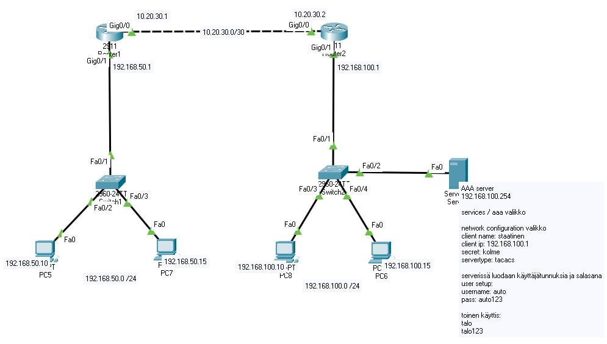

Ensimmäisenä konffaa staatisen reitityksen eli mainostaa reititimen vastapään olevan IP-osoitteen ja sen jälkeen määrittää R2:lle tacacs+ konffit

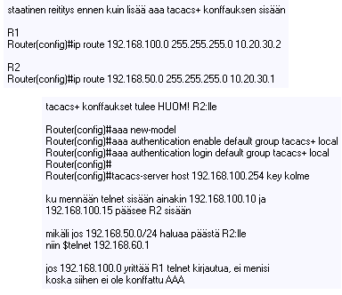

## tacacs harj 3

Tacacs+ L3 switch (3560-24PS) konffaus 

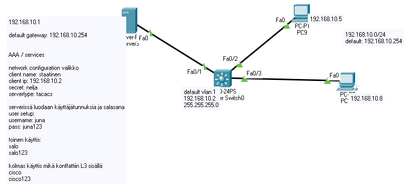

Harjoituksen konfiguroidaan oletus vlan 1 ensimmäisenä, koska käytettään L3 switch:iä telnet protokollaa pääyhteyksenä, jotta PC:n kautta mennään L3 switch:n asetuksien sisään. Myös L3 switch asetuksista konfiguroidaan tacacs+ konffauksia, ja huom. tässä on pientä eroa verrattuna tacacs harjoitus 1 ja 2:n kanssa.

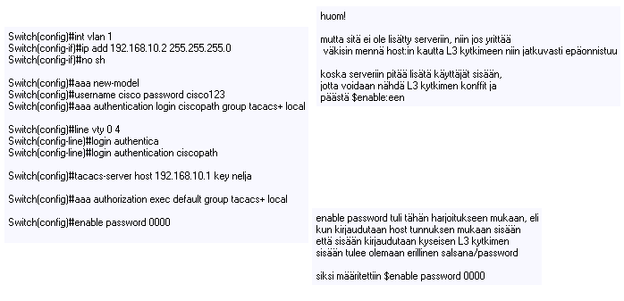

