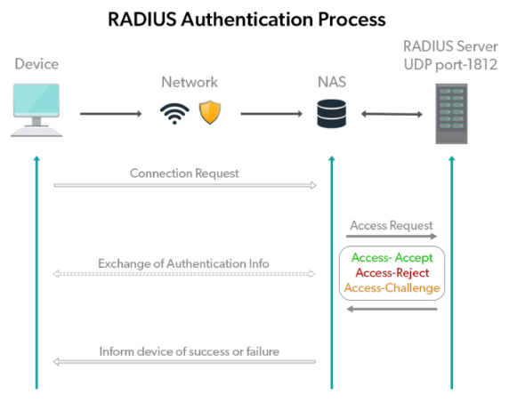
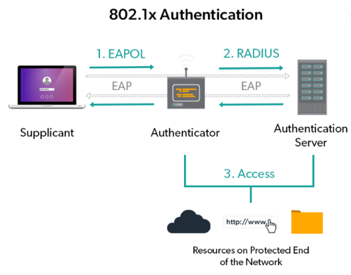
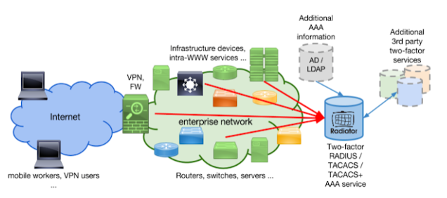
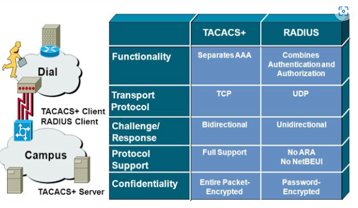
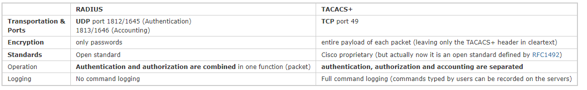

# AAA (Authentication, Authorization & Accounting)

AAA - protokolla, suom. autentikointi / todentamiset & tilastot. tai toisella termillä pääsyhallinta.

Autentikointipalvelun tarkoituksena on tunnistaa käyttäjä dataverkon käyttöoikeuden omaavaksi käyttäjäksi. Käyttäjän tunnistus voi nojautua käyttäjätunnus-salasana-yhdistelmään, kertakäyttöiseen avaimeen, digitaaliseen sertifikaattiin tai puhelinnumeroon, jossa tiettyyn numeroon soitettaessa tunnistus tehdään sen perusteella, mistä puhelinnumerosta soitto on tullut.

Valtuutuspalvelun avulla käyttäjien saamia palveluja pystytään profiloimaan. Toisin sanoen käyttäjä valtuutetaan käyttämään (tai kielletään käyttämästä) verkon palveluita. Käyttäjän käyttöön saamat palvelut voivat perustua esimerkiksi tiettyyn kellonaikaan tai fyysiseen sijaintiin.

Tilastointipalvelun avulla pystytään keräämään käyttäjistä tilastotietoja, kuten esimerkiksi yhteysaikoja. Tilastoidut yhteysajat voivat toimia esimerkiksi laskutuksen perusteena. Tyypillisiä tilastoitavia asioita voivat olla esimerkiksi käyttäjätunnus, IP-osoite, käytetyt palvelut ja yhteyden muodostus- ja päättymisaika.'

Kuten kytkimessä joutuu suorittaa virtual teletype(VTY) 4 ja 15, ja tarvitaan koneen kirjautuminen telnet ja ssh. SSH operaatiossa käyttää tcp 22-porttia oletuksena ja telnet tcp portti 23.

- [AAA](#AAA)
 * [Authentication](#Authentication)
 * [Authorization](#Authorization)
 * [Accounting](#Accounting)
 * [AAA protokollat](#AAA-protokollat)
 * [radius](#radius)
 * [tacacs](#tacacs)
 * [radius ja tacas](#radius-ja-tacas)
- [Tutoriaalit ja muut oppaat](#Tutoriaalit-ja-muut-oppaat)
  * [konffaus](#konffaus)

## Authentication
Autentikointi - jossa käyttäjän tunnistetiedot kyseenalaistaan kysymyksiä esim. käyttäjäntunnus ja salasana, jotka on salattu hajautettun algoritimilllä, joka vaikeuttaa hakkerien sieppaamista. 

## Authorization
Valtuutus - Kun käyttäjän tunnistetiedot on todennettu, valtuutusprosessi määrittää, mitä kyseinen käyttäjä saa tehdä ja käyttää verkon tiloissa. Käyttäjät luokitellaan sen perusteella, minkä tyyppisiä toimintoja he voivat suorittaa, kuten järjestelmänvalvojana tai vieraana. Käyttäjäprofiilit määritetään ja niitä ohjataan AAA-palvelimelta. Tätä keskitettään lähestymistapaa poistaa kuin " per laatikkon" muokaamisen vaivan.

## Accounting
Tili / selvitys - viimeisenä, joka tehdään AAA-mekanismissa, on tilitys kaikesta, mitä käyttäjä tekee verkossa. AAA - palvelin valvooo käytössä olevia resrssien verkkon pääsyn aikaa. Pidossa kirjaa myös käytettäväien istuntotilastoa ja auditoinninkäyttötiedot, ylensä valtuutuksen valvontaan, laskutuslaskutukseen, resurssien käyttöön, trendianalyysiin ja liiketoiminnan tietokapasiteetin suunnitteluun.

## AAA protokollat

Tunnettuimista AAA protokollat on kuten Radius ja TACAS+, mitkä ovat avoimia standardeja, joita eri valmistajat käyttävät verkon turvallisuuden armistamiseen.

Remote Authentication Dial-In User Service (RADIUS) - sen UDP 1645- ja UDP 1812 -porteissa toimiva verkkoprotokolla, joka tarjoaa keskitetyn AAA-hallinnan käyttäjille, jotka muodostavat yhteyden ja käyttävät Network Access Serveriä (NAS), kuten VPN-keskittäjä, reititin ja kytkin. . Tämän asiakas/palvelinprotokollan ja -ohjelmiston avulla etäkäyttöpalvelimet voivat kommunikoida keskuspalvelimen kanssa suorittaakseen AAA-toimintoja etäkäyttäjille. Tämä protokolla toimii sovelluskerroksessa ja voi käyttää joko TCP:tä tai UDP:tä siirtoprotokollana.

Terminal Access Controller Access-Control System Plus (TACACS+) - joka on etätodennusprotokolla, jonka avulla etäkäyttöpalvelin voi olla yhteydessä todennuspalvelimen kanssa käyttäjien verkkoon pääsyn vahvistamiseksi. TACACS+ sallii asiakkaan hyväksyä käyttäjätunnuksen ja salasanan ja välittää kyselyn TACACS+-todennuspalvelimelle.

## radius
RADIUS - protokola (Remote Authentication Dial In User Service)
Protokollan pääasiallinen käyttökohde on operaattorin sisäisessä verkossa, jolloin verkkoa voi pitää kohtuullisen luotettavana ja yhden tahon ylläpitämänä.

Protokolla lähettää paketinvaihdon, jossa NAS (Network access server) lähettää paketi pyynnön Cisco access registrator:lle (Cisco AR) nimen ja salasanan kanssa. Cisco AR etsii nimen ja salasanan varmistakseen, että on oikein ja määrittää mihin dynaamiseen resursseihin käyttäjä on valtuutettu, ja palauttaa hyväksymispaketin, jossa sisältää käyttäjäistunnon määritystiedon. Myös Cisco AR voi hylätä paketin, että sen on estettävä verkkon pääsyä väärälle käyttäjille.

Tai Cisco AR saattaa antaa haasteen, jonka NAS lähettää käyttäjälle, että luoo oikean vastauksen ja palauttaa NAS:lle, jota välittää haastevastauksen Cisco AR toisessa pyyntäpaketissa. Verkon turvallisuuden takaamisen asiakas ja palvelin käyttävät jaettua salaisuutta, joka on merkkijono, jonka he molemmat tietävät, mutta jota ei koskaan lähetetä verkon kautta. Myös käyttäjien salasanaat salataan asiakkaan ja palvelimen väliltä, koska verkon suojaamiseksi luvattomalta käytöltä.

Jos lähiverkossa halutaan käyttää AAA-palveluita, on lähiverkolla oltava RADIUS-palvelin, johon verkko/ethernet-kytkimet ja WLAN-tukiasemat ottavat RADIUS-protokollallaan yhteytä. Palvelimen ja verkkolaitteiden välille pitää olla konfiguroitu oma salasana jokaisen RADIUS-palvelimen ja verkkolaitteen välille.

## tacacs 

tacacs (Terminal Access Controller Access-Control System) & erikseen tacas+ (tacas plus)

Tarkoittaa ryhmä liittyvien protokollien käsittelyn etätunnistus ja niihin liittyvät verkottuneen kulunvalvonta kautta keskitetyssä palvelimessa. Alkuperäisen TACACS käytettiin kommunikointiin auttentikointipalvelimen kanssa, ja siitä alkoi pikku hiljaa laajentaua liittyviä protokollia:

- XTACACS - X = extended, TACACS -laajennus ilman yhteensopivuutta alkuperäiseen protokollaan. Sekä TACACS että XTACACS sallivat etäkäyttöpalvelimen kommunikoida todennuspalvelimen kanssa määrittääkseen, onko käyttäjällä pääsy verkkoon.

- TACACS+ - Peräisin tavallisesta TACACS järjestelmästä, mutta TACACS+ on erillinen protokolla, joka käsittelee todennus-, valtuutus- ja kirjanpitopalvelua eli AAA, mitä osin korvannut edellisen version. 

## radius ja tacas 

Radius ja tacas molempien ero tai yhteistä tekijää

TACACS+ ja RADIUS ovat korvanneet TACACS ja XTACACS molempien järjestelmän rakenteeseen tai päivitetyissä verkoissa. Koska TCP on yhteyskeskeinen protokolla, TACACS+: n on toteutettava lähetyksen ohjaus. RADIUS:ksen ei tarvitse havaita ja korjata lähetysvirheitä, kuten pakettien katoamista, aikakatkaisua ja jne., Koska se kulkee UDP:llä, joka on yhteydetön. RADIUS salaa vain käyttäjien salasanan, kun se kulkee RADIUS -työasemasta RADIUS -palvelimeen. Kaikki muut tiedot, kuten käyttäjätunnus, valtuutus-, kirjanpito, toimitetaan selkeänä tekstinä. Siksi se on altis erityyppisille hyökkäyksille. TACACS+ salaa kaikki edellä mainitut tiedot, joten sillä ei ole RADIUS -protokollan haavoittuvuuksia. 

- <b> Yhteistä: </b>  
  TACACS+ ja RADIUS molempien protokollien tekijöillä on AAA - protokollat, jotka tehostavat verkkoen turvallisuutta ja molemmissa suoriuttuvat samalaisia tehtäviä. Riippuu usein verkojen tyypistä tai verkkojen olevien laitteiden tyypistä, ja vaikuttaa verkkojen käytättävien keskitetyihin todennus ja suorittamiseen. Molempien käyttö tarkoitus on eri, mutta molempia voidaan teoriassa käyttää sekä laitehallinnassa ja verkkon pääsyssä.

- <b> Eroa: </b>  
  Cisco tapauksessa molemmissa muodostavat suurimman osan verkkolaitteista monissa organisaatiossa, tämä on rajoitus ja joka ei ehk ole parempi joissakin inftrastuktuureissa. Toisaalta RADIUS on toimittajan agnostinen avoin protokolla, ja Tacacs+ on patentoitu standardi, jota käytät vain CISCO-laitteissa.
  
  Toiseksi erona on, RADIUS käytetään skenaarioissa, joihin liittyy verkon käyttöoikeuksien hallinta ja TACACS+:ssa käytetään ensisijaisesti laitehallinnassa. Vaikka molemmat voivat käyttää muillakin tavoilla, mutta nämä ovat näiden kahden protokollien tyypillisimpien käyttötapaus.
  
  RADIUS käyttää UDP-protokollaa ja TACACS+ käyttää TCP-protokollaa. Tämä on suuri ero, koska TCP-protokollalla on useita etuja UDP-protokollaan verrattuna. UDP on paras mahdollinen protokolla, mikä tarkoittaa, että RADIUS käyttäminen edellyttää lisämuuttujien ohjelmointia, kuten aikakatkaisua, uudelleenyhteyksiä ja uudelleenlähetyksiä. Toisin kuin RADIUS, TCP on yhteyssuuntautunut, mikä antaa sinulle kuittauksen kaikista vastaanotetuista pyynnöistä.
  
  TCP on tosi hyödyllinen verkkoympäristöissä, koska se voi havaita ja varoittaa käyttäjien reagoimattomista tai kaatuneista palvelimista. UDP-protokollassa ei ole tällaista mekanismia. Tämä ominaisuus lisää myös TCP:tä käyttävien Keep alive -komentojen hyödyllisyyttä useiden palvelimien nykyisen tilan seuraamiseen.
  
  Lisäyksenä RADIUS ja TACACS+ ovat käytettävien pakettien salausta. RADIUS:ksen kaikki tiedot salasanat pysyvät 

# Tutoriaalit ja muut oppaat  
https://www.cisco.com/c/en/us/td/docs/security/asa/asa92/configuration/general/asa-general-cli/aaa-overview.pdf  
https://www.cisco.com/c/en/us/support/docs/security-vpn/terminal-access-controller-access-control-system-tacacs-/10384-security.html  
https://nanopdf.com/download/ccna-security_pdf  

## konffaus  
https://www.cisco.com/c/en/us/td/docs/switches/datacenter/nexus1000/sw/4_0/security/configuration/guide/n1000v_security/security_3aaa.pdf  
https://www.cisco.com/c/en/us/td/docs/switches/datacenter/nexus1000/hyperv/config_guide/security_config/5x/b_Cisco_Nexus_1000V_Microsoft_HyperV_Security_Configuration_Guide_Release_5x/b_Cisco_Nexus_1000V_Microsoft_HyperV_Security_Configuraiton_Guide_Release_5_2_1_SM_1_5_1_chapter_011.pdf 

https://www.cisco.com/c/en/us/support/docs/security-vpn/remote-authentication-dial-user-service-radius/14966-basicradius.html  

## harjoituksia  

https://nanopdf.com/download/ccnaschp3ptacta-a_pdf   

