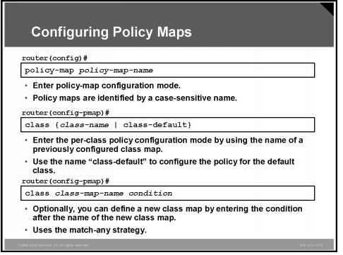
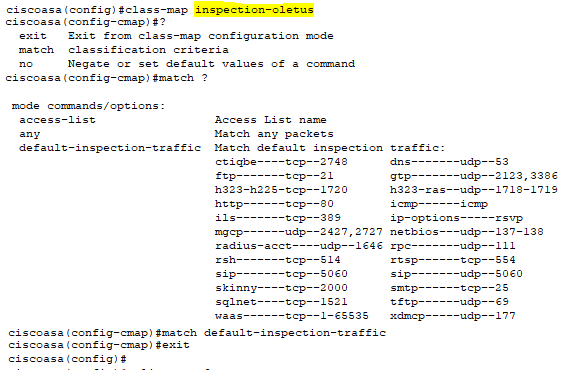
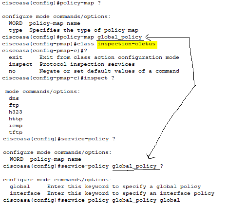
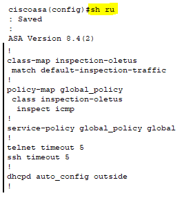

# Firewall - palomuuri

- [Cisco packet tracer](#Cisco-packet-tracer)
- [Security level](#Security-level)
- [NAT](#NAT)
  * [network object](#network-object)
  * [nat esim konfiguroitu](#nat-esim-konfiguroitu)
- [Object group for acl](#Object-group-for-acl)
- [Service Policy](#Service-Policy) 
  * [Policy map and class](#Policy-map-and-class)
  * [inspect tekijät](#inspect-tekijät)
- [guide, oppaat ja konfiguroinnit:](#guide,-oppaat-ja-konfiguroinnit)
  * [asa 5505](#asa-5505)
  * [NAT2](#NAT2)
  * [policy map and class](#policy-map-and-class)
  * [inspect objektit](#inspect-objektit)
  * [konfiguraatiot](#konfiguraatiot)

# Cisco packet tracer

CIsco simulaatiossa on kaksi tyypistä palomuuri kytkintä (5506-x ja 5505), mutta todellisuudessa voi olla useampi mallinen, että nämä kaksi tukee simulaatiossa. Nimeämisessä käytettään *ASA* eli Adaptive Seuciryt appliances, ja 5506-x on wifi point mukana.

5505 - palomuuri kytkimessä on oletuksena valmiina VLAN 1 ja 2 valmiina, sekä VLAN 1 on määritetty oletuksena (nameif inside, seucrity-level 100, ip add 192.168.1.1 255.255.255.0) ja VLAN2 (nameif outside, security level 0). Muut määrityksessä on dhcp add 192.168.1.5 - 192.168.1.6 inside, dhcp sallii "inside", portti int Eth0 sallii vlan 2.

# Security level

Cisco ASA palomuurissa käytettään ns. security level, suomeksi. turvataso, joka osoittaa kuinka luotettava käyttöliittymä on verrattuna toiseen käyttöliittymän. Mitä korkeampi suojataso on, sitä luotettavampi käyttöliitymä on. Jokaisessa ASA:n liitännässä on suojausvyöhyke, sitä käyttämällä suojataso on eri luottamustasoinen suojavyöhyke.

Korkealla suojaustasolla varustettu käyttöliittymä voi päästä matalan suojaustason liitäntään, mutta päinvastoin ei ole mahdollista, ellemme määritä käyttöoikeusluetteloa, joka sallii tämän liikenteen.

<b>Security level 0</b> : alhaisin suojataso, ja oletusarvoinen määritetty ns. ulkopuoliselle rajapinnalle. Alemmassa suojatasossa ei rajapintaa, koska tämä tarkoittaa, että ulkopuolelta (outside) tuleva liikenne ei pääse tavoittamaan mitään rajapintoja ja ellei salli sitä pääsyluetteloa (access-list)

<b>Security level 100</b> : ASA:n korkein suojataso, ja oletuarvoinen määritelmä (inside) käyttöliitymille. Normaalisti käytämme LAN-verkossa, ja tämä on korkein suojataso, ja voi saavuttaa oletuksen kaikki muihin liitäntään.

<b>Security level 1-99</b> : Luonnissa voi vapaasti luoda mitä tahansa muita haluamansa suojaustason, esim. voi käyttää suojaustasoa 50 DMZ:lle. Tämä tarkoittaa, että liikenne on sallittua sisäverkostomme DMZ:lle (turvataso 100 -> 50) ja myös DMZ:ltä ulkopuolelle (turvataso 50 -> 0). Liikenne DMZ:stä ei voi kuitenkaan voi mennä sisälle, että ilman käyttöoikeusluetteloa (access-list). Koska turvataso 50 tuleva liikenne ei saavutta suojaustasoa 100. Suojaustasoa voi luoda useamman määrän (inside, outside) kappaletta. 

DMZ on demilitarisoitu alue (dimilitarized zone), ja tarkoittaa fyysistä tai loogista aliverkkoa, mitä yhdistää organisaation oman järjestelmän turvattovampaan alueeseen, esim. internetiin. Demilitarisoidun alueen tarkoitus on lisätä ylimääräinen tietoturvataso organisaation lähiverkkoon.

# NAT

NAT (network address translation) osoitteenmuutos, mitä tuttu "inside" ja "outside", sekä PAT. Lyhyesti sisäisen salainen ja julkinen IP-osoite kuten Internet sivustot, ja vaikutava muu määritys.

Palomuurissa tapahtuu *inside | outside*  määritys, että "inside"-alueella tapahtuu esim. julkisen koneiden IP-osoite alue, ja "outside":ssa tapahtuu yskityis verkkoa. ASA 5505 palomuurin reititimessä on oletuksena määritetty VLAN 1 , ja sen security level 100 (192.168.1.1/24).

## network object

Kun paketti viesti saapuu ASA:han reititimeen, sekä lähde- ja kohteen IP-osoite tarkistetaan verkko objektista NAT-sääntöjen mukaan. Paketin lähde- ja kohdeosoite voidaan kääntää erillisinä säännöillä, jos tekee erillisen osumat. Tätä sääntöä eivoi sidoksissa toisiinsa, kuin erillainen sääntöjen yhdistelmä voidaan käyttää liikenteisen riippuen. 

Koska sääntöjä ei koskaan yhdistetä, ei voi määrittää, että lähdeosoite käännetään A:ksi, kun siirrytään kohteeseen X, mutta käännetään B:ksi, kun siirrytään kohteeseen Y. Käytä kahdesti NAT:ia tällaiseen toimintoon (kahdesti NAT:n avulla voit tunnistaa lähde- ja kohdeosoite yhdessä säännössä).

Konfiguraatiosta riippuen voit halutessa määrittää yhdistetyn osoitteen rivin sisään tai voit luoda yhdistetylle osoitteelle erillisen verkkoobjektin tai verkkoobjektiryhmän (objektiverkko- tai objektiryhmäverkkokomento). Verkkoobjektiryhmät ovat erityisen hyödyllisiä luotaessa kartoitettua osoitevarastoa, jossa on epäjatkuvia IP-osoitealueita tai useita isäntiä tai aliverkkoja. Myös konfiguroinnin määrityksessä tapahtuu joko dynaamisella tai staatisella NAT määrityksellä.
  
ciscoasa(config)#object network ?  
 
configure mode commands/options:  
  WORD  Specifies object ID (1-64 characters)  
 
ciscoasa(config)#object network inside-net   
	
ciscoasa(config-network-object)#subnet 192.168.1.0 255.255.255.0  
ciscoasa(config-network-object)#nat (inside,outside) dynamic interface   

tarkista nat  ($show nat)  
ciscoasa#show nat  
Auto NAT Policies (Section 2)  
1 (inside) to (outside) source dynamic inside-net interface  
    translate_hits = 0, untranslate_hits = 0
    
## nat esim konfiguroitu

NAT verkko objektien määrittämisestä ja tyyppisiein mallien konfigurointi eli NAT:sta on staatinen ja dynaaminen, erllisenä PAT, ja identtinen NAT.

# Object group for acl

ACL eli access-list. Hallitsevissa Cisco ASA-palomuurissa, mitä takana voi olla satoja tietokonen käyttäjiä, ja kymmensiä palvelimia, ja jokaisessa laitteessa vaaditaan pääsyluettelosääntö (access-list rule), jotka sallivat tai estävän liikenteen.

Monilla laitteilla on tulee antaa kuin käyttöoikeusluettelo lausekkeita, ja käyttöoikeusluettelon lukemista, ymmärtämistä ja päivittämisessa voi olla hallinnollinen painajainen.

Objektiryhmä mitä tulee luoda ns. "ryhmityvä" objekti, mitä voi olla kokoelma IP-osoitte, verkko, porttinumero ja muu. Luomisen pääsyluettelo, mitä on monenlaisia eri käskyjä, sitä voidaan viitata objektiryhmään. Tämä tekee pääsyluettelosta pienemmän ja helpmman luettavan. Aina, kun tekee muutoksia objektiryhmään, mitä näkyvät myös käyttöoikeusluettelossa.

Konfiguroinnin sisällä tapahtuu inside/outside luonti objekti 5505 firewall kytkimessä ja saman aikaisesti NAT (inside,outside) dynaaminen interface:  
ciscoasa(config)#object network ?  

configure mode commands/options:  
  WORD  Specifies object ID (1-64 characters)  
 
ciscoasa(config)#object network inside-net  
	
ciscoasa(config-network-object)#subnet 192.168.1.0 255.255.255.0  
ciscoasa(config-network-object)#nat (inside,outside) dynamic interface  
 
tarvittaessa tarkista nat  ($show nat)  
ciscoasa#show nat  
Auto NAT Policies (Section 2)  
1 (inside) to (outside) source dynamic inside-net interface  
    translate_hits = 0, untranslate_hits = 0  

# Service Policy

Modular Policy Frameworkia käyttävät palvelukäytännöt tarjoavat johdonmukaisen ja joustavan tavan määrittää ASA-ominaisuudet. Tätä voi käyttää palvelukäytäntöä luodaksesi tietylle TCP-sovellukselle ominaisen aikakatkaisukokoonpanon, toisin kuin kaikkia TCP-sovelluksia koskevan konfiguraation. Palvelukäytäntö koostuu useista toiminnoista tai säännöistä, joita sovelletaan käyttöliittymään tai sovelletaan maailmanlaajuisesti.

## Policy map and class

Policy map suom. kuin poliitikkan kartta tai jonkinlainen karttaus termi, ja class perus luokka / luokitus. Policy-map komento käytetään luomalla nimettyn objektin, joka edustaa joukko liikenne luokiin sovelltavia käytäntöjä. Tai muokatakseen käytäntötoimintaa (policy map), jotka yhdistävät käytäntöntoimintoja luokkakrtoihhin (class maps). Tätä komentoa käynnistää policy-map konfiguroinnin määritystilaan, mikä on eri merkitty eri kehote (config-pmap), ja poistu "exit" kerran, että antaa palata määritystilaan.

Class -  voi määrittää palvelukäytännön class-map , että käyttämällä class-map kartanon määrityskomentoa. Jos poistaa palvelukäytännön asetuksista tämän komnenon mukaan "no". esim. "no class <classmap-name>"-

## konffaus toiminnat

Konfigurointia voidaan suorittaa kuin tavallisen tai muun tuotteen kyseisen ASA palomuuri reititin, mutta kantsii tarkistaa tuotteen informaatiosta, minkälaitteen sisäinen ominaisuus on ja komennot, jos sallii palomuurin konffaukset.
	

Esimerkki konffaus tapahtuu cisco packet tracer Firewall ASA 5505 reititin:
 
ensimmäinen vaihde; class-map <nimeäminen> , ja täsmää luokituskriteerit & jos luomista käytettään (default-inspection-traffic), ja jälkeen "exit" - kerran.  

 
toisen vaihde; policy-map <nimeäminen>, tässä pitää huomioida, että tulee käyttämään kaksi kertaa, että joutuu tarkistaa MIKÄ on policy-map <nimi> ja class-map <nimi> käytössä. 

 
$show run, yhteenveto, että pääse tarkistaa policy-map ja class määrityksen

## inspect tekijät
Sallittaan protokollia kuten http - 80 , https - 443, dns - verkko sivun nimi (www.abcd.com), icmp - pinggaus (jotta lähetettään viestiä koneesta a-paiksta b-paikkaan) ja jne.
 
ciscoasa(config-pmap-c)#inspect ?  
 mode commands/options:  
  dns    
  ftp    
  h323   
  http   
  icmp   
  tftp   
	

# guide, oppaat ja konfiguroinnit:  

https://www.cisco.com/c/en/us/td/docs/security/asa/asa96/configuration/firewall/asa-96-firewall-config.pdf  
https://ipwithease.com/asa-firewall-security-levels/  
https://www.cisco.com/c/en/us/support/docs/security/asa-5500-x-series-next-generation-firewalls/115904-asa-config-dmz-00.html  
https://networklessons.com/cisco/asa-firewall/introduction-to-firewalls  
	
## asa 5505
https://www.routerfreak.com/basic-configuration-tutorial-cisco-asa-5505-firewall/  
	
## NAT2
https://www.cisco.com/c/en/us/td/docs/security/asa/asa84/configuration/guide/asa_84_cli_config/nat_objects.html  

## policy map and class
https://www.cisco.com/c/en/us/td/docs/switches/datacenter/nexus5600/sw/qos/7x/b_5600_QoS_Config_7x/configuring_policy_maps.pdf  
https://www.cisco.com/c/en/us/td/docs/app_ntwk_services/waas/waas/v501/command/reference/cmdref/policymap.pdf  
https://www.cisco.com/c/en/us/td/docs/security/asa/asa84/configuration/guide/asa_84_cli_config/mpf_inspect_maps.html  
	
## inspect objektit
https://www.cisco.com/c/en/us/td/docs/security/asa/asa96/configuration/firewall/asa-96-firewall-config/inspect-basic.html  

## konfiguraatiot  

https://www.grandmetric.com/knowledge-base/design_and_configure/how-to-configure-security-level-and-nameif-on-cisco-asa/  

