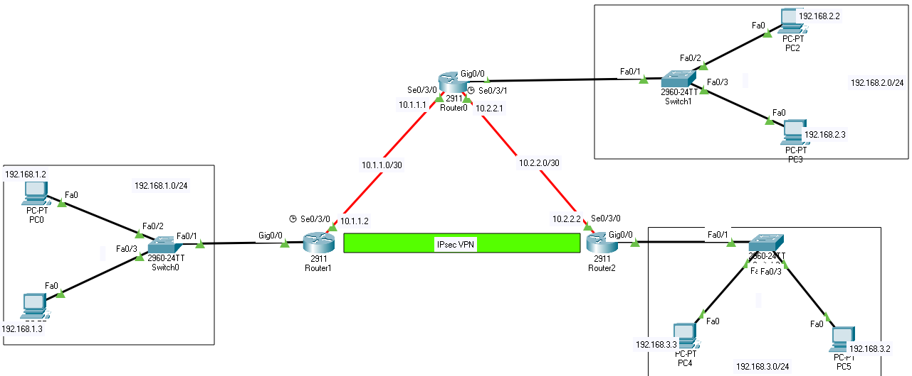

# reititimen konffaus komennot

- [konffaus malli](#konffaus-malli)
  * [R1](#R1)
  * [R2](#R2)
- [konffaus muistisääntö](#konffaus-muistisääntö)

HUOM! jotakin tiettyjä konffauksia ja määritystä cisco packet tracer simulaatiossa ei tue tai ikäänkuin ihan täsmälleen suorita kuin todellisuuden IOS malli.

Router(config)#crypto ?  
  dynamic-map  Specify a dynamic crypto map template  
  ipsec        Configure IPSEC policy  
  isakmp       Configure ISAKMP policy  
  key          Long term key operations  
  map          Enter a crypto map   

Router(config)#crypto isakmp ?   
  client  Set client configuration policy  
  enable  Enable ISAKMP  
  key     Set pre-shared key for remote peer  
  policy  Set policy for an ISAKMP protection suite   

Router(config)#crypto isakmp policy  
Router(config)#crypto isakmp policy ?  
  <1-10000>  Priority of protection suite  
Router(config)#crypto isakmp policy 10   

Router(config-isakmp)#encryption ?  
  3des  Three key triple DES  
  aes   AES - Advanced Encryption Standard  
  des   DES - Data Encryption Standard (56 bit keys).  
Router(config-isakmp)#encryption ae  
Router(config-isakmp)#encryption aes ?  
  128  128 bit keys.  
  192  192 bit keys.  
  256  256 bit keys.  
  <cr>    
Router(config-isakmp)#encryption aes 256   

Router(config-isakmp)#?  
  authentication  Set authentication method for protection suite  
  encryption      Set encryption algorithm for protection suite  
  exit            Exit from ISAKMP protection suite configuration mode  
  group           Set the Diffie-Hellman group  
  hash            Set hash algorithm for protection suite  
  lifetime        Set lifetime for ISAKMP security association  
  no              Negate a command or set its defaults   

Router(config-isakmp)#aut   
Router(config-isakmp)#authentication ?  
  pre-share  Pre-Shared Key 
Router(config-isakmp)#authentication pre   
Router(config-isakmp)#authentication pre-share   

Router(config-isakmp)#group 5  
Router(config-isakmp)#   

---------------------------------

Router(config)# crypto ?  
  dynamic-map  Specify a dynamic crypto map template  
  ipsec        Configure IPSEC policy  
  isakmp       Configure ISAKMP policy  
  key          Long term key operations  
  map          Enter a crypto map  
Router(config)# crypto isa  
Router(config)# crypto isakmp ?  
  client  Set client configuration policy  
  enable  Enable ISAKMP 
  key     Set pre-shared key for remote peer  
  policy  Set policy for an ISAKMP protection suite  
Router(config)# crypto isakmp key  
Router(config)# crypto isakmp key vpnpa55?  
WORD   
Router(config)# crypto isakmp key vpnpa55 ?  
  address  define shared key with IP address  
Router(config)# crypto isakmp key vpnpa55 add  
Router(config)# crypto isakmp key vpnpa55 address 10.2.2.2   

------------------------------------------------
luodaan crypto ipsec transfer name   

Router(config)#crypto ?  
  dynamic-map  Specify a dynamic crypto map template  
  ipsec        Configure IPSEC policy  
  isakmp       Configure ISAKMP policy  
  key          Long term key operations  
  map          Enter a crypto map  
Router(config)#crypto ipsec  
Router(config)#crypto ipsec ?  
  security-association  Security association parameters  
  transform-set         Define transform and settings  
Router(config)#crypto ipsec tra  
Router(config)#crypto ipsec transform-set ?  
  WORD  Transform set tag   

Router(config)#crypto ipsec transform-set VPN-SET ?  
  ah-md5-hmac   AH-HMAC-MD5 transform  
  ah-sha-hmac   AH-HMAC-SHA transform  
  esp-3des      ESP transform using 3DES(EDE) cipher (168 bits)  
  esp-aes       ESP transform using AES cipher  
  esp-des       ESP transform using DES cipher (56 bits)  
  esp-md5-hmac  ESP transform using HMAC-MD5 auth  
  esp-sha-hmac  ESP transform using HMAC-SHA auth  
Router(config)#crypto ipsec transform-set VPN-SET esp  
Router(config)#crypto ipsec transform-set VPN-SET esp-aes ?  
  128           128 bit keys.  
  192           192 bit keys.  
  256           256 bit keys.  
  esp-md5-hmac  ESP transform using HMAC-MD5 auth  
  esp-sha-hmac  ESP transform using HMAC-SHA auth  
  <cr>   
Router(config)#crypto ipsec transform-set VPN-SET esp-aes esp-sh  
Router(config)#crypto ipsec transform-set VPN-SET esp-aes esp-sha-hmac ?  
  <cr>

----------  
crypto map name VPN, map set peer is router three outbound interface set transfoorm can conf before and match address 110   

Router(config)#crypto ?  
  dynamic-map  Specify a dynamic crypto map template  
  ipsec        Configure IPSEC policy  
  isakmp       Configure ISAKMP policy  
  key          Long term key operations  
  map          Enter a crypto map  
Router(config)#crypto map ?  
  WORD  Crypto map tag  
  ipv6  IPv6 crypto map  
Router(config)#crypto map VPN-MAP ?  
  <1-65535>  Sequence to insert into crypto map entry  
  client     Specify client configuration settings  
  isakmp     Specify isakmp configuration settings   

Router(config)#crypto map VPN-MAP 10 ?  
  ipsec-isakmp  IPSEC w/ISAKMP   
  <cr>
Router(config)#crypto map VPN-MAP 10 ip  
Router(config)#crypto map VPN-MAP 10 ipsec-isakmp  
% NOTE: This new crypto map will remain disabled until a peer and a valid access list have been configured.   

Router(config-crypto-map)#description VPN connection to R2  
Router(config-crypto-map)#  
Router(config-crypto-map)#?  
  description  Description of the crypto map statement policy  
  exit         Exit from ISAKMP protection suite configuration mode  
  match        Match values.  
  no           Negate a command or set its defaults  
  set          Set values for encryption/decryption  
Router(config-crypto-map)#set ?  
  peer                  Allowed Encryption/Decryption peer.  
  pfs                   Specify pfs settings  
  security-association  Security association parameters  
  transform-set         Specify list of transform sets in priority order   

Router(config-crypto-map)#set peer   
Router(config-crypto-map)#set peer 10.2.2.2   
Router(config-crypto-map)#set ?  
  peer                  Allowed Encryption/Decryption peer.  
  pfs                   Specify pfs settings  
  security-association  Security association parameters  
  transform-set         Specify list of transform sets in priority order   

Router(config-crypto-map)#set transform-set ?  
  WORD  Proposal tag  
Router(config-crypto-map)#set transform-set VPN-SET ---match transform-set "VPN-SET" id/name esp-aes esp-sha-hmac   

Router(config-crypto-map)#match address ?  
  [100-199]  IP access-list number  
  WORD       Access-list name  
Router(config-crypto-map)#match address 110   

find VPN map crypto map to the outgoing from serial serial cable or other port  

Router(config)#int se0/3/0   
Router(config-if)#crypto map VPN-MAP  
*Jan  3 07:16:26.785: %CRYPTO-6-ISAKMP_ON_OFF: ISAKMP is ON  

# konffaus malli

Tätä kutsutaan site-to-site

  

molemmissas on lisätty lisenssi/päivitys versio $license boot module c2900 technology-package securityk9 - riippuu reititimen sisäisen datasta, että salliiko sen & mutta harjotuksessa käytetty cisco 2911 reititin  

## R1

!  
license udi pid CISCO2911/K9 sn FTX1524Z18X-  
license boot module c2900 technology-package securityk9  
!   

! 
crypto isakmp policy 10  
 encr aes 256  
 authentication pre-share  
 group 5  
!  
crypto isakmp key vpnpa55 address 10.2.2.2  
!   

!  
crypto ipsec transform-set VPN-SET esp-aes esp-sha-hmac  
!  
crypto map VPN-MAP 10 ipsec-isakmp 
 description VPN connection to R2  
 set peer 10.2.2.2  
 set transform-set VPN-SET   
 match address 110  
!  

!
interface GigabitEthernet0/0  
 ip address 192.168.1.1 255.255.255.0  
 duplex auto  
 speed auto  
!  
!
interface Serial0/3/0  
 ip address 10.1.1.2 255.255.255.252  
 clock rate 2000000  
 crypto map VPN-MAP  
!    
!  
ip classless  
ip route 0.0.0.0 0.0.0.0 10.1.1.1   
!  
ip flow-export version 9  
!  
!  
access-list 110 permit ip 192.168.0.0 0.0.255.255 192.168.0.0 0.0.255.255  
!  

## R2

!  
license udi pid CISCO2911/K9 sn FTX1524Z18X-  
license boot module c2900 technology-package securityk9  
!   

! 
crypto isakmp policy 10  
 encr aes 256  
 authentication pre-share  
 group 5  
!  
crypto isakmp key vpnpa55 address 10.1.1.2  
!   

!  
crypto ipsec transform-set VPN-SET esp-aes esp-sha-hmac  
!  
crypto map VPN-MAP 10 ipsec-isakmp 
 description VPN connection to R1  
 set peer 10.1.1.2  
 set transform-set VPN-SET   
 match address 110  
!  

!
interface GigabitEthernet0/0  
 ip address 192.168.3.1 255.255.255.0  
 duplex auto  
 speed auto  
!  
!
interface Serial0/3/0  
 ip address 10.2.2.2 255.255.255.252  
 crypto map VPN-MAP  
!    
!  
!  
ip classless  
ip route 0.0.0.0 0.0.0.0 10.2.2.1  
!  
ip flow-export version 9  
!  
!   
access-list 110 permit ip 192.168.0.0 0.0.255.255 192.168.0.0 0.0.255.255  
!  

------------------------------------------------------------------------------------------------------------------

# konffaus muistisääntö

mikäli jos tulee konffamaaan jotakin ipsec tunnelia ja määritystä löytyy usein sivustoilta niin usein antaa ne framework valmiiksi. HUOM tämä koskee cisco ympäristöä ja alussa pieni huomautus jotakin cisco ei tue crypto ikev1:stä tai vastaavaa ja jne. 

Yleensä ensimmäinen konffaus tapahtuu alemman pohjan mukaan, sitten vastapäässä oleva yhteys tai mihin reititimeen halutaan reitittää sitä vpn tunnelia niin tulemaan identtinen/peilikuvana.

Router(config)#crypto isakmp policy 10  
Router(config-isakmp)#authentication pre-share  
Router(config-isakmp)#encryption aes 256  

muita vaihtoehtoisia kuin (esp-aes, esp-sha-hmac)  
Router(config)#crypto ipsec transform-set ?   
  WORD  Transform set tag
Router(config)#crypto ipsec transform-set kirja ?  
  ah-md5-hmac   AH-HMAC-MD5 transform  
  ah-sha-hmac   AH-HMAC-SHA transform  
  esp-3des      ESP transform using 3DES(EDE) cipher (168 bits)  
  esp-aes       ESP transform using AES cipher  
  esp-des       ESP transform using DES cipher (56 bits)  
  esp-md5-hmac  ESP transform using HMAC-MD5 auth  
  esp-sha-hmac  ESP transform using HMAC-SHA auth  
Router(config)#crypto ipsec transform-set kirja esp-aes ?  
  128           128 bit keys.  
  192           192 bit keys.  
  256           256 bit keys.  
  esp-md5-hmac  ESP transform using HMAC-MD5 auth  
  esp-sha-hmac  ESP transform using HMAC-SHA auth   

 
Router(config-isakmp)#group 2  
Router(config-isakmp)#lifetime 86400  
Router(config-isakmp)#exit   

Reititimen mihin ollaan reititimässä niin sen menevä reititin portti IP-osoite  
Router(config)#crypto isakmp key avainsana address 10.0.0.1    
Router(config)#crypto ipsec transform-set kirja esp-aes esp-sha-hmac  

Määritä reititimen acl, että mistä mihinkin asti vaikappa oiskin kaukana tai välissä on useampi reititin välitys  
Router(config)#access-list 101 permit ip 192.168.20.0 0.0.0.255 192.168.10.0 0.0.0.255  

aktivoidaan crypto kartta ja joku sana, sekä tuossa peer tarkoittaa mihin reititimeen vastapäähän ollaan reititimässä, jotta kahden reititimen välisen yhteys muodostuu se vpn ipsec tunneli. myös täsmennetään (match) acl extendedn id (101)   
Router(config)#crypto map cmap 10 ipsec-isakmp      <<<< 10 täsmäää isakmp polic num  
% NOTE: This new crypto map will remain disabled until a peer  
        and a valid access list have been configured.  
Router(config-crypto-map)#set peer 10.0.0.1    
Router(config-crypto-map)#match address 101         <<< täsmää access-list numeron  
Router(config-crypto-map)#set transform-set kirja   <<<< "kirja" anna joku toinen sana & täsmää transform-set sanan  
Router(config-crypto-map)#exit  
 
viimeisenä aktivoidaan portti lähtö vaikappa ulkoverkkoon WAN ja se cryptatu kartta id  
Router(config)#int giga0/0  
Router(config-if)#crypto map cmap  
*Jan  3 07:16:26.785: %CRYPTO-6-ISAKMP_ON_OFF: ISAKMP is ON  

 ##############################################################################  
joku pien simppeli jos löytää mallia, että framework parametrejä syötettään
  
crypto ikev1 policy 1  
authentication pre-share  
encryption aes  
hash sha  
group 2  
lifetime 86400  
exit  
!
crypto ikev1 enable outside   

tunnel-group 173.199.183.2 type ipsec-l2l  
tunnel-group 173.199.183.2 ipsec-attributes  
ikev1 pre-shared-key Cisc0  
 
crypto ipsec ikev1 transform-set pfSense-AES128SHA esp-aes esp-sha-hmac  
!  
access-list outside_cryptomap_10 remark ACL to encrypt traffic from ASA to pfSense  
access-list outside_cryptomap_10 extended permit ip 192.168.1.0 255.255.255.0 10.0.0.0 255.255.255.0  
!  
crypto map outside_map 10 match address outside_cryptomap_10  
crypto map outside_map 10 set peer 173.199.183.2  
crypto map outside_map 10 set ikev1 transform-set pfSense-AES128SHA  
crypto map outside_map interface outside  