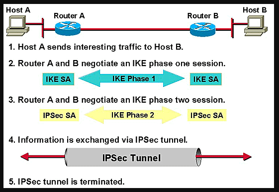
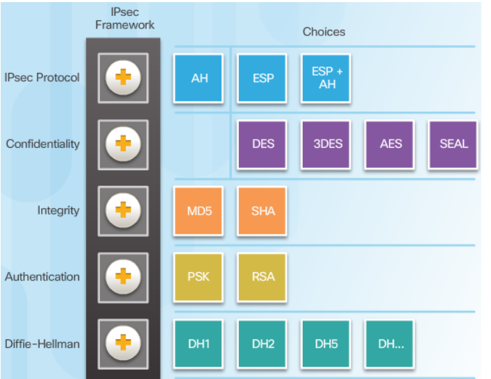
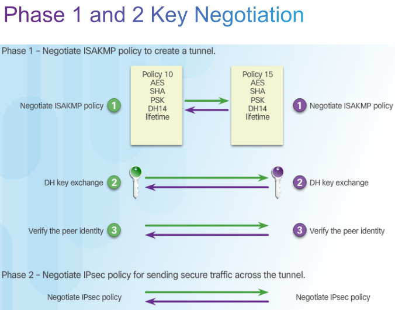
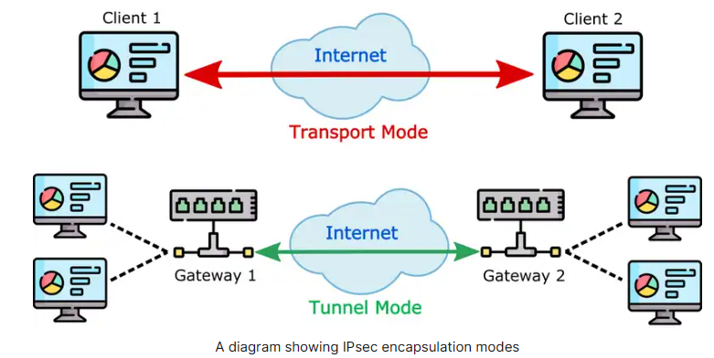
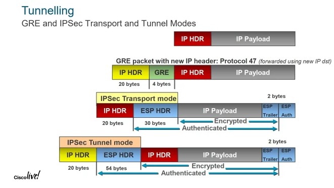
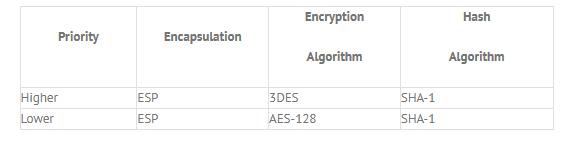

# IPsec (IP Security Architecture) 

  * [IPsec framework](#IPsec-framework)
  * [IKE](#IKE)
  * [Phase 1 ja 2](#Phase-1-ja-2)
  * [Transport vs tunnel models (ipsec)](#transport-vs-tunnel-models-ipsec)
    * [IPsec transport ja tunnel moodien edut ja haitat](#ipsec-transport-ja-tunnel-moodien-edut-ja-haitat)
  * [IPsec haavoituvuudet ja riskit](#ipsec-haavoituvuudet-ja-riskit)

- [reitittimen komennot ja konffaus](#reitittimen-komennot-ja-konffaus)
  * [tarkista määritykset](#tarkista-määritykset)
  * [reitittimen versio](#reitittimen-versio)

- [IPsec tutoriaalit ja muut guide asiat](#ipsec-tutoriaalit-ja-muut-guide-asiat)
  * [ipsec phase 1 ja 2 ja ike](#ipsec-phase-1-ja-2-ja-ike)
  * [Transport vs tunnel models (ipsec)](#transport-vs-tunnel-models-ipsec)
  * [ipsec riskit, haitat, haavoittuvuus ja jne](#ipsec-riskit-haitat-haavoittuvuus-ja-jne)

TCP/IP-joukkon kuuluva tietoliikenneprotokolla Internet-yhteyksien turvaaminen. Nämä protokollat tarjoavat salauksen, osapuolten todennuksen ja tiedon eheyden varmistamisen. Pääasiassa tämä tarkoittaa UDP-pohjaisia sovelluksia, ICMP-kontrolliviestejä sekä reitityksessä ja tunneloinnissa käytettyjä IP-protokollia kuten GRE:tä, OSPF:aa ja niin edelleen. Verrattaessa kuljetuskerroksen protokolliin (4.layer OSI-malli), kuten SSLään, haittapuolena on se, että IPsec-protokollien pitää pystyä hallitsemaan myös vakaus- ja fragmentoitumisongelmat, jotka yleensä on hoidettu korkeammalla tasolla, TCP- eli kuljetuskerroksella.

Käytössä protokolla voi käyttää vaihtoehtoisia kuten:
- yhteydenpitokanavien turvaamista, jolloin usieden koneiden isäntä tai jopa koko lähiverkon liikenne ohjataan yhden pisteiden (esim. palomuurien) kautta, jossa lähtevän liikenne salataan ja vastaavasti paluulikenne puretan tai
- pakettiliikenteen turvaamiseen koko matkalle lähettäjältä vastaanottajalle, jolloin päätepisteiden tietokoneet hoitavat salauksen vaatiman prosessoinnin.

IPsec-protokollaa voidaan käyttää VPN-ratkaisun eli näennäisen yksityisverkon rakentamiseen kummallakin tavalla. On huomioitava että saavutettava tietoturva eroaa huomattavasti näiden kahden mallin välillä. Sekä IPsec on melkoinen monimutkainen, ja toteuttamisessa on monta eri tapaa.

  

IPsec SA (Security associations)  
 

Kuinka IPsec toimii? alemman kuvan mukaisen pieni kuvaus, että kuinka ipsec tunneli toimii
Toiminnaltaan sisältyy moni kompontenttitekiikoita ja salausmenetelmiä, ja voidaan kuitenkin jakaa viiteen vaiheeseen:
- Ensimmäisenä IPsec prosessissa suoriuttuu ja määritettyn IPsec-suojauskäytäntö käyttäen IKE-prosessia. Työasema kone isäntä-A lähettää dataa isäntä-B:lle.
- IKE SA phase 1; IKE todentaa IPsec-vertaisyrityksen ja neuvottelee IKE-SA:t vaiheen ajalal ja perustaa suojatun kanavan IPsec-SA:iden neuvottelmista varten phase 2
- IKE phase 2; IKE neuvottelee IPsec SA parametrit ja määrittää vastaavat IPsec SA:t vertaisversioissa.
- Tiedonsiirto; Datoja siirrettään IPsec -vertaiyrityksen välillä SA-tietokantaan tallennettujen IPsec-parametrien ja avainten perusteella.
- IPsec tunnelin pääte/päättyminen; IPsec SA päättyvät poistamiseen tai ajastettu seuraksena.

IPSEC pääprotokollat:  
(AH) authentication header  
IP protocol 51 ei siällä tietojen luottamuksellisuutta. Se ei salaa tietoja ollenkaan. AH tarjoaa sekä todennus- että eheyspalvelua.  AH ei suorita salausta, se on nopeampi standardi kui ESP

(ESP) Encapsulation security payload:  
IP protocol 50 suorittaa luottamuksellista-, todennusta, ja eheyspalvelua. ESP suorittaa salausta ja on luonnostaan turvallisempi kuin AH. ESP esittelee sekä ylätunnisteen, että perävaunun pakettiin.

Policy ID saa olla eri toisistaan, mutta konffauksen algoritmit, aes, ja muut jotakin tiettyjen ominaisuudet pitää olla identtisiä toisistaan
  

  

## IPsec framework

IPsec protokollan suojauksen liikenteen teknisen yksittäiset ominaisuudet:

- Confidentiality: luottamuksellisuus, salaamalla tietoja kuka muu kuin lähettäjä ja vastaanottaja ei voi lukea tietoja. 
- Integrity : eheys, haluttaan varmistaan, että kukaan ei muuta popakettien tietoja. Laskemalla has-arvon lähettäjä ja vastaanottaja voivat tarkistaa, että onko pakettiin tehty muutosta.
- authentication: todennus, lähettäjä ja vastaanottajat todentavat toisensa varmistakseen, että puhutaan todella sen tietyn laitteen kanssa, jotta aikoo käyttää.
- anti-reply: toiston esto, vaikka pakettien olisi salattu ja todennettu, hyökkääjä voi yrittää kaapata tiettyjä/näitä paketteja ja lähettää niitä uudestaan. Järjestysnumeroita käyttämällä IPsec ei lähetä päällekkäisiä paketteja.

Tämän kuvan mukaan DES, 3DES, AES, MD5, SHA, PSK, DH1 & 2, ja jne nämä tekijät ovat parametrejä. Verkon tietoturvan arkkitehtuuria kehystä määrityksen kannalta, pitää valita suojausprotokolla, määrittää suojausalgoritmit ja vaihtaa avaimien vertaiskerroksien välillä sekä tarjota palveluita, kuten pääsyhallinta, tietolähteen todentamista ja tietojen salausta.  

 

Riskiä ja tietoturvan kannalta, ja varautuminen on hyvä olla. Salauksen kannalta voi halutakseen käyttää DES-, 3DES tai AES-salausta. Todennusta varten voi valita MD5:sen tai SHA-välillä. IPsec voi käyttää monissa erissä laiteissa, että käytetään reitittimessä, palomuurissa, host:ssa ja palvelimessa. Muutama esim. kuinka sitä IPsec käytettään:

- Kahden reitittimen välillä luodakseen site-to-site VPN silattu "bridge" kaksi lähiverkkon yhteytä (LAN). Bridge eli silattu VPN tarkoittaa muodostamista yhdistämällä yksi tai useampi ethernet rajapinta, joista käyttä joko fyysinen tai virtual TAP-liitäntä, jota käytettään VPN-tunneloinnissa.
- Palomuurin ja Windows:hostien välisen VPN-etäkäyttöä.
- Kahden Linux -palvelimien välillä suojattujen turvatonta protokollaa, kuten telnet.

## IKE
Internet Key Exchange - versioita on kaksi tyypistä nimellä IKEv1 tai IKEv2.

IKE on standardiprotokolla, joka käytetään luomaan turvallisen ja todennettun viestikanavan kahden osapuolen välille VPN tunnelin kautta. Protokolla varmistaa VPN-neuvottelujen, etä työskentelevän koneen ja verkko käytön turvallisuutta. 

IKE tärkeässä toiminassa on neuvotella IPSec tietoturvayhdistyksiä (SA security associations). SA:ssa ovat tietoturvakäytäntöjä, jotka on määritelty kahden tai useamman entiteetisen/olion välisen viestinnän varten. Molempien osapuolet käyttävät ja edustavat tietoyn määrän joukkon algoritmita ja yhteisesti sovitujen avaimia yritettäisi muodostaa VPN-tunnelia tai yhteytä. Myös IKE on osa IPsec-protokollia ja algoritmia, joita käytettään siirrettävien arkaluonteisia tietojen suojaamista. IETF (internet negineer task force) kehitti IPsec tarjoamaan turvallisuutta IP-verkkopakettien ja suojattujen VPN-verkkojen todentamista ja salauksia varten.

Hybridiprotokolla, IKE, joka toteutaa myös kaksi aikaisempaa suojausprotokollaa kuin <b>Oakley</b> ja <b>SKEME</b>, TCP/IP-pohjaisessa Security Association Key management protocol (ISAKMP) kehyksessä.

SKEME-protokolla on vaihtoehtoinen versio vaihtoavaimelle (exchange key). ISAKMP RFC 2408:aa käytettään neuvotteluihin (negotiations), tietoturvayhteyksien luomista ja yhteyksien turvaamista IPsec-vertaisyrityksien välillä, että avaintenvaihtoa ja autetikointien puutteen määritämistä. Oakley RFC 2412:tä käytetään avainten sopimuksiin tai vaihtoihin, ja sitä määrittää mekanismi, jota käytetään IKE-istunnon aikana avainten vaihdossa. Diffie-Hellman (D-H) on vaihdossa käytetty oletusalgoritmi.

## Phase 1 ja 2

- ISAKMP (Internet Security Association and Key Management Protocol)
- AES (Advanced Encryption Standard) Encryption Algorithm
- SHA (Secure Hash Algorithm) Cryptographic hash function
- PSK (Pre-Shared Key)
- DH (Diffie-Hellman) Method of securely exchanging cryptographic keys over a public channel

VPN tunnelin rakentamiseksi IPsec vertaisyritykset vaihtavat joukon viestejä salauksesta ja todennusta ja yrittävät sopia monista erilaisista parametristä, siks tätä kutsutaan VPN-neuvottelut (negotiation). Tämä sekvensi laite on kuin herätin ja toisessa vastapäässä on vastaaja.

Neuvoteltussa suoriuttuu kahden erillisen vaihdeen (Phase 1 ja 2). 
- Phase 1: tarkoituksena on perusta suojattun ja salatun kanavan, jonka kautta turvata phase 2 vertaistaa/neuvotella toisensa yhteytä. Diffie-Hellman avaimen algoritmi luo turvallisen autentikointi viesitntäkanavan. Tämä digitaalisen salaus menetelmä käyttää tiettyissä tehoissa korotettujen lukujen salauksenpurkuavainta tuottamista. Phase 1 ja 2 neuvottelun tuloksena tulisi olla istuntoavaimen ja yksi kaksisuuntainen SA. Kun phase 1 on konfattu onnistuneesti niin kumppani siirtyvät nopeasti phase 2:lle neuvotteluun. Mikäli jos phase 1 vaihe konffaukset epäonnistuu niin laitteet eivät voi kommunikoida toisensa.

- Phase 2: neuvotellussa sen tarkoituksena on, että kahden vertaisen eli phase 1 ja 2:sen sopivia parameterjä, jotka määrittelevät toisensa, että liikennettä voi kulkea VPN:n kautta ja kuinka liikenne salataan ja todennetaan, siksi tätä kutsutaan turvallisuuden yhdistämiseksi (security association)

Phase 1 ja 2 kokoonpanoja on vastattava tunnelin kummasssakin päässä olevista laitteesta, että suoriutuvat kuin peili mukaisena konffauksena.

## Transport vs tunnel models (ipsec)
Transport vs tunnel models tukee molempien protokollassa (AH & ESP), voi operoida kahta modeemia  

Tunnel moodi määrittää suojatun yhteyden ja transport moodissa vain salaa lähetettävien tietoja ilman suojattua yhteytä. 
Transport moodi lähettävät ja vastaanottavat hostien (isännän) muodostavien yhteytä ennen tietojen vaihtoa. Tunnel moodissa toinen IP-paketti lähetetään täysin erillä protokollalla ja täjä suojaa datapakettien tarkastusta tai muuttamista kuljetuksen ajalla.

- Tunnel mode; suojaa tiedot paikasta toiseen (site-to-site) tai verkosta verkoon (network-to-network) skenaariolla. Tunneloidussa moodissa VPN-toiminta suorittavat laiteet eli reititin tai suojauslaite, että ne tekee sen muiden käyttäjien puolesta. Tunnel moodissa koko IP-paketit eli sisältyen IP-header ja hyötykuorma, salataan ja uusi IP-header lisätään.

- Transport mode; suojaa tiedon työlaiteisto isänän (host-to-host) tai päästä-päähän (end-to-end) skenaario. Transport moodissa jokainen käyttäjä suorittaa VPN-toiminnot itsenäisesti. Siirossa IPsec suojaa alkuperäisen IP-paketin hyötykuormaa, mutta sulkee pois IP-header. Transport moodi on eri kuin tunnel moodi, säilyttää alkuperäisen IP-header ja lisää IPsec header alkuperäisen IP-header ja hyötykuorman väliin. 

Tunnel moodin edut verrattuna transport moodissa on se voi toimia osoitteenmuutoksena eli NAT (network address translation) ja koko alkuperäisen IP-paketti on piilotettu. NAT kartoittaa yksittäisen private IP-osoitteen julkiseksi IP-osoitteeksi muokkaamalla verkko-osoitetietoja paketien IP-headeriä liikenteen reitityslaitteen lävitse siirron ajalla. 

Tunnel mode suuremmista/tärkeimmistä haitat ovat kapselointi aiheuttamia ylimääräisiä kapselointia, kyvyttömyys puolustautua heikkoja eheysprotokollia vastaan kohjdistuvilta hyökkäyksiltä, ja transport moodi saattaa olla yhteensopivuus joissakin palomuurien kanssa.

### IPsec transport ja tunnel moodien edut ja haitat

IPsec asennettun moodien tyyppien edut ja haitat. Myös pitää huomioida ja harkita asiansa, että mikä tila sopii parhaiten. IPsec VPN käyttöä salattujen tunnelin luomista ja suojatun etäkäyttöön takaamista koko verkkoon tai toimisto konttorissa.

IPsec Transport
etuna: yhteensopivuus tiettyjen palomuurien kanssa ja tarjoaa korkeamman suojaustason. Transportissa ei vaadi suojatun yhteytä muodostamista kahden pisteen välille (endpoints), ja sillä on vähemmän ylimääräisiä kapselointia, koska se ei kapseloi pakettia.

haitat: suurin haitassa on se vaikeuttaa NAT-läpiviennin tai UDP kapselointia. UDP protokollan on tekniikka verkko-otsikoiden lisäämiseksi paketteihin ja auttaa kuormituksen tasapainottamisessa verkkoliikenteen jakamiseksi paremmin. UDP sisäisessä tekniikka on noi suoratoistot, live, äänet ja jne. ettei saa niitä takaisin ja se on nopea.

IPsec tunnel;

edut: se luo suojatun yhteyden kahden päätepisteen välille kapseloimalla paketit ylimääräiseen IP-headeriin. Tunnel moodi tarjoaa myös paremman suojauksen transport moodiin verratuna, koska tunnel moodi paketit on salattu.

haitat: suurin haittapuoli, että se vaatii suojatun yhteyden muodostamista kahden päätepisteen (endpoints) välille ja aiheuttaa enemmän ylimääräistä kustannusta, koska koko alkuperäisen paketti on oltava kapseloitava. Myös transport moodi voi ehkä toimia paremmin kuin tunnel moodi tietyissä tyyppissä verkoissa ja palomuureilla.

## IPsec haavoituvuudet ja riskit

Yksi IPsec suurimmista haitoista on sen monimutkaisuus, mutta vaikka sen joustavuus tekee siitä suosituimmaksi ja voi olla hämmentävä. Tärkeänä IPsec sisältää paljon vaihtoehtoisia ja paljon joustavuutta. Suurin osa IPsec kehitettiin komiteaprosessin kautta. Asianmukaisen poliittisen luonteesta johtuen standardi lisättiin lisätoimintoja, vaihtoehtoja ja joustavuutta niin standardointivriasto eri ryhmittymisen tyydyttämiseksi. Monimutkaisuuden takia voi johtaa IPsec virheellisen käyttöönotton tai määritystä, mikä voi johtaa tahattomia tietoturvaseurauksia.

may 2022 mukaan IPsec edut ja haitoja (https://www.teal-consulting.de/en/2022/05/16/ipsec-best-practices-update/):

edut; 
- IPsec tarjoaa kaksisuuntaisen todennuksen (two-way) authentication kahden viestinnän kommunikoinnin välillä Kerberos v5-protokollalla x-509 kanssa varmenteilla tai esijaetun avain (preshared key). 
- Avain menetelmänä ei suositella turvallisuudensyistä ja sitä käytetään yleensä vain testauksena. 
- Valinnaisena tietojen salaus IP:ssä koska IPsec on toteutettu IP-layer, ja se toimii sovelluksista riippumatta.

haitat; 
- IPsec yhteyden suojaussäännöstä jaetaan yleensä päätelaitteelle GPO (group policy object) ryhmille jaettu oikeudellinen objektin kautta. Tämä edellyttää, että päätelaite on AD (active directory) jäsen. Tämä on yksi tapaus josta usein yrityksille tulee muodostua/osoittautuvia pien haitoja ympäristössä kuten DMZ:ssä (demilitarized zone), ja kaikki WIndows-järjestelmät eivät välttämättä ole AD domain (toimialueen) jäseniä.
- Jos käyttää todentamista x.509-varmennetta niin tarvii joko sisäisen PKI tai varmenteita, mitä on ostettu ulkopuolisilta kumppanin taholta. (x.509 => kryptografian standardi julkisen avaimen salauksessa käytettäville varmenteille & Standardia käytetään useissa Internetin protokollissa kuten TLS ja HTTPS.) (PKI = Public Key Infrastructure, julkisen avaimen järjestelmä)
- IPsec käyttö itsensä ja voi olla joskus monimutkainen.  
- IPsec salausta käytettäess järjestelmien suorittaminen kuormitus on suurempi.

# reitittimen komennot ja konffaus

## tarkista määritykset

| komennot | kuvaus |
| ----- | ---------- |
| $show crypto ipsec transform-set  | | 
| $show crypto isakmp sa  | varmistaa, että ISAKMP-tunneli on konfiguroitu/olemassa/luotu | 
| $show crypto ipsec sa   | varmistaa, että IPsec-tunneli on konfiguroitu/olemassa/luotu | 
| $show crypto map  | varmistaa crypto map on konfiguroitu, että IPV4 reititys reititimestä, ipsec-isakmp id, BGP reititys eli tietojen vaihtamista. | 

## reitittimen versio
tarkista routerin security määritys "$show version"  

jos puuttuu voidaan määrittää sen securityk9:ksi mikä tais olla oletus nimi. Jokaisen routeri määrityksessä on oma "cLuku"
  
"license boot module c1900 technology-package securityk9"
  
jokaisessa routerissa on eriluku toi "c1900" kantsii tarkistaa
  
jos mielestäsi on oikea valikko sit vaan "yes"
muist tallentaa "$copy run start" tai "write" / "wr"
  
käynnistä uudelleen "$reload" ja tarkista, että on määritetty securitety licenssi

# IPsec tutoriaalit ja muut guide asiat  

https://www.cisco.com/en/US/docs/routers/access/800/850/software/configuration/guide/vpngre.html  
https://www.firewall.cx/cisco-technical-knowledgebase/cisco-routers/867-cisco-router-site-to-site-ipsec-vpn.html  
https://networklessons.com/cisco/ccie-routing-switching/ipsec-internet-protocol-security  
https://kalaharijournals.com/resources/141-160/IJME_Vol7.1_159.pdf  
https://cybersecfaith.com/2020/11/01/setting-up-an-ipsec-vpn-using-cisco-packet-tracer/  
https://www.cisco.com/en/US/docs/routers/access/800/850/software/configuration/guide/vpngre.pdf   
https://www.twingate.com/blog/ipsec/  

## ipsec phase 1 ja 2 ja ike

https://www.watchguard.com/help/docs/help-center/en-US/Content/en-US/Fireware/mvpn/general/ipsec_vpn_negotiations_c.html  
https://www.techtarget.com/searchsecurity/definition/Internet-Key-Exchange  
https://www.cisco.com/c/en/us/support/docs/security-vpn/ipsec-negotiation-ike-protocols/217432-understand-ipsec-ikev1-protocol.html  

## ipsec riskit, haitat, haavoittuvuus ja jne

https://www.teal-consulting.de/en/2022/05/16/ipsec-best-practices-update/
