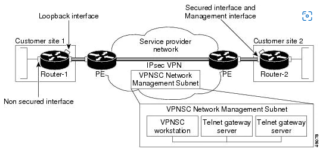
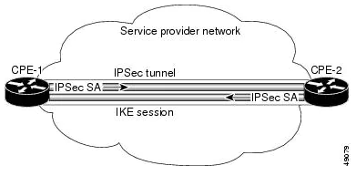
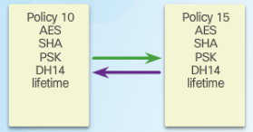
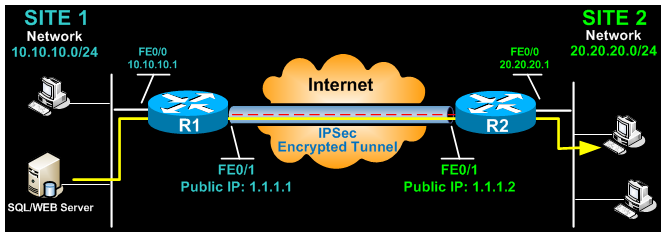
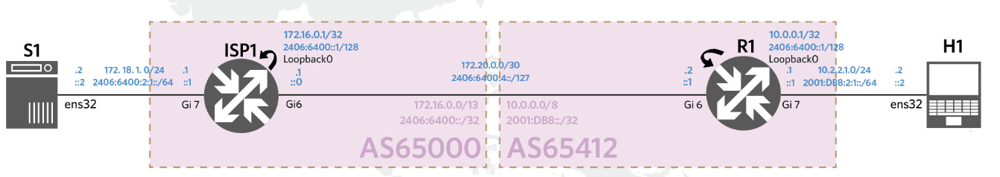

# IPsec (IP Security Architecture) 

- [Transport vs tunnel models ](#Transport-vs-tunnel-models)
  * 
- [reitittimen komennot ja konffaus](#reitittimen-komennot-ja-konffaus)
  * [tarkista määritykset](#tarkista-määritykset)
  * [reitittimen versio](#reitittimen-versio)
- - [IPsec tutoriaalit ja muut guide asiat](#IPsec-tutoriaalit-ja-muut-guide-asiat)

TCP/IP-joukkon kuuluva tietoliikenneprotokolla Internet-yhteyksien turvaaminen. Nämä protokollat tarjoavat salauksen, osapuolten todennuksen ja tiedon eheyden varmistamisen. Pääasiassa tämä tarkoittaa UDP-pohjaisia sovelluksia, ICMP-kontrolliviestejä sekä reitityksessä ja tunneloinnissa käytettyjä IP-protokollia kuten GRE:tä, OSPF:aa ja niin edelleen. Verrattaessa kuljetuskerroksen protokolliin, kuten SSLään, haittapuolena on se, että IPsec-protokollien pitää pystyä hallitsemaan myös vakaus- ja fragmentoitumisongelmat, jotka yleensä on hoidettu korkeammalla tasolla, TCP- eli kuljetuskerroksella.

Käytössä protokolla voi käyttää vaihtoehtoisia kuten:
- yhteydenpitokanavien turvaamista, jolloin usieden koneiden isäntä tai jopa koko lähiverkon liikenne ohjataan yhden pisteiden (esim. palomuurien) kautta, jossa lähtevän liikenne salataan ja vastaavasti paluulikenne puretan tai
- pakettiliikenteen turvaamiseen koko matkalle lähettäjältä vastaanottajalle, jolloin päätepisteiden tietokoneet hoitavat salauksen vaatiman prosessoinnin.

IPsec-protokollaa voidaan käyttää VPN-ratkaisun eli näennäisen yksityisverkon rakentamiseen kummallakin tavalla. On huomioitava että saavutettava tietoturva eroaa huomattavasti näiden kahden mallin välillä.

  

IPSEC protokollat:  
(AH) authentication header  
IP protocol 51 ei siällä tietojen luottamuksellisuutta. Se ei salaa tietoja ollenkaan. AH tarjoaa sekä todennus- että eheyspalvelua.  AH ei suorita salausta, se on nopeampi standardi kui ESP

(ESP) Encapsulation security payload:  
IP protocol 50 suorittaa luottamuksellista-, todennusta, ja eheyspalvelua. ESP suorittaa salausta ja on luonnostaan turvallisempi kuin AH. ESP esittelee sekä ylätunnisteen, että perävaunun pakettiin.

  

  

## Transport vs tunnel models 
Transport vs tunnel models molempien protokollassa (AH & ESP), voi operoida kahta modeemia  

- Transport moodi - aluperäisen IP-otsikon jätetään ehjiksi. Käytetään suojaamaan tiedonsirtoa yhdellä laitteella toiselle laitteelle. 

- Tunnel moodi - koko alkuperäisen pakettin hajautettua ja/tai salattua, mukaanlukien sekä hyötykuorma, että mahdolliset alkuperäiset otsikot. Väliaikaisen IP-otsikkoa lisätään pakettiin siirron aikana. Käytettään tunnelin liikenteelle paikasta toiseen.

# reitittimen komennot ja konffaus

## tarkista määritykset

$show crypto map   
$show crypto ipsec transform-set   
$show crypto isakmp sa  
$show crypto ipsec sa  

## reitittimen versio  
tarkista routerin security määritys "$show version"  

jos puuttuu voidaan määrittää sen securityk9:ksi mikä tais olla oletus nimi. Jokaisen routeri määrityksessä on oma "cLuku"
  
"license boot module c1900 technology-package securityk9"
  
jokaisessa routerissa on eriluku toi "c1900" kantsii tarkistaa
  
jos mielestäsi on oikea valikko sit vaan "yes"
muist tallentaa "$copy run start" tai "write" / "wr"
  
käynnistä uudelleen "$reload" ja tarkista, että on määritetty securitety licenssi

# IPsec tutoriaalit ja muut guide asiat

