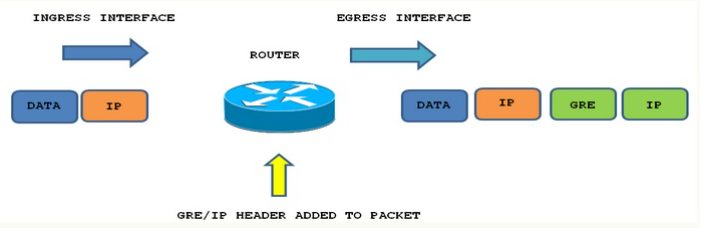
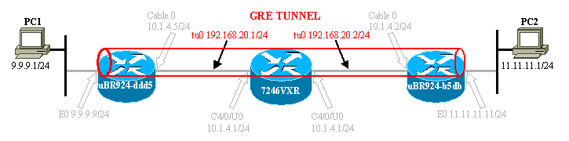
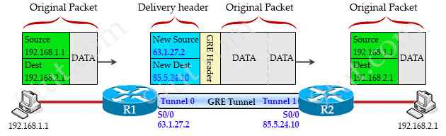
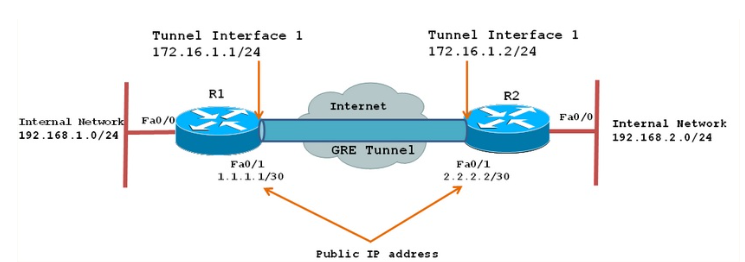
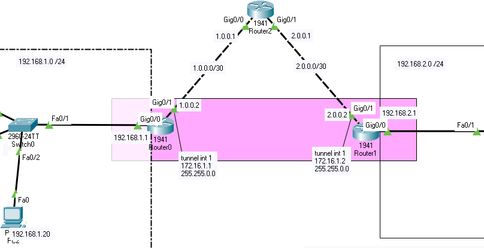

# VPN

Cisco packet tracer VPN konffaukset tulee tänne ja muita harjoituksia

- [konffaus-tunnel-interfaces](#konffaus-tunnel-interfaces)
  * [GRE](#GRE)
  * [gre teoria](#gre-teoria)

# konffaus tunnel interfaces
## GRE

Generic Routing Encapsulation - GRE on Cisco ympäristön kehittämä IP-tunneloitu protokolla. Sisällä tunneloidaan tavallisen VPN-yhteys, ja tavallisen IP-pakettia, mutta osa siirtää myös multicast- ja IPv6-liikennettä. Protokolla on hyvä väline ja toteuttamisessa käyttävät sitä nopeita ja tehokkaita. 

Tunnelit toimivat virtuaalisina point-to-point-linkkeinä, joilla on kaksi päätepistettä, jotka tunnistaa tunnelin lähde (source)- ja tunnelin kohdeosoite (destination) kussakin päätepisteessä.

## gre teoria

Kun lähettää reititimestä dataa kohti vastaanottajaan paketit GRE-tunneli kuin käärii sen "wrap" paketin toiseen IP-osoitteksi, jossa on kaksi ylätunnistetta: eli 1. GRE-header (4tavua/bytes), jossa käytetään itse tunnelin hallinnassa. Toinen on nimeltään "Delivery headeri" (40tavua/bytes), joka sisältää tunnelin kahden virutaalisen rajapinnan (interfaces) ns. (tunneloitu interfaces) uuden lähde- ja kohde-IP-osoitteet (new source and destination IP addresses), ja myös kutsutaan kapseloimiseksi (encapsulation)

Simppelimpi kuva 

Data paketti käärii sen osiin, kahden välissä on tunnelien IP-osoite ja data paketi menee kohti vastaanottajan luokse

Kuva esimerkissä reititin R1 vastaanottaa IP-paketin, ja muuttaa/käärii sen paketin GRE-tunneliin ja toimitusotsikkolla. Toimitus otsikko sisältää uuden lähde-IP-osoitteen (source) eli 63.1.27.2 (R1 portin liitännän IP-osoite, jota käytetään tunnelin luomista), ja uuden kohde IP-osoite (destination) 85.5.24.10 (R2 portin liitännnän IP-osoite, jota käytetään tunnelin luomista).

GRE-tunneli ei salaa pakettia, vain kapseloi sen, ja jos halutaan salata paketit GRE tunneli sisällä on käytettävä IPsec, mutta se ei kuulu CCNA soveltamisalaan. IPsec:llä on salaus protokolla (encription).

Kun GRE paketi saapuu vastaanottajan eli paketi viesti perille eli ylemmän kuvan mukaan R2:lle. Saappueessa purkaa GRE-pakkauksen ja toimittaa sisäisen data kuin alkupeärinen lähtö eli R1.

VPN, joka ei tue monilähetystä, GRE-tunneli tukee monilähetystä ja monet suosituksen reititysprotokollat kuten OSFP, EIGRP voivat toimia yhdessä.

HUOM. GRE-tunnelin kahden pään IP-osoitteet eli ylemmän kuvan mukaan (63.1.27.2 & 85.5.24.10), voivat olla samassa tai erissä aliverkossa (subnet), mikäli kaksi reititintä osaa päästäkseen toisen tunnelin IP-osoitteeseen. R1 portti liitäntä 63.1.27.2 <<<----------->>> 85.5.24.10 portti liitäntä R2.

<h3>1 - esimerkki konffaus</h3>

GRE-tunnelin määrittämisessa edellyttää tunnelinrajapinnan luomista, että on looginen käyttöiittymä (interfaces). Myös tunneliin tulee määrittää päätepisteen tunnelin käyttöliitymä

Määrittämällä tunnelin lähde (source) ja kohteen (destination) antamalla tunneli lähteen:
 
$tunnel source {ip-address | interface-type} and tunnel destination {host-name | ip-address}
 

| R1 | R2 |
| ------- | ------- |
| R1(config)# ip route 0.0.0.0 0.0.0.0 172.16.1.2     R1(config)# interface Tunnel1   R1(config-if)# ip address 172.16.1.1 255.255.255.0   R1(config-if)# ip mtu 1400   R1(config-if)# ip tcp adjust-mss 1360   R1(config-if)# tunnel source 1.1.1.1   R1(config-if)# tunnel destination 2.2.2.2   | R1(config)# ip route 0.0.0.0 0.0.0.0 172.16.1.1     R2(config)# interface Tunnel1   R2(config-if)# ip address 172.16.1.2 255.255.255.0   R2(config-if)# ip mtu 1400   R2(config-if)# ip tcp adjust-mss 1360   R2(config-if)# tunnel source 2.2.2.2   R2(config-if)# tunnel destination 1.1.1.1  

<h3>2 - esimerkki konffaus</h3>

| R0 | R1 |
| ------- | ------- |
| Router(config)#ip route 0.0.0.0 0.0.0.0 1.0.0.1   Router(config-if)#   %LINK-5-CHANGED: Interface Tunnel1, changed state to up    Router(config-if)#ip add 172.16.1.1 255.255.0.0   Router(config-if)#tunnel source giga   Router(config-if)#tunnel source gigabitEthernet 0/1   Router(config-if)#tunnel destination 2.0.0.2   Router(config-if)#   %LINEPROTO-5-UPDOWN: Line protocol on Interface Tunnel1, changed state to up     Router(config)#ip route 192.168.2.0 255.255.255.0 172.16.1.2   | Router(config)#ip route 0.0.0.0 0.0.0.0 2.0.0.1   Router(config-if)#   %LINK-5-CHANGED: Interface Tunnel 2, changed state to up    Router(config-if)#ip add 172.16.1.2 255.255.0.0   Router(config-if)#tunnel source giga   Router(config-if)#tunnel source gigabitEthernet 0/1   Router(config-if)#tunnel destination 1.0.0.2   Router(config-if)#   %LINEPROTO-5-UPDOWN: Line protocol on Interface Tunnel1, changed state to up     Router(config)#ip route 192.168.1.0 255.255.255.0 172.16.1.1   | 

# tunnel interface ohjeita  
https://community.cisco.com/t5/networking-knowledge-base/how-to-configure-a-gre-tunnel/ta-p/3131970  
https://www.cisco.com/c/en/us/td/docs/routers/ncs6000/software/ncs6k_r5-2/interfaces/configuration/guide/b-interfaces-cg-ncs6k-52x/b-interfaces-cg-ncs6k-52x_chapter_01000.pdf  
https://www.9tut.com/gre-tunnel-tutorial  

https://www.firewall.cx/cisco-technical-knowledgebase/cisco-routers/868-cisco-router-gre-ipsec.html  

https://ipcisco.com/lesson/gre-tunnel-configuration-with-cisco-packet-tracer/  

www.ciscopress.com/articles/article.asp?p=2832406&seqNum=7   
www.imperva.com/blog/setting-up-a-gre-tunnel-on-a-cisco-router/  

