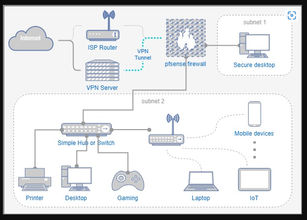
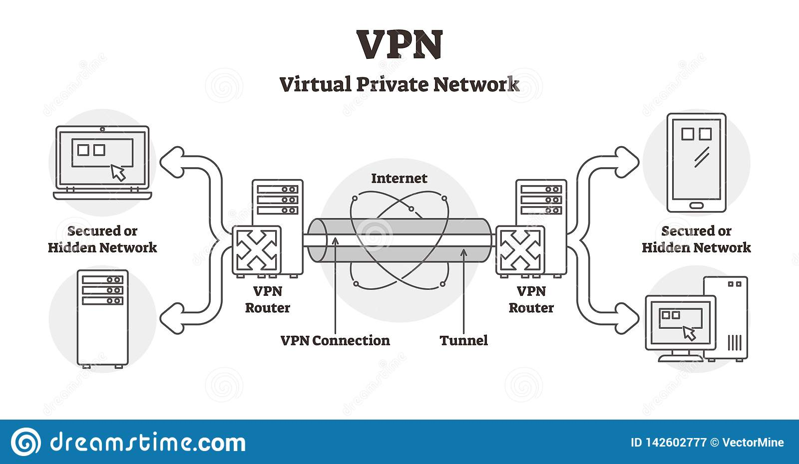
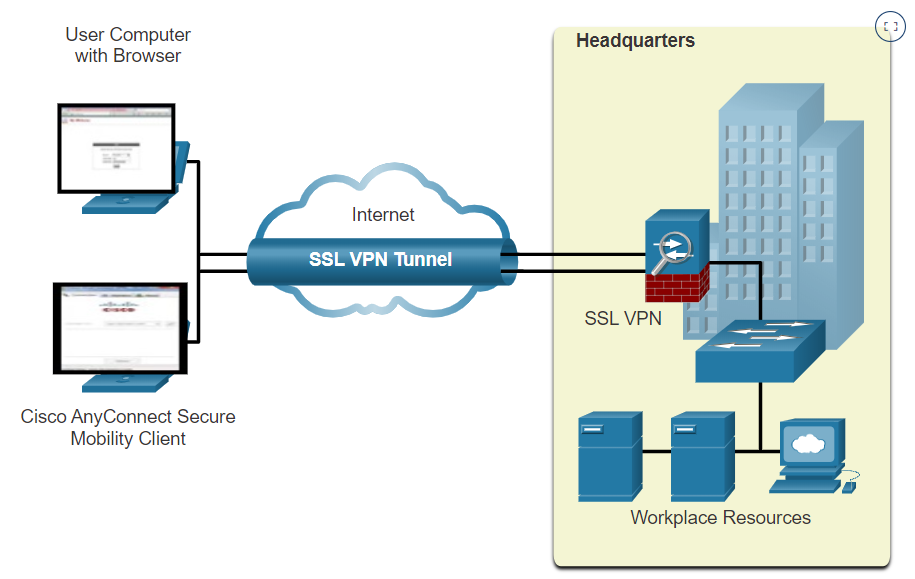
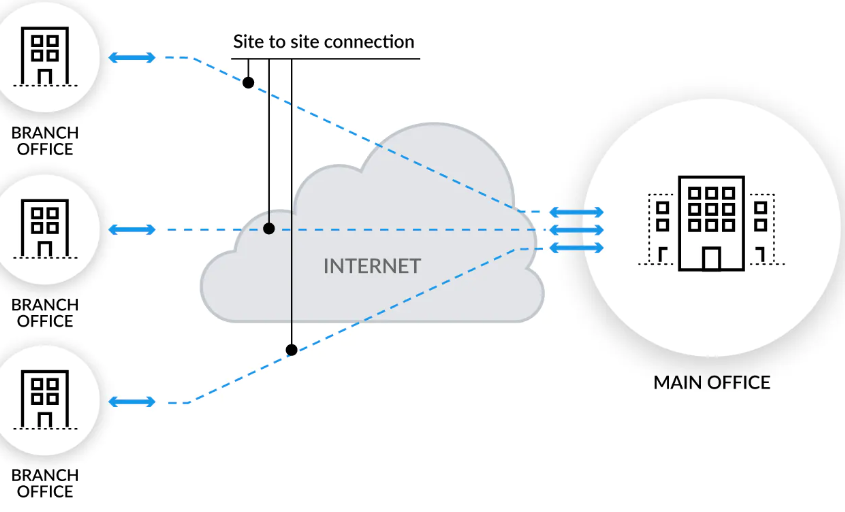
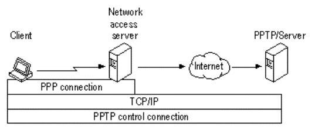
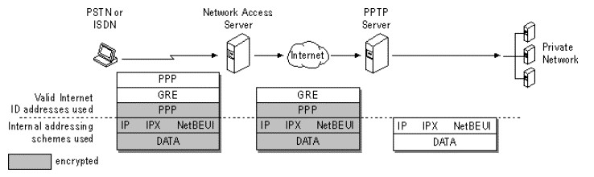
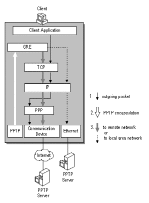
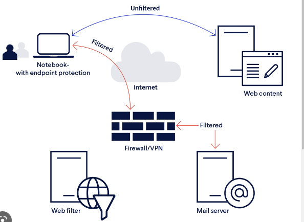
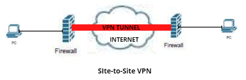
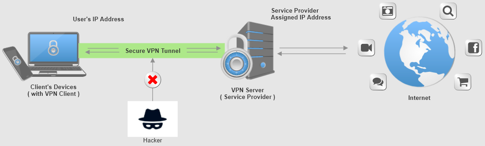

- [Security (tietoturva)](#Security-(tietoturva))
- [VPN (virtual private network)](#vpn-virtual-private-network)
  * [VPN tyyppit](#VPN-tyyppit)
   * [Remote access](#Remote-access)
   * [Site-to-site VPN](#Site-to-site-VPN)
   * [Point-to-point](#Point-to-point)
   * [full vs split tunnel](#full-vs-split-tunnel)
   * [VPN osa huonoja puoleja](#vpn-osa-huonoja-puoleja)

 - [VPN tyyppit](#VPN-tyyppit)
   * [Intranet VPN](#Intranet-VPN)
   * [Extranet VPN](#Extranet-VPN)

- [SSL VPN] (#SSL-VPN)
  * [SSL VPN vs. IPsec VPN](#ssl-vpn-vs-ipsec-vpn)
  * [Type of SSL VPN](#type-of-ssl-vpn)

- [Linkkit ja lukemista vähän:](#linkkit-ja-lukemista-vähän)
  * [Suomeksi selostettu](#suomeksi-selostettu)

# Security (tietoturva)

Tänne tulee kytkimen & reitittimen tietoturva konffaukset kuten palomuurit, ssh, telnet ja jne, kuten pääsyhallinat ja muut käyttäjien todentamisen tunnukset. esim. ssh käyttäjäntunnus, ja salasana.

sama vaikuttaa host käyttäjä esim. yrittää käydä kiinni käsiksi kytkimen/reitittimeen sisään käsiksi, että tarkistettaan sisäisen kytkimen rakenne, ominaisuus, mitä on konfiguroitu ja mitä porttit ovat päällä/pois päältä, ja muut virheet. Toki varsinaisesti kytkimen konfiguroinnista ei nähdä varsinaisesti sitä virheilyä, mutta mikäli sattuu sähkö häiriötä vasta sen jälkeen voidaan epäillä sitä oiretta. Oireita voi olla monipuolisia esim. pinggaus, palomuuri / oikeudet, tai muu sähkö häiriön este.

| Security protkollia on: |  IPsec   GRE   ISAKMP    NTP   AAA   RADIUS   TACACS   SNMP   SSH   Syslog   CBAC   Zone-Based Policy Firewall    IPS |
| ---------- | ---------- |

# VPN (virtual private network)
virtuaalinen erillisverkko on tapa, jolla kaksi tai useampia yrityksen verkkoja voidaan yhdistää julkisen verkon yli muodostaen näennäisesti yksityisen verkon. Nykyisin VPN-määritelmä on laajennettu koskemaan myös yksittäisten etätyöasemien liittämistä yrityksen verkkoon.

VPN-verkon yksityisyys ja tietoturva voidaan hoitaa joko fyysisesti tai salauksella. Asiakkaan verkkoja yhdistävä VPN voi siis perustua jommallekummalle seuraavista:

- Perinteiset suljetut verkot, kuten operaattoriverkot fyysisellä suojauksella
- Julkiset ja avoimet verkot, kuten salattu Internet
- 

Myös vaikuttaa palomuurien määrityksiin, kuten työpaikan salaisia asioita, mitä ei julkaista ulkopuolisille asiakkaalle tai yrityksille.

Runkoverkoissa käytetään useimmiten useiden asiakkaiden liikenteen erotteluun MPLS:ää, ATM:ää tai yksinkertaisimmillaan IP-osoitekohtaisia pääsylistoja.

IPsec-protokollaa käytetään suljetuissa operaattori-VPN:issä, muttei tietoturvan vaan konfiguroinnin vuoksi. IPsec-tunneleiden konfigurointi operaattorin runkoverkon reunareitittimien välillä yksinkertaistaa konfiguraatiota IP-pääsylistoista huomattavasti, ja ei ole riskiä, että asiakkaiden verkkojen liikenteet pääsisivät sekaantumaan. IPsec on protokollana todistettu kohtalaisen turvalliseksi ja hyvä ohjelmistotuki on antanut sille jalansijan moniin muihinkin käyttötarkoituksiin VPN:ien lisäksi. Muun muassa langattomissa WLAN-lähiverkoissa voidaan käyttää joko WLAN:ien omien suojausten sijasta tai lisäksi IPsec-protokollaa.

<b> VPN tunneli kaavio </b>  

## VPN tyyppit

### Remote access

## Site-to-site VPN

Yrityksellä laajentuu jatkuvasti/usein eri osastoon, ja kahden tai useamman aloilla/osastoiden välillä siirrettään jatkuvasti tiedostoi suojaamista, minkä on otettava käyttöön paikallisen VPN. Yleisen sivustojen välisessä VPN:ssä on käytetyt VPN-protokollat eli IPSec (Internet Secuirty Protocol). Tämän tyyppisen VPN:n toteuttamiseksi meidän on määritettävä vaiheen (Phase) 1 ja vaiheen (Phase) 2 VPN-neuvottelut. IKE Phase 1 -neuvottelu on paikka, jossa luomme suojatun salatun kanavan tai salatun verkkoyhteyden kahdelle palomuurille, jotka voivat aloittaa vaiheen 2 neuvottelun.

IKE Phase 2 -neuvotteluissa kaksi palomuuria sopivat konfiguroiduista parametreista, jotka määrittävät, mitä liikennettä voi kulkea VPN-tunnelin kautta ja kuinka liikenne todennetaan ja salataan. Sopimus on nimeltään Security Association. Sekä Vaiheessa 1 että Vaiheessa 2 tulee olla samat parametrit, kuten esijaetut avaimet, todennus, salaus ja IKE-versio.

## Point-to-point

PPTP (point-to-point tunneling protocol) VPN-tunneloitu protokollat, joka pohjautuu PPP - protokollaan (Point-to-Point Protocol). Tämä protokolla hyödyntää GRE-protokollaa pakettien tunneloitumista ja ävlittämistä. Osaksi GRE protokollan ongelmista johtuen ei PPTP ole kovin suosittu kiinteisissä verkkojen yhdistymisessä, aan sitä käytetään lähinnä liikkuvien etäpiteiden tunnelointiin. Protokollan kehitymminen on pysähtynyt, kun L2TP-protokolla (Osi mallin 2.krs) mikä on pääosin korvannut sen ja siirtynyt osin kohti IPsec- ja SSL-protokollilla toteuttujen salattujen VPN-tunneliin. Jossakin verkostossa PTP on yhä käytössä esim. cisco ympäristössä.

Ilmaisu Point to Point viittaa protokollan luomaan tiettyyn yhteystyyppiin. Se mahdollistaa yhden pisteen (käyttäjän laitteen) pääsyn toiseen tiettyyn pisteeseen (käyttäjän toimistoverkkoon) Internetin kautta. PPTP:ssä point-to-point-protokolla (PPP) on kääritty TCP/IP-protokollan sisään, joka tarjoaa suojatun Internet-yhteyden. Vaikka yhteys luodaan Internetin kautta, PPTP-yhteys luo suoran linkin kahden sijainnin välille, mikä mahdollistaa suojatun yhteyden.

## full vs split tunnel

VPN tekniikoissa <b>remote access</b> ja <b>site-to-sites</b> mahdollistaa tietoliikenteen tunnelontia joko <ins>full tunnel</ins> tai <ins>split tunnel</ins> moodia. 

- Full tunnel moodissa: kaikki käyttäjän tietoliikenne ohjataan VPN-tunneliin ja siihen kautta esim. yrityksen lähiverkkoon LAN, josta saa reititettyn julkiseen internetiin ja sen palveluihin. Tätä usein käytettän etätyössä tai tietyissä asiakasprojektissa esim. työntekijä tarkastelee säätietoja internetistä, että hän kulkee tietoliikenteensä sääsivulle ensin salattuna hänen tietokoneeltaan yrityksen verkkoon ja siitä reitittyy internetissä olevaan sääpalveluun ja sieltä takaisin. Full tunnel tekniikkassa kaikki tiedonsiirto vaikuttaa VPN-yhteyteen ja tämän takia mahdolista kuormitusta yhteyttä. 

- Split tunnel; on toinen vaihtoehto määrittää salattavaa VPN tunnelin kautta välitettäväksi tietoliikenteen erikseen muusta tietoliikenteestä, kuten julkisten internetpalveluiden käytöstä. Split tunnel - tekniikassa vain yrityksn sisäverkko tarkoitettu liikenne tunneloidaan ja kaikki muu liikenne jätetään tunneloinnin ulkopuolelle. Esim. etätyöskennellyssä tarkastessa säätietoja, tietoliikenne reitittyisi suoraan käyttäjän päätelaitteeltaan internetiin ja sääpalveluun sekä sieltä takaisin. Saman aikaisesti työntekijä suorittamat työasiat kulkisivat päätelaitteelta tunneloituna yrityksen lähiverkkoon.

## VPN osa huonoja puoleja

Yrityksille ongelmina on VPN yhteyksissä on tiedonsiirtokapasiteetti, mikäli jos yrityksessä on/oli käytössä full tunnel tekniikka niin etätyöskentelyt kasvamisessa määrä hidastaisi yritysten verkkoa tosi paljon. Suosituksen kannalta on hidastamiseen oli split tunnel tekniikka yrityksissä. Split tunnel tekniikka käyttöönotto vaatisi tarkkoja määrittelyjä tekniikan toteutumista, koska väärin konffattuja tekniikoita saattaa mahdollista ulkopuolisia hyökkäyksiä ulkoverkosta yrityksen sisävekrkoon. Suuresta/Valtavasta hyökkäysvektorien syystä, yritysten tulisi tehdä riskiarvio aina tapauskohtaisesti split tunnel tekniikkaan käyttöönotosta ja mietiä asiansa, mikäli tietoliikenne jätettäisiin tunneloinnin ulkopuolelle.

# VPN tyyppit

VPN (virtual private network)

(VPN) tarjoaa suojatun tunnelin julkisen (ja siten epävarman) verkon yli. Tämä tarjoaa organisaatioille mekanismin käyttäjien ja toimistojen yhdistämiseksi ilman erillisten kiinteiden johtojen korkeita kustannuksia. VPN-verkkoja käytetään useimmiten Internetissä, maailman suurimmassa julkisessa verkossa, tarjoten käyttäjille pääsyn sähköpostiin, asiakirjoihin, tulostimiin ja järjestelmiin ikään kuin he olisivat tosiasiallisesti päätoimipaikassaan.
 
On kaksi tapaa ottaa käyttöön sivustojen välinen VPN:

- Intranet VPN - tarjoaa suojatun toimipisteen välisen yhteyden yrityksien sisällä tai sisäisesti
- Extranet VPN - tarjoaa suojatun toimipisteen välillä yhteyden yrityksien ulkopuolella. esim. asiakkaan tai kumpannit voivat käyttää turvallisesti yrityksen yhteystä resurssia.

## Intranet VPN

## Extranet VPN

Henkilökohtaisessa VPN palvelussa yhteys on jaettu kahteen osaan. Ekana osa poin-to-point suojattu VPN tunneli (ylemmän kuva vihreä tunneli), jossa käyttäjä muodostaa yhteyden VPN-palvelimeen henkilökohtaisen laitteen VPN-asiakkaan kautta. Kaikki suoajtun VPN-tunnelin kautta lähetettävät tiedot salataan. Toisen osa on VPN-palvelimelta Internet-kohteeseen. Koska suojattu VPN-tunneli (vihräe väri ylemmäsäs kuvassa) on päätetty VPN-alvelimessa, tätä lähetystä ei salata VPN-tekniikalla. Kun käyttäjä käyttää henkilökohtaista VPN-palvelua, käyttäjän tiedot salataan ja välitetään palveluntarjoajan VPN-palvelimelle suojatun VPN-tunnelin kautta, minkä jälkeen ne siirretään Internet-kohteeseen ilman VPN-tekniikan salausta.

Lisäksi, kun käyttäjä käyttää henkilökohtaista VPN-palvelua, VPN-palveluntarjoaja määrittää VPN-asiakkaalle IP-osoitteen Internet-palvelun käyttöä varten. Voimme viitata ylemmän kuvan vasemmalla olevaan asiakaslaitteeseen. Kun VPN-asiakas on onnistuneesti muodostanut yhteyden henkilökohtaiseen VPN-palveluun, kaikki henkilökohtaisen VPN-palvelun kautta Internetiin välitetyt tiedot muuttuvat palveluntarjoajan antamaan IP-osoitteeseen. lähteen IP-osoite käyttäjän IP-osoitteen käyttämisen sijaan.

# SSL VPN

## SSL VPN vs. IPsec VPN

https://www.fortinet.com/resources/cyberglossary/ssl-vpn

## Type of SSL VPN

 

# Linkkit ja lukemista vähän:  
https://www.cisco.com/c/dam/en_us/training-events/netacad/course_catalog/docs/CCNAsecurity_DS.pdf  
https://staffweb.itsligo.ie/staff/pflynn/Telecoms%203/CCNP%202%20Secure%20WAN%27s/Secure%20Converged%20Networks/CCNA%20Security.pdf  
https://nanopdf.com/download/ccna-security_pdf  

https://www.cisco.com/c/dam/en_us/training-events/le21/le34/downloads/689/academy/2008/sessions/BRK-134T_VPNs_Simplified.pdf  

https://www.ciscolive.com/c/dam/r/ciscolive/emea/docs/2020/pdf/BRKSEC-3629.pdf  
http://maciej.sobieraj.pracownik.put.poznan.pl/Lab12_bsi.pdf  

https://www.cisco.com/c/dam/global/da_dk/solutions/small-business/ivpn.pdf  

https://www.cisco.com/c/dam/en_us/training-events/le21/le34/downloads/689/academy/2008/sessions/BRK-134T_VPNs_Simplified.pdf  
https://www.cisco.com/c/en/us/td/docs/security/vpn_modules/6342/vpn_cg.pdf  

https://matteocappelli.files.wordpress.com/2010/02/cisco-ccna-security_note.pdf  

## Suomeksi selostettu
https://www.kaspersky.fi/resource-center/definitions/what-is-a-vpn  
https://www.kaspersky.fi/resource-center/definitions/how-does-vpn-keep-me-safe-online

https://www.theseus.fi/bitstream/handle/10024/749133/Kuri_Jukka.pdf?sequence=2
