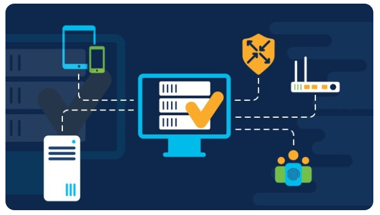

# Verkonhallinta

Verkonhallinta on tietokoneverkkojen hallinta- ja hallintaprosessi. Tämän tieteenalan tarjoamiin palveluihin kuuluvat vikaanalyysi, suorituskyvyn hallinta, verkkojen provisiointi, käytön laskutuksen hallinta, tietoturvallisuuden hallinta ja palvelun laadun ylläpitäminen. Verkon järjestelmänvalvojat käyttävät verkonhallintaohjelmistoa näiden toimintojen suorittamiseen.

Alueesta on määritelty ITU-T (International Telecommunication Union – Telecommunnication) verkonhallintastandardissa X.700. Standardi kattaa kaikki verkkotekniikat, mutta painottuu lähiverkkotekniikkaan, lähinnä vian-, suorituskyvyn ja määrittelyjen hallintaan.

* [Vikatilanne](#vikatilanne)
* [määrittelyjen hallinta](#määrittelyjen-hallinta)
* [Suorituskyky](#suorituskyky)
* [käyttö ja laskutus](#käyttö-ja-laskutus)
* [turvallisuus](#turvallisuus)

- [yhteys ja signaalit](#yhteys-ja-signaalit)
    * [pullonkaula](#pullonkaula)
    * [max ja min tasapuolisuus](#max-ja-min-tasapuolisuus)

## Vikatilanne

Vikatilanteiden hallinta (Fault Management) parantaa verkon luotettavuutta antamalla verkon ylläpitäjälle työkalut tiedostamaan verkon tilan, kriittisien tapahtumien tallentamisen sekä vikojen nopean ratkaisun. Vikalokeja voi hyödyntää tulevaisuuden vastaavissa vioissa sekä suunnittella vikasietoisempia verkkoa. Vikalokeja voidaan myös käyttää, kun on selvitettävä uusien laitteiden tarvetta.

## määrittelyjen hallinta

Määrittelyjen hallinta (Configuration Management) sisältyy tiedon verkon laittiestoa ja resursseista sekä niiden välisistä yhteyksiä. Määrityksiä voidaan käyttää hyväksi vianhaussa ja eristyksessä sekä verkon suunnittelussa.

## Suorituskyky

Suorituskyvyn hallinta (Performance Management) kuvaa parhaiten juuri toiminnon, sillä pyritään ylläpitämään verkon suorituskykyä riittävän korkealla tasolla. Yleisin mittari on tehdä ping-testi, josta selvitettään vasteaika kyselyvastaukselle ja mahdollisesti voidaan korjata verkon pullonkaula (bottleneck). Verkon kapasiteettia ja verkon kuormitusastetta käytetään myös hyvin paljon, koska osittain helpottaa mittamiseen.

## käyttö ja laskutus

Käyttö ja laskutuksen hallinta (Accounting Management) seuraa ja mittaa käyttäjien liikennettä sekä resurssien todellista käyttöä verkossa. Saaduilla tiedoilla voidaan rajoittaa käyttäjien liikennettä halutulla tavalla sekä laskuttaa esim. vuokraverkon kuormituksesta siirretyn tiedon määrän perusteella.

## turvallisuus

Turvallisuuden hallinta (Security Management) on pitkälti kontrolloitua käyttöoikeuksien jakoa niille, joille lukuoikeudet haluttuun tietoturvatasoon liittyen ovat aiheellisia. Tärkeä osa on myös verkkoon ja siihen liitettyjen laitteiden pääsyn seurantaa ja kontrollointia, lokien keräämistä, tallennusta ja sekä analysointia että mahdollisia tietomurtohälytyksiä.

 

# yhteys ja signaalit

## pullonkaula

pullonkaula eng. <b>bottleneck</b>

## max ja min tasapuolisuus