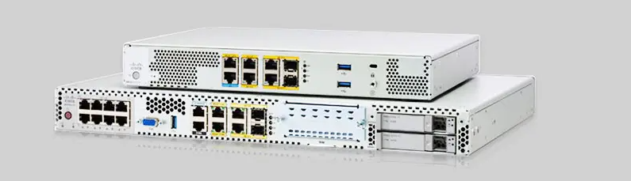
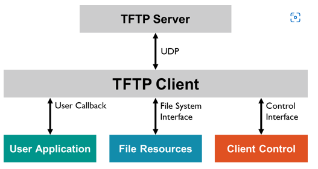

Joskus saatettaan tarkistaaa jotakin backup konffei, että esim. kyseinen reititin voi olla mahdollisesti rikki/portti ongelma tai muu tausta vika. Alkuperäisen reititimestä otettaan back up talteen, ja tilalle tulee kyseinen uusi reititin riippuu mallista, mitkä saattaa sallia sisäiset konfiguroinnit. Ei väliä onko kyseessä reititin tai kytkin, että molempia pitää ottaa talteen, ja riippuu mitkä ovat ns. kuin tärkeitä kuten WAN, hostname, kyseinen staatinen/dynaava konffi, sepcial snmp ja acl konffaukset.

# TFTP 
Trivial File Transfer Protocol on tiedostojen siirto tarkoittujen verkkoprotokolla, ja se on suunniteltujen yksinkertaisen ja vähän tilaisen vietävän toteuttavaksi.

# lisää ohjeita ja muita linkkei:  
https://www.cisco.com/c/en/us/support/docs/ios-nx-os-software/ios-software-releases-122-mainline/46741-backup-config.html   
https://learningnetwork.cisco.com/s/blogs/a0D3i000002SKKbEAO/understanding-cisco-auto-archive-feature-to-backup-configuration-file   
https://www.thunder-link.com/docs/post/Cisco-Router-IOS-Configuration-Backup-And-Recovery.html   

