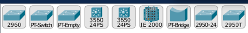

- [Cisco packet tracer simulation](#Cisco-packet-tracer-simulation)
  * [Cisco Packet tracer protokollat](#cisco-packet-tracer-protokollat)
  * [Cisco packet tracer laiteistot mallit](#cisco-packet-tracer-laiteistot-mallit)
 - [Other Simulation software by using Cisco materials](#Other-Simulation-software-by-using-Cisco-materials)

# Cisco packet tracer simulation
Cisco packet tracer kertausta ja harjoitusta itsenäisesti & sekä vähän uutta tarvittaessa  

 

## Cisco Packet tracer protokollat

## Cisco packet tracer laiteistot mallit
 
Reititin

  

 
Kytkimet

  

 
Muut laitteet:

# Reititimen, kytkimen, tietoturva (security) ja muu konffaus, myös IoT, WLAN, Server ja muu verkon protokollan määritys

# Other Simulation software by using Cisco materials

Olemassa on muitakin kuin Cisco packet tracer simulaatio sovellus, että sisäisen ohjelmistossa puuttuu jotakin määrityksiä ja tueta sisällä. Myös realistisessa Cisco:n laiteesa voidaan määrittää niitä protokollia. On olemassa useita simulaatio sovelluksia, että sisällä on valmiit ominaisuudet, tuet ja muut protokollan tarvittavat tarvikkeet, että kuin toimii realisisten reitittimen/kytkimen konfiguroinnin ympäristössä.
   
https://www.netacad.com/courses/packet-tracer (tämä on Cisco packet tracer)  
https://www.eve-ng.net/  
https://www.gns3.com/ 

# Cheat sheet komennot ja muut lunttilaput & guide & chapter materiaalit:
https://www.ii.pwr.edu.pl/~kano/index.html  
https://packetlife.net/library/cheat-sheets/  
https://slideplayer.com/slide/3561082/  
https://data.kemt.fei.tuke.sk/PocitacoveSiete/_materialy/Prednasky/  
https://www.routeralley.com/guides/  
https://ipcisco.com/protocol-cheat-sheets/  
http://vapenik.s.cnl.sk/pcsiete/  
