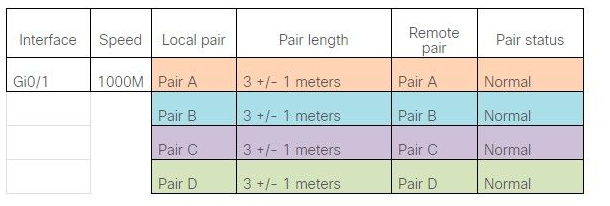
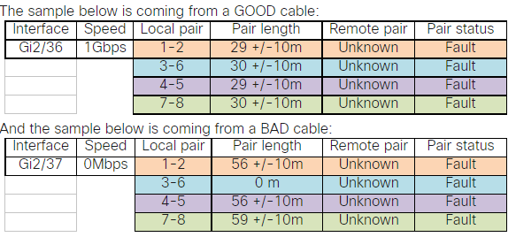

# Kytkin - Switch

# kytkimien porttien todennus

Kytkimien porttien status tilanne, että päästään porttien num käsiksi. Porttista tarkistaa, mitä konffausta sisään on määritetty tai koko kytkimeen sisään kuten telnet, ssh tai muu määritys. Sekä tärkeimmistä ja $show ? - kysymys merkin avulla tulostaa, mitä käyttäjä yrittää hakea, jotta ei tarvitse aina muistaa jokaista komentoa.

| komennot | teknisen kuvaus | 
| ---- | ------- |
| $show interfaces [interfaces-id] | tulosta interface porttien status ja koffauksen, esim. $show interface (koko kytkin), jos rajoittaa vain kytkimen porttin $show int fa0/2
| $show startup-config | tulostaa nykyisen startup konffauksen |
| $show running-config | tulostaa nykyisen running-config määrityksen eli mitä kytkimen sisään on konffattu, tai vaihtoehtoinen komento on sama mutta lyhyempi $show run |
| $show flash | information flash file system; Flash-tiedostojärjestelmä on tiedostojärjestelmä, joka on suunniteltu tiedostojen tallentamiseen flash-muistipohjaisille tallennuslaitteille |
| $show version | kytkimen versio, malli ja mahdollisen kytkimen sarjanumero, kauan on ollut päällä esim. ollut aktiivinen viimeisen min. tunti tai jopa pv/kk/yyyy. Kytkimen sisäinen muisti määrä, fyysinen mac-osoite (tuote sarja), laiteisto ja sovelluksen tila. |
| $show history | tulostaa käyttäjän antaman viimeisimmät komennot |
| $show vlan | tarkistaa kytkimen vlan-id, ja mitäkin porttissa on määritetty access/trunk vlan-id tunnus |
| $show ip int br | tarkistaa kytkimen porttien taulukkon, että onko porttissa määritetty yksittäinen oma ip-osoite, status up/down, protocol up/down & kokonainen komento $show ip interface brief tai vaihtoehtoinen komento $show interface status ($show int status) |
| $show mac-address-table OR $show mac address-table | tarkista mac-osoite, että löytyy mm. vlan -id oma mac-osoite, tyyppi ja portti num |
| $show int status | tarkista koko kytkimen tilanne / kytkin taulukko, mikä portti on/off, määritetty vlan-id, dupleksi (auto/full/half) ja FastEthnet tyyppi kuten 10/100BASE-TX |

## duplex 
dupleksi tarkoittaa yhteyden tai järjestelmän kaksisuuntaisen, että voi lähettää A-kytkimestä B-kytkimeen viestin, ja sama vastaanottaa toisen puolen viestin, tätä kutsutaan kaksisuuntaiseksi. Jos puolet dupleksi tarkoittaa, että voi vain vastaanottaa vastakohdan viestin, mutta itse ei lähetä viestiä. 

Termeinä full dupleksi tai half dupleksi käytetään tietokoneen äänipiirien tai äänikorttien kohdalla osoittamaan, tukeeko piiri saman- tai eriaikaista toistoa ja digitointia, tai automaatinen. Automaattinen neuvotteluvirhe luo yhteensopimattomia asetuksia. Cisco suosittelee automaattisen komennon käyttöä duplex-toiminnossa ja liitäntänopeuden manuaalista määrittämistä nopeuskomennolla, jotta vältetään laitteiden väliset yhteysongelmat.

##  kaapelien testaus

Kytkin kaapelien testau, mitä usein esim. testataan kytkimen POE (power over-ethernet) porttien tilannetta, että esim. pelittääkö yhteys vastapäässä. Kytkimien portteista saattaa olla kytketty monipuolisia laiteita kuten tulostin, langaton tukiasema, valvontakamera tai muu käyttö tarkoitus tuote, että tarvii verkkon. Kaapelien testauksessa tarkistettaan se portti tilanne, että mahtaako olla portti aktiivinen, löysällä tai muu vika.

